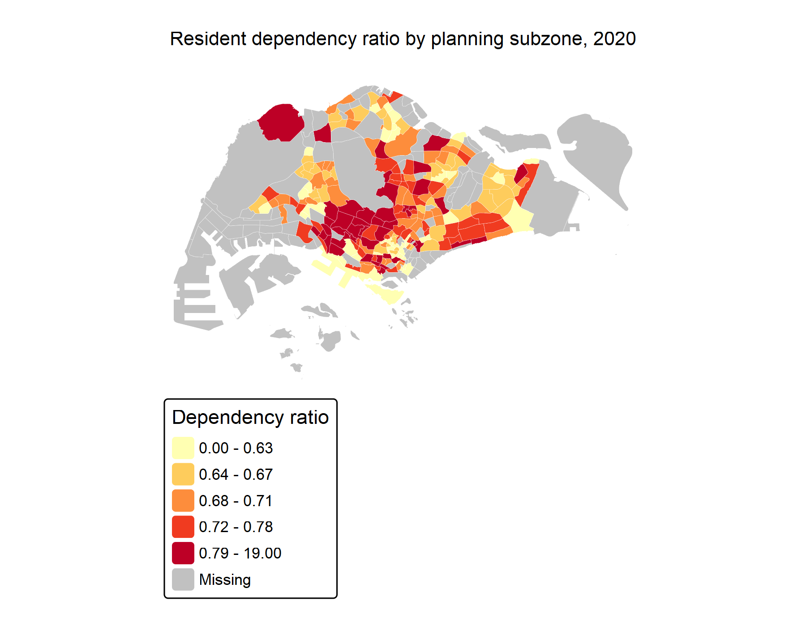

## Overview

This page extends Exercise 1A by joining a resident-population table to planning subzones and mapping the result. The focus is not just on making a coloured map: the classifications, palette, and supporting chart all change what is easy to notice.

The population table covers 2011–2020, so I use 2020 as the last available year. The public data sources and download instructions are listed in [the data-provenance note](data-provenance.md).

```{r}
#| label: setup
#| include: false
library(sf)
library(tidyverse)
library(tmap)
library(patchwork)

tmap_mode("plot")
data_dir <- file.path("Hands-on_Ex", "Hands-on_Ex01", "data")
geo_dir <- file.path(data_dir, "geospatial")
asp_dir <- file.path(data_dir, "aspatial")
required_files <- c(
  file.path(geo_dir, "masterplan_subzones.geojson"),
  file.path(asp_dir, "respopagesextod2011to2020.csv")
)
if (!all(file.exists(required_files))) {
  stop("Data files are missing. Run `Rscript scripts/download_data.R` from the project root first.")
}
```

## Preparing the demographic table

The source table is disaggregated by sex and dwelling type, so I sum those rows first. I then group the age bands into young residents (0–24), economically active residents (25–64), and older residents (65 and above). The dependency ratio is the combined young and older population divided by the economically active population.

```{r}
#| label: prepare-population
popdata <- read_csv(file.path(asp_dir, "respopagesextod2011to2020.csv"), show_col_types = FALSE)

young_ages <- c("0_to_4", "5_to_9", "10_to_14", "15_to_19", "20_to_24")
active_ages <- c("25_to_29", "30_to_34", "35_to_39", "40_to_44", "45_to_49", "50_to_54", "55_to_59", "60_to_64")

population_2020 <- popdata |>
  filter(Time == 2020) |>
  mutate(
    cohort = case_when(
      AG %in% young_ages ~ "young",
      AG %in% active_ages ~ "active",
      TRUE ~ "aged"
    )
  ) |>
  group_by(PA, SZ, cohort) |>
  summarise(population = sum(Pop), .groups = "drop") |>
  pivot_wider(names_from = cohort, values_from = population, values_fill = 0) |>
  mutate(
    total = young + active + aged,
    dependency = if_else(active > 0, (young + aged) / active, NA_real_),
    PA = str_to_upper(PA),
    SZ = str_to_upper(SZ)
  )

population_2020
```

## Joining population to the map

```{r}
#| label: spatial-join
mpsz_pop <- st_read(file.path(geo_dir, "masterplan_subzones.geojson"), quiet = TRUE) |>
  st_transform(3414) |>
  mutate(
    PLN_AREA_N = str_to_upper(PLN_AREA_N),
    SUBZONE_N = str_to_upper(SUBZONE_N)
  ) |>
  left_join(population_2020, by = c("PLN_AREA_N" = "PA", "SUBZONE_N" = "SZ"))

sum(!is.na(mpsz_pop$dependency))
```

The join does not force missing subzones to zero. A missing value can mean that a subzone was not represented in the resident table, and treating that as a population of zero would hide the difference.

## A first choropleth map

```{r}
#| label: dependency-map
#| fig-width: 9
#| fig-height: 7
dependency_map <- tm_shape(mpsz_pop) +
  tm_polygons(
    fill = "dependency",
    fill.scale = tm_scale_intervals(style = "quantile", n = 5, values = "YlOrRd"),
    fill.legend = tm_legend(title = "Dependency ratio"),
    col = "white",
    lwd = 0.15
  ) +
  tm_title("Resident dependency ratio by planning subzone, 2020") +
  tm_layout(frame = FALSE)

dependency_map
```

Quantiles make the visual emphasis relative: each class contains a similar number of subzones. That is useful when looking for a ranking, but it should not be read as equally sized differences in the underlying ratio.

## Comparing classifications and palettes

```{r}
#| label: classification-comparison
#| fig-width: 11
#| fig-height: 4
equal_map <- tm_shape(mpsz_pop) +
  tm_polygons(fill = "dependency", fill.scale = tm_scale_intervals(style = "equal", n = 5, values = "Blues"), col = "white", lwd = 0.1) +
  tm_title("Equal intervals")

quantile_map <- tm_shape(mpsz_pop) +
  tm_polygons(fill = "dependency", fill.scale = tm_scale_intervals(style = "quantile", n = 5, values = "YlOrRd"), col = "white", lwd = 0.1) +
  tm_title("Quantiles")

jenks_map <- tm_shape(mpsz_pop) +
  tm_polygons(fill = "dependency", fill.scale = tm_scale_intervals(style = "fisher", n = 5, values = "Purples"), col = "white", lwd = 0.1) +
  tm_title("Fisher-Jenks")

tmap_arrange(equal_map, quantile_map, jenks_map, ncol = 3)
```

The broad geography is stable across the three views, but the boundaries between classes move. For a short exercise, I prefer the quantile version because it avoids giving most subzones the same pale colour; in a formal report I would also show the numeric class breaks.

## Small multiples and a selected planning area

The three age groups can be compared as small multiples. I also map Tampines on its own because selecting a single planning area makes its internal variation easier to see.

```{r}
#| label: small-multiples
#| fig-width: 10
#| fig-height: 7
mpsz_long <- mpsz_pop |>
  select(SUBZONE_N, young, active, aged, geometry) |>
  pivot_longer(cols = c(young, active, aged), names_to = "cohort", values_to = "population")

tm_shape(mpsz_long) +
  tm_polygons(
    fill = "population",
    fill.scale = tm_scale_intervals(style = "quantile", n = 5, values = "BuGn"),
    col = "white",
    lwd = 0.1
  ) +
  tm_facets(by = "cohort", ncol = 3) +
  tm_title("Population cohorts by subzone, 2020") +
  tm_layout(frame = FALSE)
```

```{r}
#| label: selected-area
#| fig-width: 8
#| fig-height: 6
tampines <- mpsz_pop |> filter(PLN_AREA_N == "TAMPINES")

tm_shape(tampines) +
  tm_polygons(
    fill = "dependency",
    fill.scale = tm_scale_intervals(style = "quantile", n = 4, values = "YlGnBu"),
    fill.legend = tm_legend(title = "Dependency ratio"),
    col = "white"
  ) +
  tm_title("Dependency ratio within Tampines") +
  tm_layout(frame = FALSE)
```

## Complementing a map with a chart

The map answers *where* dependency is higher. The bar chart adds a quick comparison of the planning areas with the largest resident population, which is helpful because a high ratio in a small subzone and a high ratio in a large subzone do not imply the same service demand.

```{r}
#| label: map-chart-composition
#| fig-width: 11
#| fig-height: 6
planning_area_totals <- mpsz_pop |>
  st_drop_geometry() |>
  group_by(PLN_AREA_N) |>
  summarise(total = sum(total, na.rm = TRUE), .groups = "drop") |>
  slice_max(total, n = 10) |>
  arrange(total)

population_chart <- ggplot(planning_area_totals, aes(x = total / 1000, y = fct_reorder(PLN_AREA_N, total))) +
  geom_col(fill = "#2a788e") +
  labs(title = "Largest planning areas by resident population", x = "Residents (thousands)", y = NULL) +
  theme_minimal()

map_for_composition <- ggplot(mpsz_pop) +
  geom_sf(aes(fill = dependency), colour = "white", linewidth = 0.08) +
  scale_fill_viridis_c(option = "C", na.value = "grey90", name = "Dependency\nratio") +
  labs(title = "Dependency ratio, 2020") +
  theme_void()

map_for_composition + population_chart + plot_layout(widths = c(1.25, 1))
```

## Interactive version and submission image

The interactive map keeps the same measure but adds a popup for the subzone name, total population and dependency ratio. I also save the static map as a PNG so it can be submitted to eLearn as an image rather than a text-only URL.

```{r}
#| label: save-png
#| include: false
dir.create(file.path("Hands-on_Ex", "Hands-on_Ex01", "images"), recursive = TRUE, showWarnings = FALSE)
tmap_save(
  dependency_map,
  filename = file.path("Hands-on_Ex", "Hands-on_Ex01", "images", "finished-thematic-map.png"),
  width = 1800,
  height = 1400,
  units = "px"
)
```

{fig-alt="Choropleth map of the Singapore resident dependency ratio by planning subzone in 2020." width="75%"}

```{r}
#| label: interactive-map
#| fig-width: 9
#| fig-height: 7
tmap_mode("view")
tm_shape(mpsz_pop) +
  tm_polygons(
    fill = "dependency",
    fill.scale = tm_scale_intervals(style = "quantile", n = 5, values = "YlOrRd"),
    popup = c("SUBZONE_N", "total", "dependency"),
    id = "SUBZONE_N"
  )
```

```{r}
#| label: restore-static-mode
#| include: false
tmap_mode("plot")
```

## Reflection

The two strongest lessons for me were practical rather than cosmetic. First, matching the CRS before buffering or overlaying is essential; a layer can look plausible on screen and still be wrong for distance-based work. Second, a choropleth is sensitive to classification choices. I found the map much easier to read after comparing the alternatives instead of treating the first colour scheme as the final answer.
