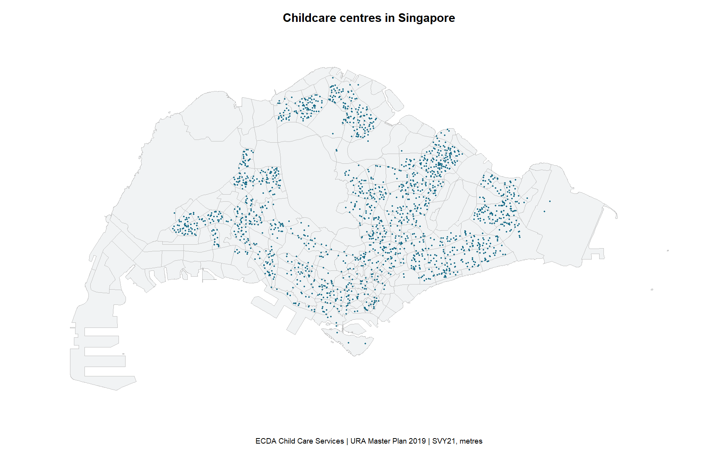
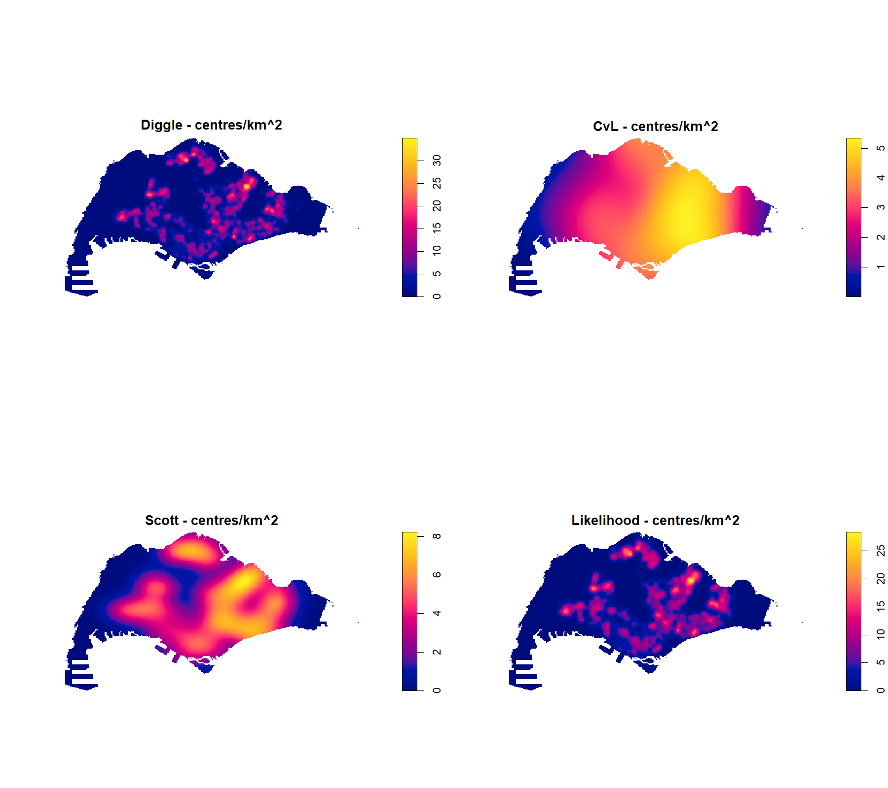
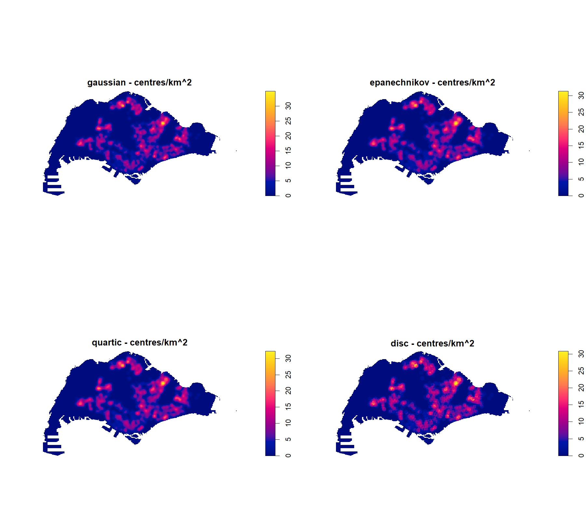
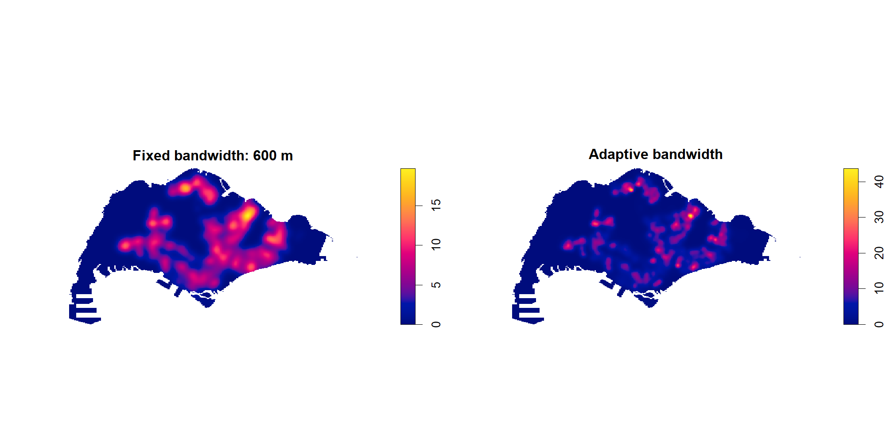
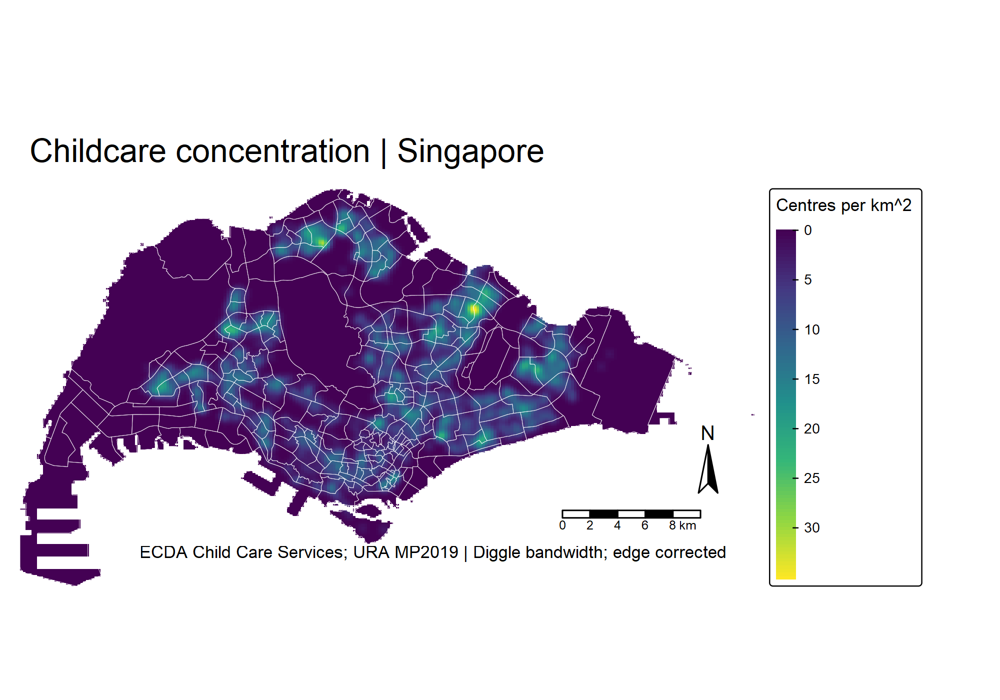
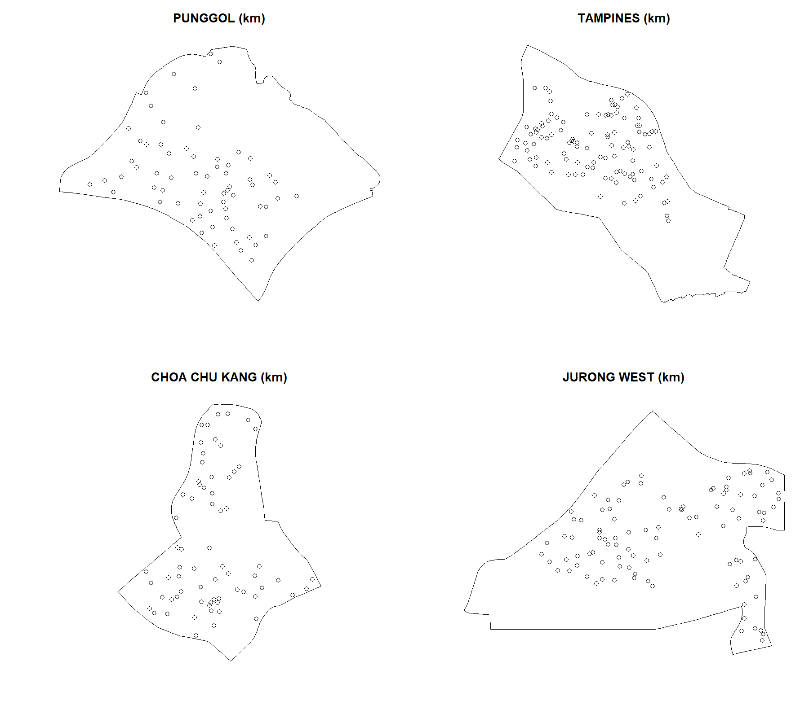
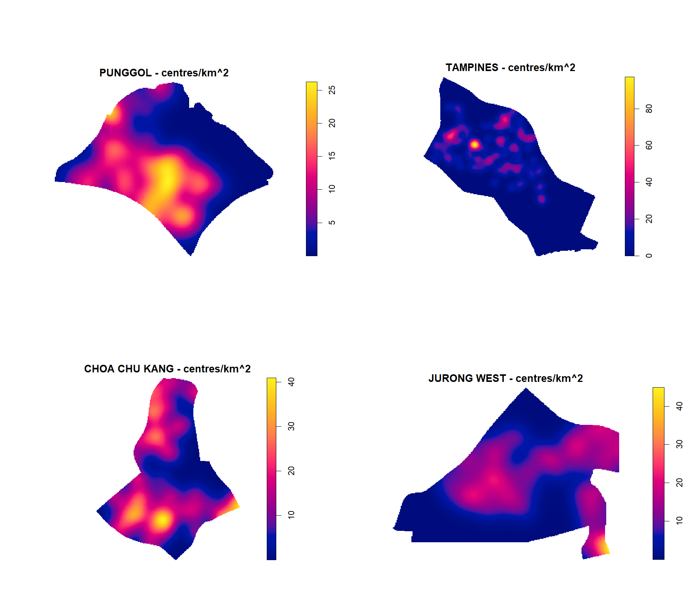

```{r}
#| include: false
source("Hands-on_Ex/Hands-on_Ex02/analysis-2a.R")
knitr::read_chunk("Hands-on_Ex/Hands-on_Ex02/prepare.R")
knitr::read_chunk("Hands-on_Ex/Hands-on_Ex02/analysis-2a.R")
```

## Aim and approach

This exercise follows [Chapter 4 of R for Geospatial Data Science and Analytics](https://r4gdsa.netlify.app/chap04.html). I use childcare centres to explore the difference between a map of individual locations, a nearest-neighbour summary, and a smoothed intensity surface. The question is about the **distribution of facilities**, not whether every neighbourhood has enough childcare places.

The analysis uses the workbook's public Singapore datasets, not the previously supplied ZIP. [Exercise 2B](Hands-on_Ex02b.qmd) extends these same inputs to distance-dependent statistics. The source scripts run during rendering; the displayed code is read from those scripts rather than maintained as a second implementation.

## Getting started and preparing the data

The workflow uses `sf`, `spatstat`, `terra`, `tmap` and `tidyverse`. Data are downloaded by [prepare.R](prepare.R); [reproduction instructions](README.md) and [session information](outputs/session-info.txt) record the environment. The download manifest distinguishes the dataset's coverage from its catalogue update and access dates: these are not a September 2026 census of centres.

```{r}
#| echo: false
manifest <- read_csv(file.path(base,"outputs/data-manifest.csv"),show_col_types=FALSE)
knitr::kable(manifest |> select(dataset,coverage,catalogue_updated,downloaded),
 col.names=c("Dataset","Coverage","Catalogue updated","Downloaded"))
```

Sources: [URA Master Plan 2019 Subzone Boundary (No Sea)](https://data.gov.sg/datasets/d_8594ae9ff96d0c708bc2af633048edfb/view) and [ECDA Child Care Services](https://data.gov.sg/datasets/d_5d668e3f544335f8028f546827b773b4/view). The [manifest](outputs/data-manifest.csv) includes original source links and file checksums.

### Projection, validity and island exclusions

Both layers are transformed to SVY21 / Singapore TM (EPSG:3414), whose units are metres. Invalid polygons are repaired before creating the observation window. Following the chapter, I exclude the `SOUTHERN GROUP` subzone and the `WESTERN ISLANDS` and `NORTH-EASTERN ISLANDS` planning areas. The resulting window still includes the other polygons retained by this rule; “mainland” here is shorthand for that explicit selection.

```{r preparation}
#| eval: false
```

```{r}
#| echo: false
knitr::kable(audit,col.names=c("Validation check","Count"))
```

All 1,925 centre records lie inside the selected window. The 187 repeated coordinate rows are additional records at already-used coordinates, not 187 proven duplicate facilities. I retain them without jitter because multiple centres can share a building. This means the point pattern is not strictly simple, and coincident facilities contribute zero nearest-neighbour distances. Clustering statistics therefore describe recorded centre locations, with this caveat.

## Visualising the locations



[Download location map (PNG)](figures/locations.png)

```{r interactive-map}
#| eval: false
```

<iframe src="maps/childcare-locations.html" title="Interactive map of Singapore childcare centres" style="width:100%;height:560px;border:1px solid #ddd" loading="lazy"></iframe>

[Open the interactive map in its own page](maps/childcare-locations.html). The browser display uses 20-metre boundary simplification; all calculations use the original repaired geometries.

The point map is useful for locating facilities but hides overlapping records. Zooming helps with orientation; it does not turn these points into a measure of capacity or access.

## Creating the point pattern and observation window

`ppp` stores the coordinates and `owin` defines where a centre could be observed for this exercise. Both must use the same units. I keep the primary point pattern in metres and create a separate kilometre version for density comparisons. A bounding rectangle would include large areas of sea and would change the reference intensity, so I use the polygon union instead.

## Testing the spatial pattern: Clark–Evans

The Clark–Evans ratio divides observed mean nearest-neighbour distance by its homogeneous-CSR expectation. A value below one indicates shorter distances than this reference. As in the chapter, the national alternative is clustering and the correction is `none`. The analytical calculation uses the current `spatstat` argument `method="asymptotic"`; an `nsim` argument does not turn an analytical test into a simulation test.

```{r nearest-neighbour}
#| eval: false
```

```{r}
#| echo: false
knitr::kable(ce_table |> mutate(p_value=ifelse(p_value==0,"Numerical underflow",format(p_value,scientific=TRUE,digits=4))),digits=5,col.names=c("Test / area","R ratio","p-value"))
```

The national ratio is `r round(ce_table$R[1],3)`. The Monte Carlo result is reported at the resolution supported by **99 simulations**, not as an arbitrarily small p-value. The analytical approximation can give much smaller p-values, but that is a different calculation. Uncorrected edge effects, coincident coordinates and the unrealistic assumption of equal intensity across industrial, residential and undeveloped land all limit a substantive interpretation of this test.

## Kernel density estimation

### Automatic bandwidth selection

Bandwidth determines the spatial scale of smoothing. I compare Diggle, Cronie–van Lieshout (CvL), Scott and likelihood cross-validation, with edge correction enabled. Scott can select different bandwidths in the two coordinate directions; the other selectors below return a single scale.

```{r bandwidths}
#| eval: false
```

```{r}
#| echo: false
knitr::kable(bw_table,digits=3,col.names=c("Selector","x bandwidth (km)","y bandwidth (km)"))
```



The selected scales range from `r round(min(bw_table$sigma_x_km),3)` to `r round(max(c(bw_table$sigma_x_km,bw_table$sigma_y_km)),3)` km. I interpret the sharpness of local peaks alongside those numerical scales, rather than choosing whichever surface looks most striking. Each panel uses its own legend: colours cannot be read as identical values across panels.

### Comparing kernel functions

Gaussian, Epanechnikov, quartic and disc kernels are compared at the **same Diggle bandwidth**. This holds the smoothing scale constant while changing the weighting profile. The Gaussian has a smooth tail; the compact kernels give zero weight beyond their support. Differences in local peak shape do not imply that one estimate has discovered a different set of centres.



### Fixed 600-metre and adaptive estimates

```{r fixed-adaptive}
#| eval: false
```



The fixed estimate uses a common 600-metre scale everywhere. The adaptive estimate changes its smoothing scale with the local pattern, retaining more local detail where centres are concentrated. It is a descriptive comparison, not proof that adaptive smoothing better represents service demand. Very sharp peaks deserve particular caution where records share coordinates.

### From a density image to a correctly projected raster

```{r raster-map}
#| eval: false
```



[Download labelled KDE map (PNG)](figures/kde-map.png)

I compute this raster from the **metre-coordinate** pattern, assign EPSG:3414, and multiply intensity values by one million to obtain centres/km². Merely assigning EPSG:3414 to a kilometre-coordinate raster would not transform its extent: it would put the map in the wrong place. The script checks CRS agreement and numerical equivalence to the kilometre-based KDE.

## Local analysis and DIY comparisons

### Punggol, Tampines, Choa Chu Kang and Jurong West

```{r}
#| echo: false
knitr::kable(area_summary,digits=2,col.names=c("Planning area","Centres","Area (km²)","Centres/km²"))
```



```{r local-kde}
#| eval: false
```



Choa Chu Kang has 74 centres in about 6.12 km², whereas Tampines has 117 across about 20.80 km². Thus Tampines has more centres, but Choa Chu Kang has the higher area-average intensity (12.10 versus 5.63 centres/km²). Punggol and Jurong West are closer in average intensity, at 7.68 and 7.49 respectively. Counts alone would miss these differences.

The local Clark–Evans tests above are two-sided analytical tests, matching the local chapter examples. Their ratios are `r round(ce_table$R[ce_table$test=="CHOA CHU KANG"],3)` for Choa Chu Kang and `r round(ce_table$R[ce_table$test=="TAMPINES"],3)` for Tampines. Locally fitted bandwidths and separate colour ranges make the KDE panels useful for internal structure, but not a controlled comparison of colour alone. Area edges also truncate neighbouring facilities; residents need not restrict their journeys to the planning area they live in.

## What I learned

The most useful distinction in this exercise is between a count and an intensity. Tampines leads Choa Chu Kang in total centres, but the ordering reverses after dividing by area. Even that adjustment is only a first step: land area is not the same as the population of children who need care.

I also learned why projection metadata cannot repair a units mistake. The point coordinates, bandwidth and raster extent have to agree before the density values can be given meaningful units. Explicitly keeping metre and kilometre versions made that easier to check.

Finally, a clustered facility pattern is not automatically evidence of competition, attraction, or inadequate provision elsewhere. Co-location, residential development and heterogeneous land use can all produce it. A service-adequacy study would need capacity, eligible child population, affordability and travel-network access. [Exercise 2B](Hands-on_Ex02b.qmd) examines the distance scales of departure from CSR without making those causal claims.

## Reproducibility and references

- [Workbook Chapter 4](https://r4gdsa.netlify.app/chap04.html), accessed 17 September 2026.
- [Preparation script](prepare.R), [analysis script](analysis-2a.R), [data manifest](outputs/data-manifest.csv), and [validation counts](outputs/audit.csv).
- [Project source on GitHub](https://github.com/yufanyou2025/ISS626-VAA/tree/master/Hands-on_Ex/Hands-on_Ex02).

This is an AI-assisted worked exercise. The calculations and figures are generated by the accompanying R scripts; the interpretations remain limited to what these data and methods can support.
