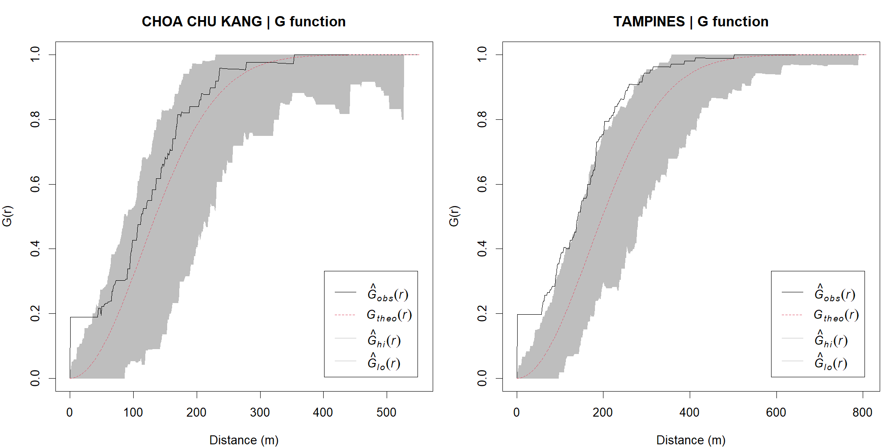
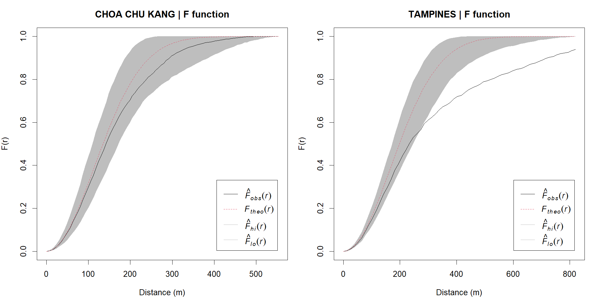
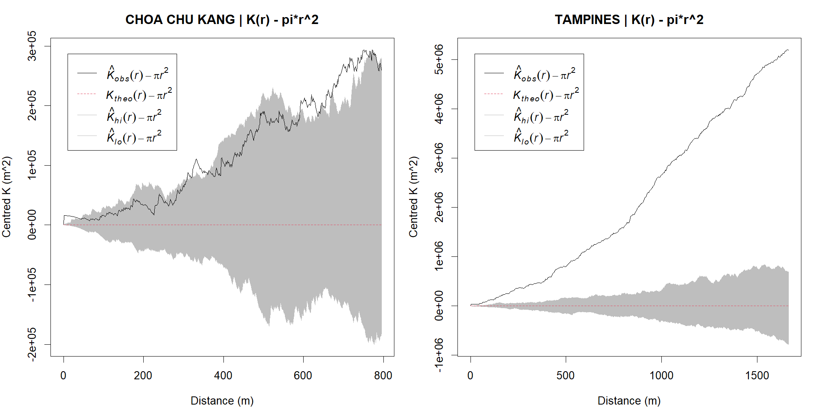
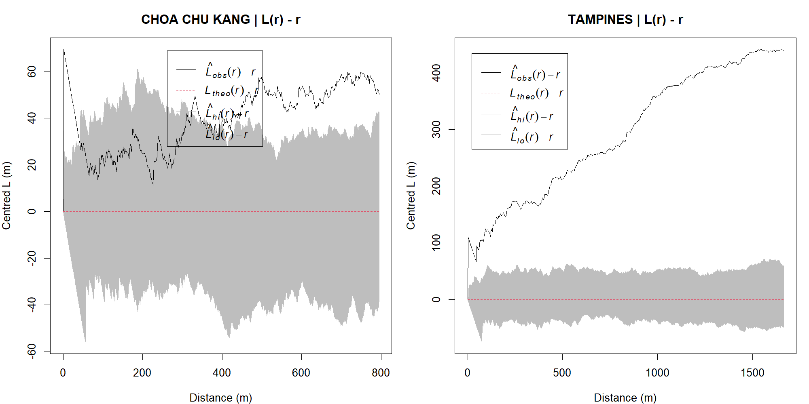

```{r}
#| include: false
source("Hands-on_Ex/Hands-on_Ex02/analysis-2b.R")
knitr::read_chunk("Hands-on_Ex/Hands-on_Ex02/analysis-2b.R")
```

## Aim and reference model

Following [Chapter 5](https://r4gdsa.netlify.app/chap05.html), I compare childcare locations in Choa Chu Kang and Tampines using G, F, K and L functions. [Exercise 2A](Hands-on_Ex02a.qmd) summarised intensity and nearest-neighbour distances. Here the question becomes distance-specific: how does the observed pattern differ from **homogeneous complete spatial randomness (CSR)** within each planning-area boundary?

G and F describe nearest-neighbour and empty-space distances; K and L describe pairwise structure over a range of distances. They are complementary summaries, not four independent confirmations of the same hypothesis. In particular, L is a transformation of K.

## Getting started: shared inputs and windows

This page runs [prepare.R](prepare.R), the same validated preparation used in Exercise 2A, before executing [analysis-2b.R](analysis-2b.R). Both original layers are transformed to EPSG:3414, invalid polygons are repaired, and the chapter's Southern Group, Western Islands and North-Eastern Islands exclusions are applied. The retained polygons define `owin` windows; childcare coordinates define `ppp` patterns. All distances on this page are **metres**.

The inputs are [ECDA Child Care Services](https://data.gov.sg/datasets/d_5d668e3f544335f8028f546827b773b4/view), covering December 2021, and [URA Master Plan 2019 Subzone Boundary (No Sea)](https://data.gov.sg/datasets/d_8594ae9ff96d0c708bc2af633048edfb/view), with September 2021 coverage. Download dates, catalogue updates and checksums are recorded in the [provenance manifest](outputs/data-manifest.csv). These historical data should not be described as current provision.

```{r}
#| echo: false
knitr::kable(area_summary |> filter(area %in% c("CHOA CHU KANG","TAMPINES")),digits=2,
 col.names=c("Planning area","Centres","Window area (km^2)","Centres/km^2"))
```

The national audit retains 1,925 centres, excludes none outside the window, and identifies 187 additional records sharing coordinates. Such records are retained, not randomly displaced or automatically deleted. Zero-distance pairs can increase short-range G, K and L, so they are part of the interpretation rather than a hidden data-cleaning choice.

## Estimating G and comparing with CSR

G(r) is the probability that a typical centre has another centre within distance r. Under homogeneous CSR, the theoretical curve is $1-\exp(-\lambda\pi r^2)$. A curve above this reference indicates an excess of short nearest-neighbour distances; one below suggests greater separation. Here G uses the reduced-sample (`rs`) edge correction, which accounts for boundary censoring by restricting usable observations at each distance.

```{r}
#| eval: false
G_cck <- Gest(patterns[["CHOA CHU KANG"]], correction="rs")
G_tampines <- Gest(patterns[["TAMPINES"]], correction="rs")
plot(G_cck)
plot(G_tampines)
```

### Simulation envelopes and the Tampines DIY comparison

Each area has its own fitted intensity and polygon window. I use 999 homogeneous Poisson simulations for G and F, and 99 for K and L, as in the chapter. Simulated counts are allowed to vary (`fix.n=FALSE` by default), rather than conditioning on the observed count. Seeds are fixed deterministically for each area/function combination.

**Implementation choice:** the workbook mixes `border`, `best`, `all` and default settings for G/F. I make the reduced-sample correction explicit for both areas and for their simulations, so the comparison uses a consistent estimator. This documented choice, along with separate fixed seeds, means the curves need not exactly reproduce the workbook screenshots.

```{r simulation-envelopes}
#| eval: false
```



[Download G comparison (PNG)](figures/envelope-G.png)

Choa Chu Kang's observed G exceeds the upper envelope at 33 evaluated positive-distance grid points, with the first and last departures at approximately 1–35 m. Tampines has 156 such grid points, spanning approximately 2–325 m. These endpoints describe the first and last departures, not necessarily one uninterrupted interval. Both patterns have excess very close neighbours, but Tampines' departure extends to longer distances in this comparison. Shared-coordinate records are especially relevant near the origin.

## Estimating F: the empty-space perspective

F(r) is the probability that an arbitrary location in the window is within distance r of a centre. It samples space rather than centres. Under homogeneous CSR its theoretical form equals G's, but the observed interpretations differ: an F curve **below** CSR indicates more empty space, which is compatible with clustering. I again use reduced-sample edge correction and 999 simulations.

```{r}
#| eval: false
F_cck <- Fest(patterns[["CHOA CHU KANG"]], correction="rs")
F_tampines <- Fest(patterns[["TAMPINES"]], correction="rs")
plot(F_cck)
plot(F_tampines)
```



Choa Chu Kang's F curve does not leave the envelope at the evaluated distances. That is a lack of detected departure for this summary, not proof of randomness. Tampines falls below the lower envelope at 43 distance values, with first and last departures around 273 and 819 m. Its combination of excess close neighbours in G and larger gaps in F is consistent with concentration in some parts of the window and relatively empty space elsewhere. Administrative land area includes land that may not plausibly host childcare centres, which makes homogeneous CSR a deliberately simple baseline.

## Estimating K: neighbours at multiple distances

K(r) expresses the expected number of other points within r of a typical point, divided by intensity. Its CSR reference is $\pi r^2$, **not r**. The isotropic (Ripley) edge correction weights pairs according to the fraction of the relevant circumference observable within the window. I plot $K(r)-\pi r^2$ so that CSR is a horizontal zero reference, with area units of m².

```{r}
#| eval: false
K_cck <- Kest(patterns[["CHOA CHU KANG"]], correction="isotropic")
K_tampines <- Kest(patterns[["TAMPINES"]], correction="isotropic")
plot(K_cck, . - pi*r^2 ~ r)
plot(K_tampines, . - pi*r^2 ~ r)
```



Choa Chu Kang exceeds the upper K envelope at 178 grid points, with first and last departures around 2 and 790 m. Tampines exceeds it at all 512 evaluated positive-distance points, out to approximately 1,665 m. The distance grids and maximum usable ranges differ between areas, so the number of crossings is not an effect-size score. At longer distances, window geometry and edge weights also deserve more caution.

## Estimating L and completing the DIY comparison

L(r) is $\sqrt{K(r)/\pi}$; plotting $L(r)-r$ puts the departure in metres. Values above zero indicate more neighbours than homogeneous CSR predicts. The same isotropic correction and 99-simulation setting are used. K and L are monotonically related, but their envelope crossings need not match exactly here because the chapter-style runs use separate simulation draws.

```{r}
#| eval: false
L_cck <- Lest(patterns[["CHOA CHU KANG"]], correction="isotropic")
L_tampines <- Lest(patterns[["TAMPINES"]], correction="isotropic")
plot(L_cck, . - r ~ r)
plot(L_tampines, . - r ~ r)
```



[Download L comparison (PNG)](figures/envelope-L.png)

Choa Chu Kang's L curve exceeds its upper envelope at 313 evaluated points, with departures extending to approximately 795 m. Tampines again exceeds the envelope throughout the positive-distance grid, up to approximately 1,665 m. The broad conclusion agrees with K: neither pattern is well summarised by a uniform Poisson process, and the Tampines curves show persistent positive departures across its plotted range. This does not identify causal attraction between centres.

## Reading the envelopes correctly

These are **pointwise**, rank-one envelopes (`global=FALSE`). At a single preselected distance, their nominal two-sided tail probability is $2/(m+1)$ for m simulations: 0.002 for 999, and 0.02 for 99, subject to ties and the fitted reference model. A one-sided Monte Carlo rank test has minimum attainable p-value $1/(m+1)$; 999 simulations therefore do not justify claiming $p<0.001$. No global p-value has been computed here.

Scanning many distances increases the chance of finding a crossing somewhere. The shaded bands must not be presented as simultaneous confidence bands. A formal whole-curve claim would need a global envelope test, chosen in advance, rather than translating the number of crossings into a p-value.

```{r}
#| echo: false
knitr::kable(summary_b |> select(area,function_name,simulations,correction,above_points,below_points,
 first_departure_m,last_departure_m),digits=1,
 col.names=c("Area","Function","Simulations","Correction","Above","Below","First (m)","Last (m)"))
```

The table counts grid evaluations, not independent tests or separate clusters. Missing endpoints mean no crossing. [Download numerical summary](outputs/envelope-summary.csv). Full observed, theoretical and envelope curves are stored as CSV files alongside it in the [GitHub outputs directory](https://github.com/yufanyou2025/ISS626-VAA/tree/master/Hands-on_Ex/Hands-on_Ex02/outputs).

## What I learned

G and F made the distinction between a centre's experience and a location's experience much clearer. A centre can have a close neighbour while large parts of its planning area remain far from any centre. Tampines illustrates that combination; Choa Chu Kang's F result shows why it is worth checking more than one summary.

K and L add scale, but L does not provide independent evidence just because the vertical axis is easier to read. Correctly centring K by $\pi r^2$ and L by r matters more than a visually dramatic curve.

The strongest limitation is the reference model. Centres follow housing, land use and planning decisions, so spatially varying intensity can produce apparent second-order clustering even without interaction between facilities. An inhomogeneous analysis, a duplicate-location sensitivity check and a residential-land window would be useful extensions, but they are not silently substituted for the chapter's CSR exercise here.

Finally, more centres or stronger clustering does not establish adequate service. Capacity, children of eligible ages, waiting lists, cost and network travel times are absent. These results describe locations in historical public data, not causal behaviour or current childcare access.

## Reproducibility and references

- [Workbook Chapter 5](https://r4gdsa.netlify.app/chap05.html), accessed 17 September 2026; [Chapter 4 preparation](https://r4gdsa.netlify.app/chap04.html).
- [Shared preparation](prepare.R), [second-order analysis](analysis-2b.R), [reproduction instructions](README.md), and [R session information](outputs/session-info.txt).
- [Exercise 2A](Hands-on_Ex02a.qmd) contains the location maps, geometry audit and first-order analysis.
