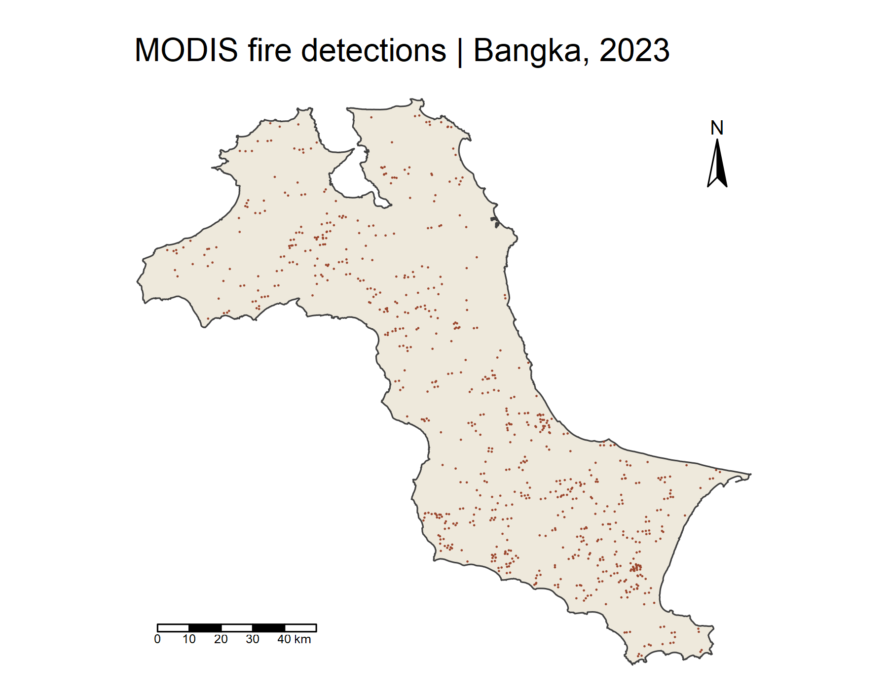
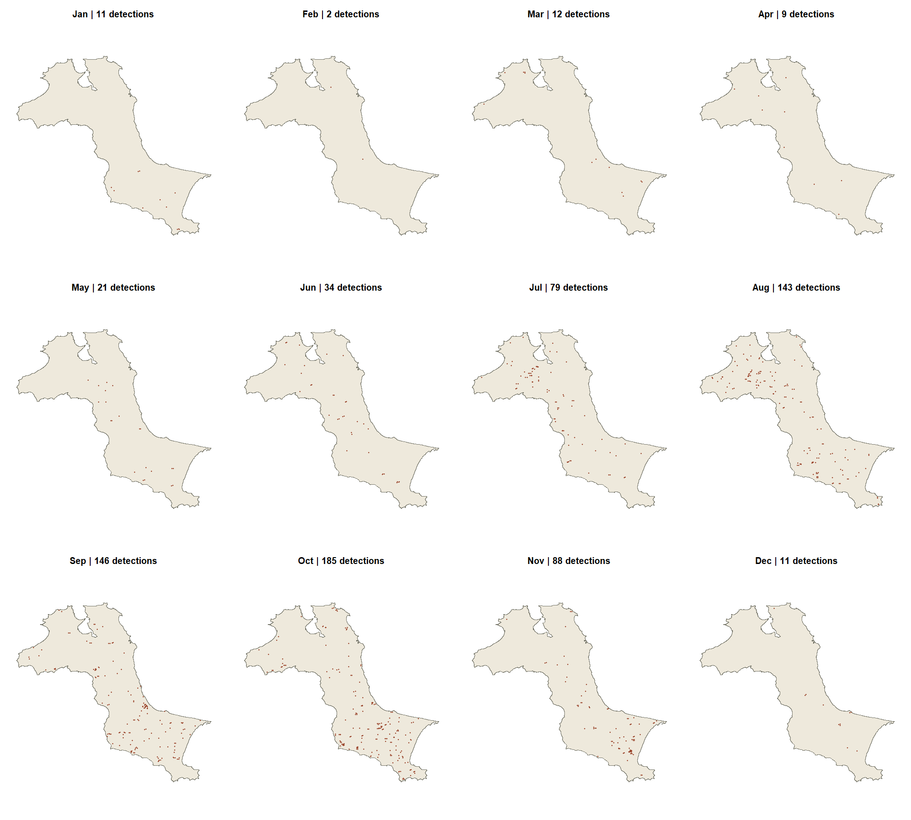
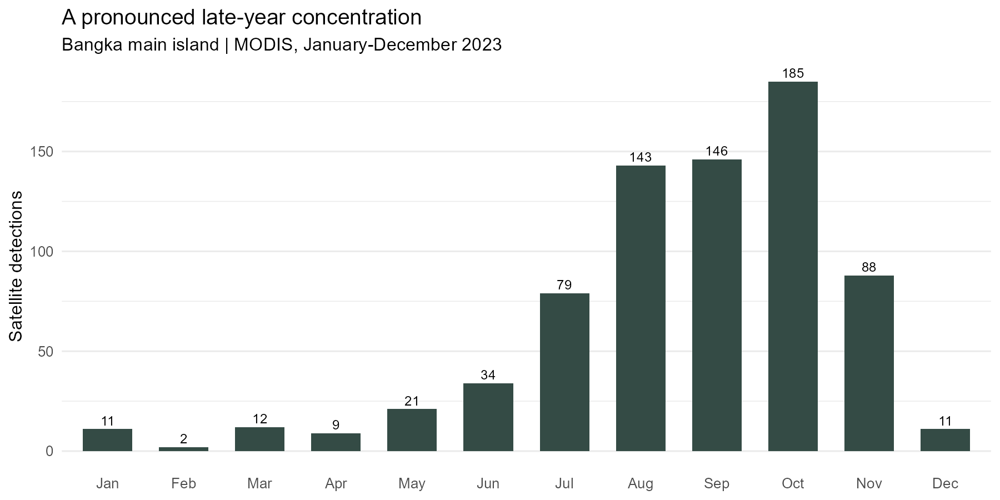
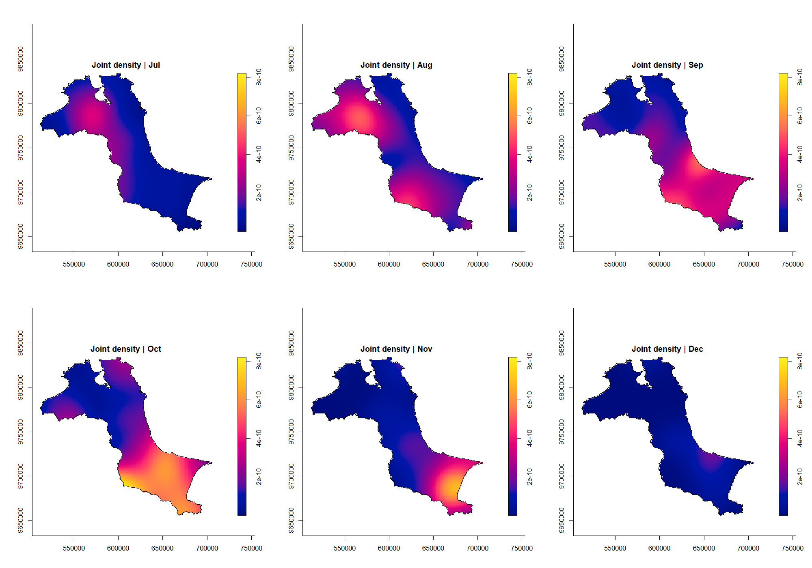
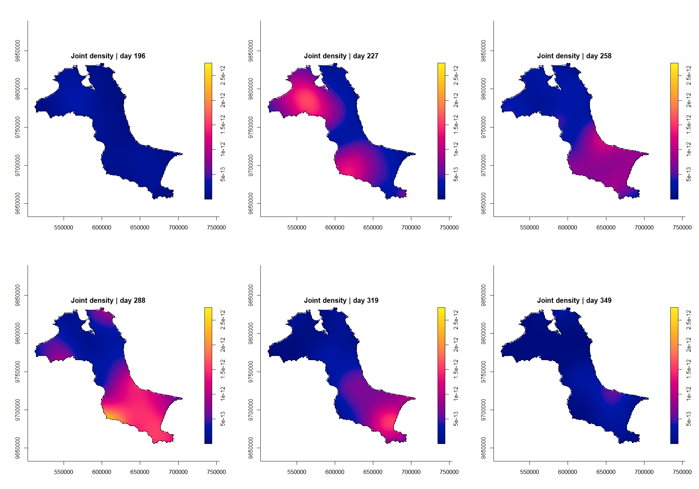
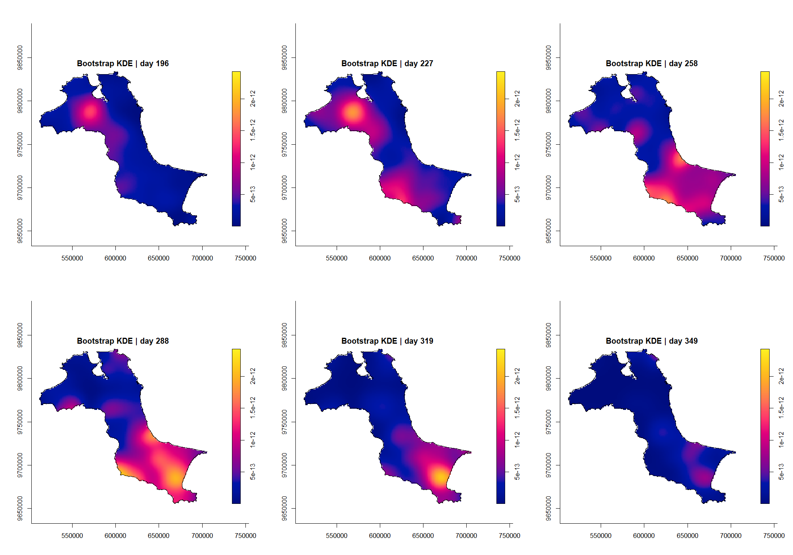
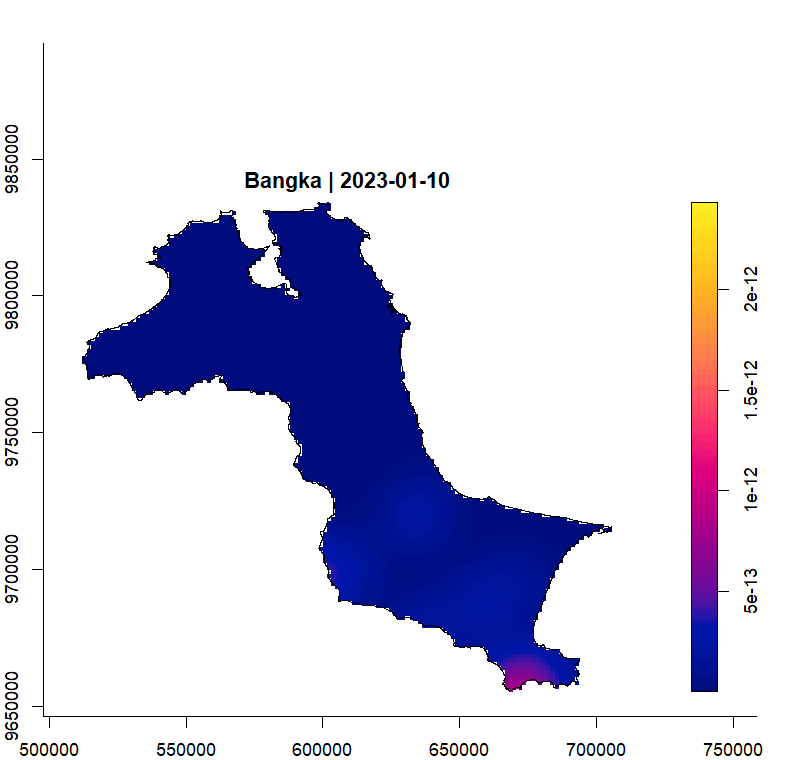
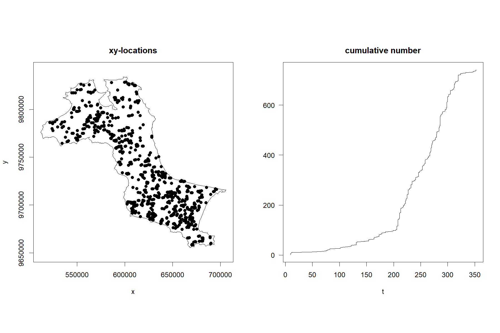
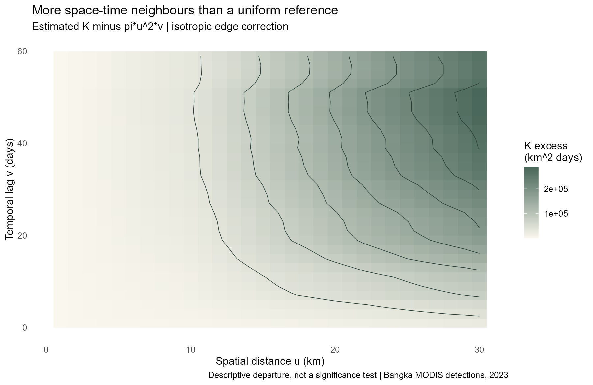

```{r}
#| include: false
source("Hands-on_Ex/Hands-on_Ex03/analysis.R")
knitr::read_chunk("Hands-on_Ex/Hands-on_Ex03/prepare.R")
knitr::read_chunk("Hands-on_Ex/Hands-on_Ex03/analysis.R")
```

## Overview and research questions

An annual map can show where fire detections are concentrated, but it hides whether those concentrations occurred together or months apart. Following [Workbook Chapter 6](https://r4gdsa.netlify.app/chap06), this exercise introduces time as a third dimension: location is represented by projected x and y coordinates, and acquisition date by month or day of year.

I examine three questions: when detections were most frequent, how the estimated spatial distribution changes through the year, and how observed space-time neighbourhoods compare with a homogeneous Poisson reference. The density maps are descriptive. The K-function is also interpreted cautiously: the chapter does not supply a simulation-based test of independence.

## Data and packages

The fire observations come directly from [NASA FIRMS' 2023 MODIS Indonesia country file](https://firms.modaps.eosdis.nasa.gov/data/country/modis/2023/modis_2023_Indonesia.csv), accessed on 18 September 2026. There are 52,156 country-wide records before clipping. These are satellite active-fire/thermal-anomaly detections, not a catalogue of unique forest-fire incidents or burned area. Repeated satellite observations can describe the same continuing fire, and detection depends on overpass timing, cloud cover and sensor resolution.

The boundary originates from the [Indonesia Geospatial administrative-boundary dataset cited by the workbook](https://www.indonesia-geospasial.com/2023/05/download-shapefile-batas-administrasi.html). I use its province extract from a [pinned public data mirror](https://github.com/Hungthq/ISSS626-GAA/tree/f7a95396d1088cb7356e3677a574ef20c28b62a0/data/geospatial), rather than downloading the much larger national archive. Only the boundary data are reused; this analysis and its interpretations are developed here. Boundary attributes identify a December 2022 compilation, with underlying delineation labels referring to 2019. The [download manifest](outputs/data-manifest.csv) records the exact URLs, access date and checksums; it does not imply that the boundary was surveyed on the download date.

The R workflow uses `sf`, `spatstat.geom`, `sparr`, `stpp`, `tmap`, `dplyr`, `readr` and `lubridate`. `ggplot2` draws the count chart and `magick` exports the animation. [prepare.R](prepare.R) downloads and checks the inputs, while [analysis.R](analysis.R) computes the results. [Reproduction instructions](README.md) and [session versions](outputs/session-info.txt) are available for rerunning the work.

## Preparing the study area

### A geographical clarification

Although the chapter names the province of Kepulauan Bangka Belitung, its displayed extent and 297 subdistricts cover **Bangka's main island**, not the separate island of Belitung. I reproduce that window explicitly: exclude the Belitung regencies, dissolve the remaining boundaries, and retain the largest connected polygon. The resulting area is approximately `r format(round(area.owin(window)/1e6),big.mark=",")` km². Offshore polygons are not silently treated as part of the study.

The boundary is stripped of unused Z coordinates, repaired where necessary, and transformed to WGS 84 / UTM zone 48S (EPSG:32748). Metres are appropriate for the spatial distances used below. `as.owin()` turns the polygon into the observation window required by `spatstat`.

```{r prepare-study}
#| eval: false
```

## Preparing the fire observations

Longitude and latitude are first declared as WGS84 coordinates and then transformed—not merely relabelled—to EPSG:32748. I restrict acquisition dates to 2023 and retain detections intersecting the island polygon. `Month_num` gives the month and `DayofYear` counts days from 1 January.

```{r}
#| echo: false
knitr::kable(audit,digits=2,col.names=c("Check","Result"))
```

The 741 retained detections match the workbook's reported sample. There are no repeated XY coordinates or repeated XY-day combinations in this extract. The 51,415 exclusions are country-wide detections outside this island, not missing or invalid fire records. A detection remains an observation of a thermal anomaly; absence of exact duplicate coordinates does not establish that each observation represents a different fire.

## Visualising the fire points

### Overall distribution

```{r locations}
#| eval: false
```

{fig-alt="Map of Bangka island with 741 MODIS detection locations."}

[Download the location map (PNG)](figures/fire-locations.png)

### Monthly distribution

{fig-alt="Twelve monthly maps of detection locations on the same Bangka boundary."}

{fig-alt="Bar chart showing October as the peak month with 185 detections."}

October records 185 detections, compared with only two in February. August–November together account for `r round(100*results$autumn_share,1)`% of the annual total. That concentration is visible in the monthly panels, but the data alone do not explain its cause. Weather, land use, burning practices and observation conditions are plausible influences that would require additional evidence.

```{r}
#| echo: false
knitr::kable(monthly |> select(month_name,count),col.names=c("Month","Detections"))
```

## Computing space-time KDE by month

A marked `ppp` combines projected locations with numerical month marks. Clipping it to the island window avoids treating the sea inside the bounding rectangle as observable land. `sparr::spattemp.density()` smooths both the spatial and temporal dimensions, with uniform spatial and temporal edge correction.

```{r monthly-kde}
#| eval: false
```

{fig-alt="Six joint-density maps for July through December, with a fixed shared density range."}

These are **joint probability-density** surfaces, with units of 1/(m² × month), not counts per month. Multiplying by 741 would convert them to estimated event intensity under this model. The common colour range supports comparisons across panels. Month numbers are coarse time measurements: the default temporal selector may choose a very narrow bandwidth when many observations share an integer month. Such a result should not be interpreted as precise evidence about changes within a month.

## Computing KDE by day of year

```{r daily-kde}
#| eval: false
```

{fig-alt="Default daily KDE slices at days 196, 227, 258, 288, 319 and 349."}

Day-of-year marks retain more timing information than month marks. The default spatial bandwidth is an oversmoothing choice, while the default temporal bandwidth uses the Sheather–Jones rule. Here the observed day range is `r results$day_range[1]`–`r results$day_range[2]`. To reproduce the chapter's KDE, its default temporal limits follow that observed range. This is different from saying that the actual observation campaign began and ended on those dates: the source covers the whole year.

The plotted slices use identical dates in the next comparison. Density units are now 1/(m² × day), so their numerical legends should not be compared directly with the month-based legend. A visually higher peak can reflect a narrower bandwidth rather than more underlying observations.

## Improved day-based KDE: bandwidth selection

```{r bootstrap-bandwidth}
#| eval: false
```

`BOOT.spattemp()` jointly selects spatial and temporal bandwidths by minimising a bootstrap approximation to integrated squared error. Despite its name, the implementation exploits Gaussian-kernel theory and does not require repeatedly resampling the observations. The seed is fixed for reproducibility. I use the returned bandwidths directly rather than substituting the workbook's rounded 9,000 m and 19-day settings.

```{r}
#| echo: false
knitr::kable(bandwidths,digits=3,col.names=c("Method","Spatial bandwidth (m)","Temporal bandwidth","Time unit"))
```

{fig-alt="Six daily KDE slices computed with bootstrap-selected space and time bandwidths."}

[Download the comparison figure (PNG)](figures/improved-kde.png)

The July and August slices show a prominent north-western concentration. By October, stronger density is visible in the southern part of the island, while the November slice retains a more localised south-eastern concentration. December is subdued on the same colour scale. This changing geography is information that an annual point map and a monthly total cannot show separately. It describes a shift in the distribution of observations, not the movement of one fire across the island.

The selected spatial bandwidth is `r round(improved$h)` m, compared with `r round(day_kde$h)` m under the default rule; the temporal bandwidth is `r round(improved$lambda,2)` days, compared with `r round(day_kde$lambda,2)`. This changes the balance between spatial detail and temporal continuity. “Improved” refers to the bandwidth-selection criterion, not proof that the estimated surface equals the true fire process.

### Watching the pattern change

{fig-alt="Animation of the bootstrap KDE through the observed dates of 2023."}

The animation samples every seven days from the daily estimate to keep the page manageable. The analysis still evaluates every integer day in the observed interval; the animation is a display choice, not a change in the underlying data. [Download animation](figures/daily-kde.gif).

## Space-time point-pattern analysis with stpp

### Preparing the space-time object

`as.3dpoints()` combines x, y and integer day-of-year into a space-time point-pattern object. Dates are kept at daily precision rather than inventing an ordering within a day. This is particularly important when interpreting the `infectious=TRUE` setting, which considers future-event neighbourhoods: it is a computational definition, not evidence that one fire transmitted to another.

{fig-alt="Spatial locations alongside the cumulative count of 741 detections by day of year."}

### Computing the space-time K-function

```{r space-time-k}
#| eval: false
```

I use the full year, `t.region=c(1,365)`. The chapter's example of `c(150,250)` does not contain all the observations and cannot represent this full-year analysis. The spatial window for pairwise edge correction uses a documented coastal approximation: a 100-metre buffer followed by 100-metre simplification, retaining its exterior ring. All 741 points must remain inside it. This keeps the pairwise calculation tractable; the KDEs retain the original detailed island window. The resulting area difference is reported below, and coastal results remain sensitive to this approximation.

```{r}
#| echo: false
knitr::kable(k_audit,digits=3,col.names=c("Original area (km^2)","K window (km^2)","Area change (%)","Vertices","Retained points"))
```

The `STIKhat` name can be misleading here: **without a supplied `lambda` vector, the function uses a constant-intensity estimate**. This reproduces the chapter's homogeneous-reference calculation; it is not an intensity-adjusted test. I evaluate spatial distances of 1–30 km and temporal lags of 1–59 days, with isotropic edge correction.

{fig-alt="Contour plot of estimated space-time K minus its homogeneous Poisson reference."}

The labelled display converts spatial distances to kilometres and the centred K values to km²-days for readability; it does not change the calculation. The [workbook-style contour output](figures/workbook-k-contour.png) is also available.

### Interpreting the surface

For the future-event convention, the reference is $\pi u^2v$, where u is spatial distance and v is temporal lag. In the installed `stpp` implementation, `plotK(L=TRUE)` displays $\widehat K(u,v)-\pi u^2v$; it is **not** the square-root L transformation used in the previous spatial-only exercise. Positive contours indicate more space-time neighbours than the homogeneous Poisson reference at that combination of scales.

Across the evaluated grid, the observed/reference ratio ranges from `r round(results$k_ratio_range[1],2)` to `r round(results$k_ratio_range[2],2)`. These are descriptive ratios, not p-values. The [numeric ratio surface](outputs/k-ratio.csv) makes the comparison inspectable. Strong seasonality and spatially uneven intensity can produce departures even without causal interaction between distinct fires. No simulation envelope or global independence test is computed in this chapter workflow, so I do not label the contours statistically significant.

## What I learned

The count chart and density maps answer different questions. October's high count is a direct description of the records. A bright KDE peak also depends on how much smoothing has been applied across space and time. Comparing the selected bandwidths made that distinction concrete.

The study window is part of the analysis, not simply a map background. The workbook's province label initially suggests a larger region than its example actually uses. Matching the 297 subdistricts and 741 observations required checking the geographical extent, not just the filename. Time needs the same care: a K-function window must contain the events being analysed.

Finally, a satellite detection is not the same thing as an independent incident. Neither a concentration of detections nor a positive K departure proves that fires caused neighbouring fires. A stronger investigation would combine observation conditions and land cover with a spatially and temporally varying intensity model, then use simulation-based inference and bandwidth/window sensitivity checks. The present results identify patterns worth investigating; they do not establish causes or quantify financial losses.

## Reproducibility and references

- [Workbook Chapter 6](https://r4gdsa.netlify.app/chap06), accessed 18 September 2026.
- [NASA FIRMS](https://firms.modaps.eosdis.nasa.gov/), MODIS Collection 6.1, 2023 country archive.
- [sparr density documentation](https://tilmandavies.github.io/sparr/reference/spattemp.density.html) and [bootstrap selector](https://tilmandavies.github.io/sparr/reference/BOOT.spattemp.html).
- [stpp package documentation](https://cran.r-project.org/web/packages/stpp/stpp.pdf).
- [Source project](https://github.com/yufanyou2025/ISS626-VAA/tree/master/Hands-on_Ex/Hands-on_Ex03), [download manifest](outputs/data-manifest.csv), [validation audit](outputs/audit.csv), and [monthly counts](outputs/monthly-counts.csv).
