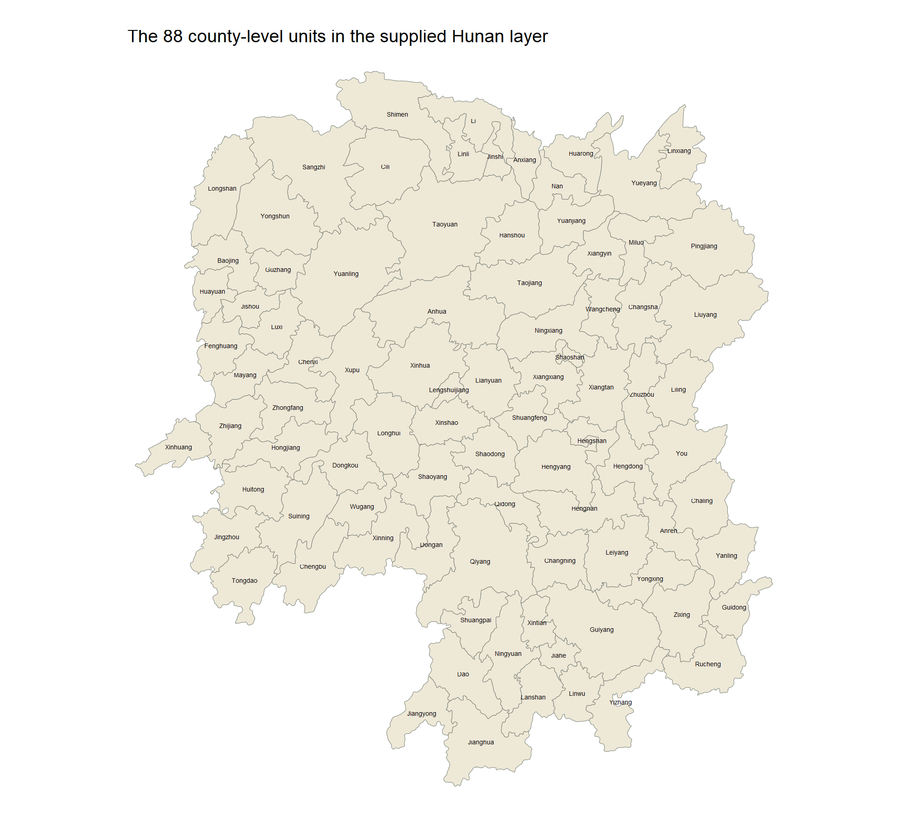
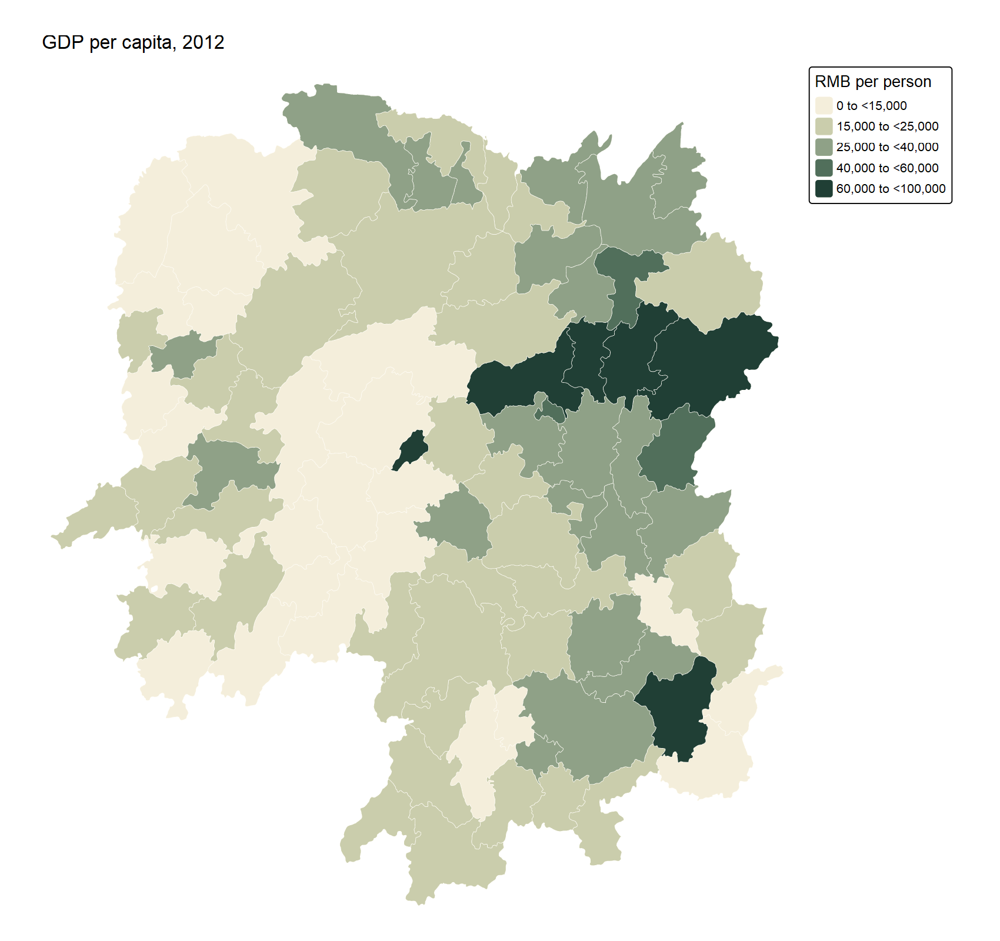
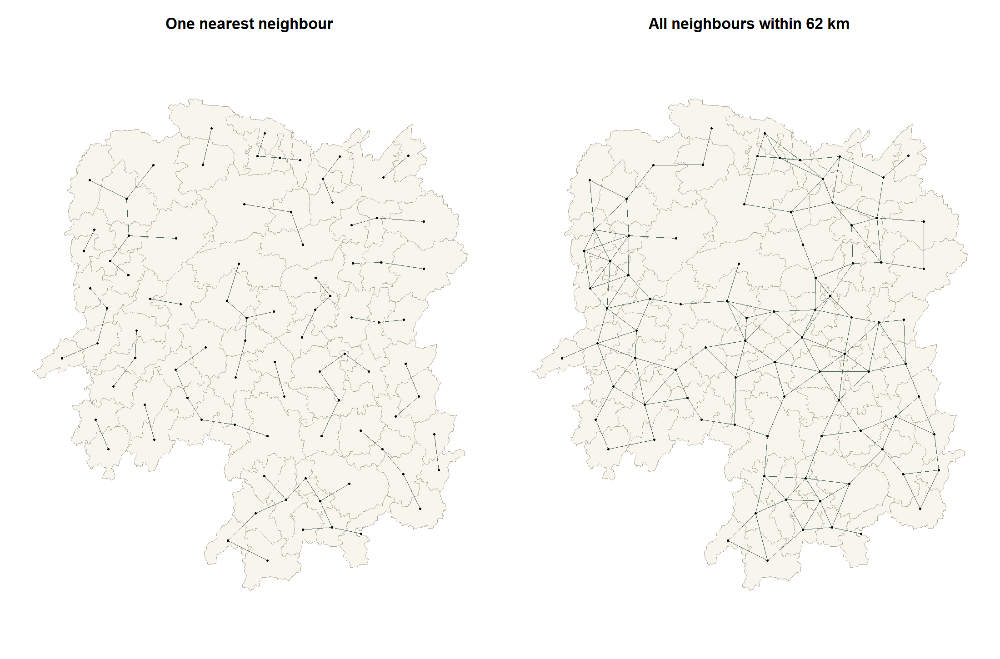
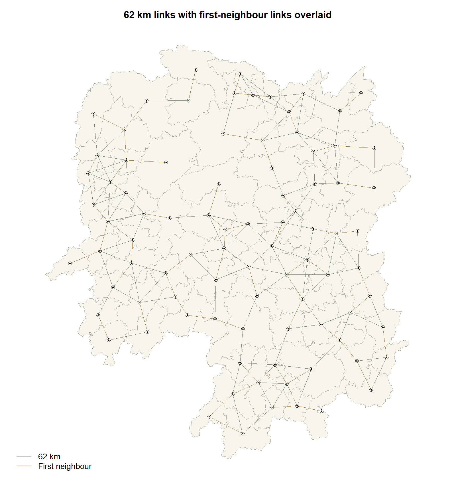
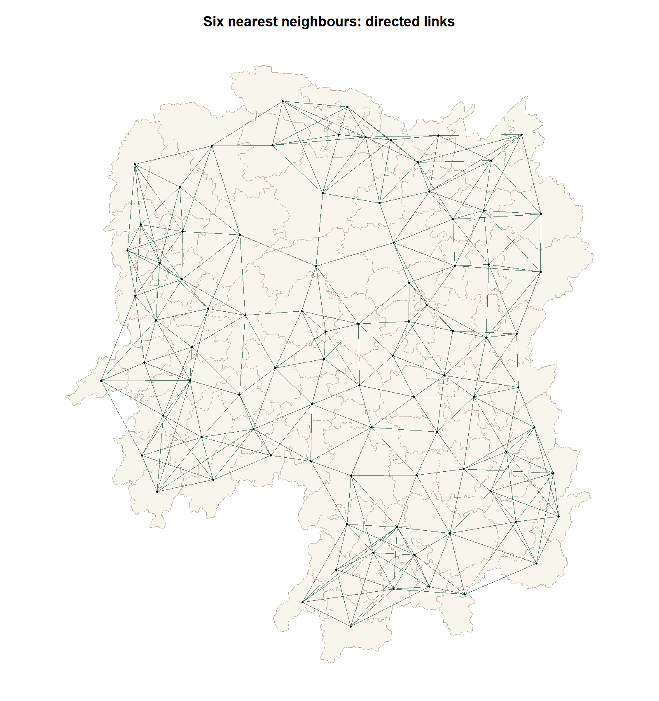
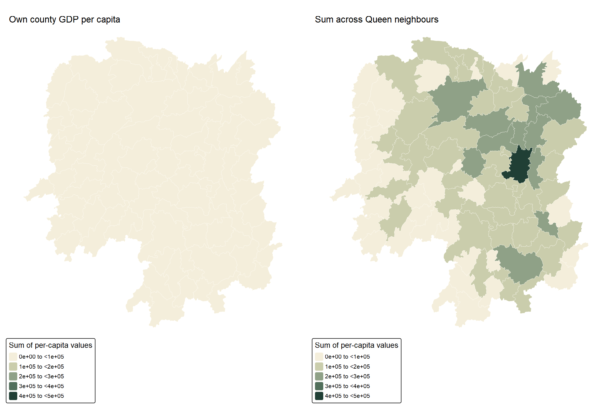
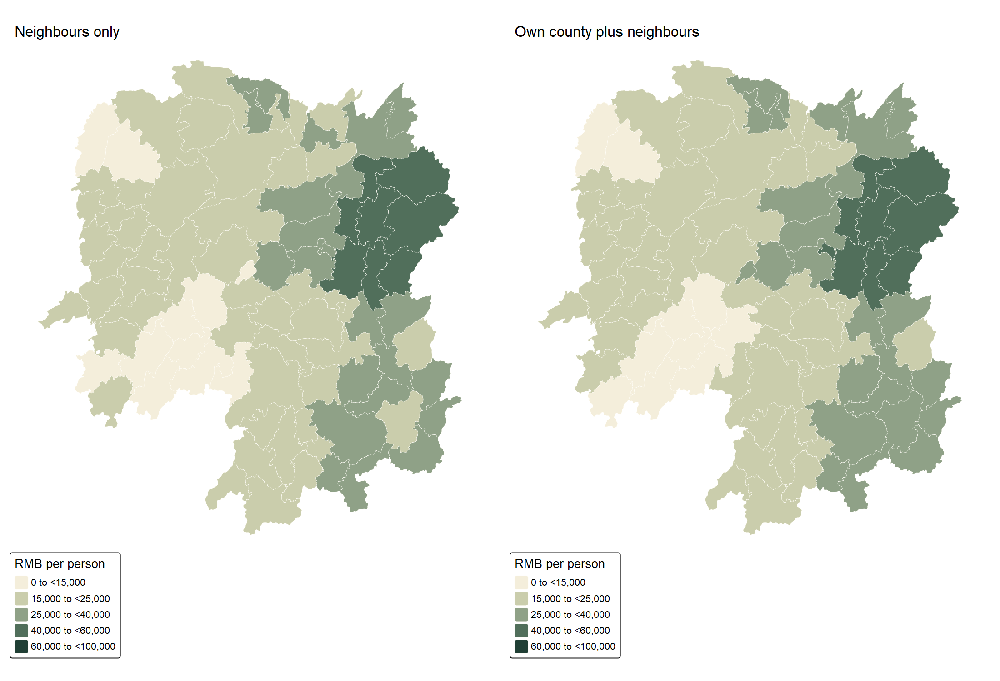
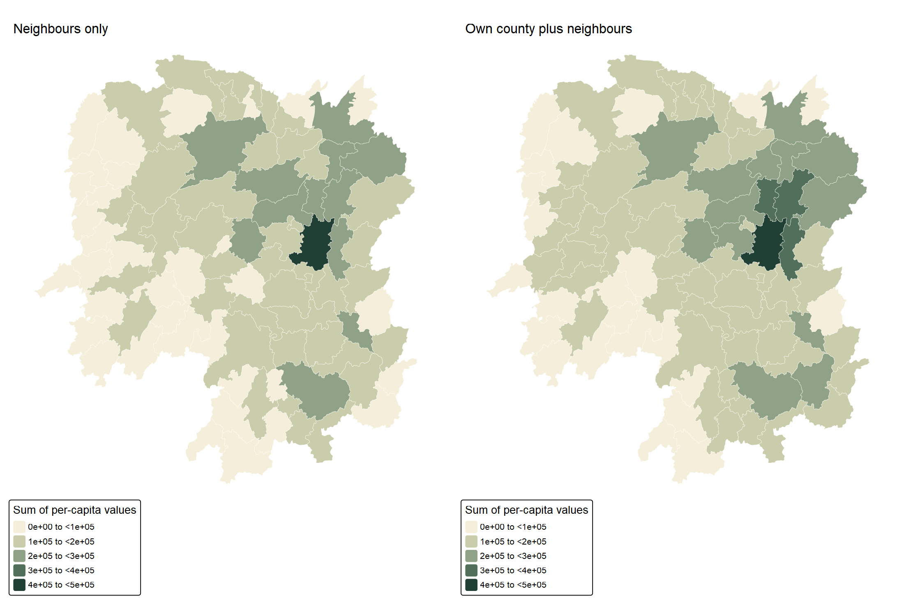
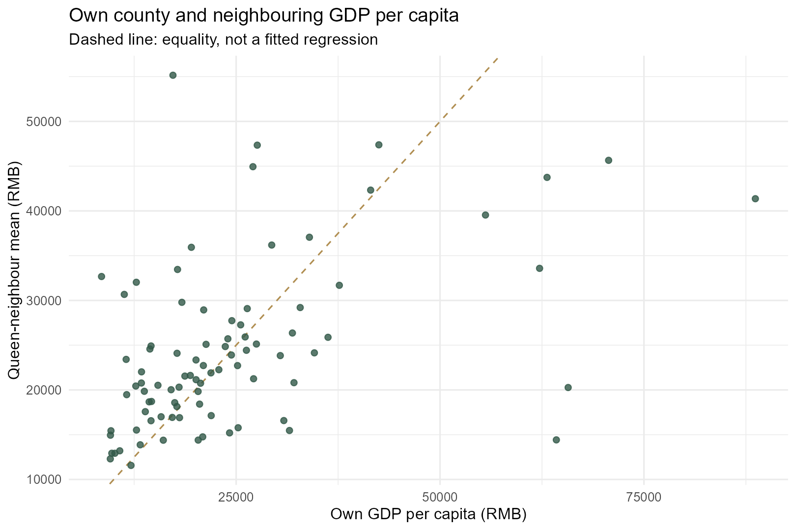

```{r}
#| include: false
source("Hands-on_Ex/Hands-on_Ex04/analysis.R")
knitr::read_chunk("Hands-on_Ex/Hands-on_Ex04/prepare.R")
knitr::read_chunk("Hands-on_Ex/Hands-on_Ex04/analysis.R")
fmt4 <- function(x,digits=1) format(round(x,digits),big.mark=",",trim=TRUE,nsmall=digits)
```

## Overview

A county's GDP per capita can look quite different when it is compared with neighbouring counties rather than with the province as a whole. But “neighbouring” needs a rule. Sharing a boundary, lying within a fixed distance and belonging to the nearest six counties produce different comparison groups.

Following [Chapter 8 of the workbook](https://r4gdsa.netlify.app/chap08.html), I build these relationships and use them to calculate neighbourhood summaries of Hunan's 2012 GDP per capita. The aim is to understand what each weight matrix measures before using it in a statistical model. These are descriptive comparisons, not tests of economic spillovers or causal effects.

## Study area and supplied data

The supplied archive, `data（Spatio-Temporal Point Patterns Analysis）.zip`, contains the Hunan county shapefile, `Hunan_2012.csv` and `Dictionary.xlsx`. Its filename refers to another topic, but the contents match Chapter 8. No replacement data were downloaded.

The study uses the **88 county-level units present in this teaching extract**. It should not be treated as a complete contemporary inventory of all Hunan administrative units. The dictionary identifies GDPPC as gross domestic product per capita, measured in RMB; the CSV is the 2012 cross-section. GDP per capita is neither household income nor total GDP. The original statistical publisher and boundary vintage are not established by the supplied metadata, so I do not assign them an invented date or provenance.

The files were inspected on 19 September 2026. Their [checksums](outputs/input-checksums.csv), [validation audit](outputs/input-audit.csv) and [GDPPC dictionary entry](outputs/gdppc-definition.csv) are retained. Raw inputs stay local; reproduction requires the supplied ZIP. [Reproduction instructions](README.md) explain how to point R to it.

### Packages

The workflow uses `sf`, `spdep`, `tmap`, `dplyr`, `readr`, `readxl` and `ggplot2`. Quarto and `knitr` assemble the page. Package versions are recorded in [session information](outputs/session-info.txt). All calculations and figures are rebuilt in a fresh R session, with no analytical cache.

## Bringing the data into R

### Import and relational join

The shapefile supplies geometry and county identifiers. The CSV supplies the economic variables. I join explicitly on `County`, check that keys are unique in both sources, and require a one-to-one match. This avoids an accidental join on every similarly named field. Polygon order is preserved because neighbour indices and lag vectors must refer to the same counties throughout.

```{r import-and-join}
#| eval: false
```

```{r}
#| echo: false
knitr::kable(audit4,col.names=c("Validation check","Result"))
```

Every county matches, and no GDPPC value is missing. The supplied geometries are valid and use WGS84 (EPSG:4326), so no repair or row deletion is needed.

## Visualising the regional development indicator

{fig-alt="Labelled map of the 88 county-level polygons in the Hunan teaching dataset."}

{fig-alt="Choropleth of 2012 Hunan county GDP per capita using five fixed intervals."}

The highest value in this extract belongs to `r hunan$County[which.max(hunan$GDPPC)]`, at RMB `r fmt4(max(hunan$GDPPC),0)` per person. The darker counties are concentrated around the eastern part of the map, with additional high-valued counties further south. The county labelled Changsha is the county-level unit in this file, not automatically the whole prefecture-level city.

All mean-based comparisons below use the same five intervals and colours. That matters: independently classifying each map could make a smoothed neighbourhood mean appear just as variable as the original observations.

## Contiguity-based neighbours

### Queen and Rook definitions

Queen contiguity accepts a shared edge or vertex. Rook contiguity requires a shared boundary segment. Both use the supplied polygon topology rather than centroid distance.

```{r contiguity}
#| eval: false
```

{fig-alt="Side-by-side Queen and Rook connectivity maps, showing similar but not identical networks."}

Queen produces 448 directed neighbour entries and Rook produces 440. Since both graphs are symmetric, these represent 224 and 220 unique undirected pairs. Queen therefore adds four pairs that Rook does not recognise. Both graphs form one connected component and neither has an isolated county.

Under Queen contiguity, `r hunan$County[which.max(card(queen))]` has the most neighbours (`r max(card(queen))`). `r paste(hunan$County[card(queen)==min(card(queen))],collapse=" and ")` each have only `r min(card(queen))`. These different neighbour counts will matter when interpreting sums and averages.

### Inspecting Anxiang's neighbours

```{r}
queen[[anxiang]]
hunan$County[queen[[anxiang]]]
```

Anxiang has five Queen neighbours. The distance columns below use the centroid method explained in the next section; distance changes the IDW weights, but does not determine whether a county enters this Queen list.

```{r}
#| echo: false
knitr::kable(anxiang_neighbours |> select(County,GDPPC,distance_km,equal_weight),digits=c(0,0,2,2),
 col.names=c("Neighbour","GDPPC (RMB)","Centroid distance (km)","Equal weight"))
```

## Distance-based neighbours

### Centroids, units and cut-off distance

I calculate centroids after transforming the polygons to UTM zone 49N (EPSG:32649), then transform those points back to WGS84. Both nearest-neighbour selection and distance measurement explicitly use `longlat=TRUE`, giving great-circle distances in kilometres. These are representative-point distances, not road distances or minimum distances between county boundaries.

```{r centroids-and-distance}
#| eval: false
```

The longest first-neighbour distance is `r fmt4(max(nearest_dist),2)` km. Rounding upward gives `r threshold_km` km, supporting the chapter's 62-km threshold without leaving any county isolated. This guarantees at least one neighbour, **not** that the whole graph must be connected; connectivity is checked separately.

### Fixed-distance neighbours and the chapter quiz

{fig-alt="Maps comparing the one-nearest-neighbour graph and the fixed 62-kilometre graph."}

{fig-alt="Grey 62-kilometre links and gold first-neighbour links on Hunan county boundaries."}

The quiz's “average number of links” is the total number of directed neighbour entries divided by the number of counties: **324 / 88 = 3.6818**. It is not an average distance. Here the 62-km graph has one connected component, whereas the one-nearest-neighbour graph has 24 weakly connected components despite every county selecting one neighbour.

### Adaptive distance: six nearest neighbours

{fig-alt="Directed six-nearest-neighbour graph over Hunan county polygons."}

Each county selects exactly six neighbours, giving 528 directed entries. This controls the number of comparisons, but allows the search distance to expand where centroids are sparse. A selection need not be reciprocal: county A can select B without B selecting A. Taking the symmetric union increases the graph to 614 entries and allows some counties to have more than six neighbours.

```{r}
#| echo: false
knitr::kable(graph_summary,digits=2,col.names=c("Definition","Directed entries","Mean degree","Min","Max","Isolates","Weak components","Symmetric"))
```

The [county-level degree table](outputs/degree_table.csv) provides each county's neighbour counts and 62-km component identifier.

### Checking the workbook's coordinate convention

The chapter obtains centroids directly from longitude/latitude geometries and calls `knearneigh()` on a coordinate matrix without specifying `longlat=TRUE`. I retain that version as a sensitivity check, not as the primary distance calculation. Relative to it, my consistent projected-centroid/great-circle approach replaces 17 directed six-neighbour links. The 62-km graph is unchanged. This comparison changes both centroid construction and distance metric, so it does not attribute the difference to either one alone.

[Download the sensitivity comparison](outputs/sensitivity4.csv). The API's kilometre and great-circle conventions are documented in [knearneigh](https://r-spatial.github.io/spdep/reference/knearneigh.html) and [dnearneigh](https://r-spatial.github.io/spdep/reference/dnearneigh.html).

## Inverse-distance weights

For the existing Queen neighbours, I calculate $a_{ij}=1/d_{ij}$, where distance is in kilometres. A nearby Queen neighbour receives a larger weight, but a non-Queen county remains excluded even if its centroid is relatively close. No centroid pairs coincide, so the reciprocal is finite.

```{r inverse-distance}
#| eval: false
```

```{r}
#| echo: false
knitr::kable(anxiang_neighbours |> select(County,distance_km,raw_idw,normalised_idw),digits=c(0,2,4,4),
 col.names=c("Neighbour","Distance (km)","Raw weight (1/km)","Normalised weight"))
```

For Anxiang, nearby Jinshi receives about 34.9% of the normalised inverse-distance weight, compared with 20% under equal weighting. Taoyuan receives about 10.2%. The resulting IDW neighbour mean is RMB `r fmt4(hunan$idw_average[anxiang])`, higher than the equally weighted mean because higher-valued Jinshi gets more influence.

## Row-standardised weights

```{r row-standardisation}
#| eval: false
```

For equal Queen weights, row standardisation sets each neighbour's weight to $1/n_i$. Anxiang's five weights are 0.2 each. County row 10 (`r hunan$County[10]`) has eight neighbours and therefore eight weights of 0.125. This is the row used in the chapter's eight-neighbour example; it is not the first polygon.

The chapter's `glist=ids, style="B"` calculation retains the supplied raw reciprocal-distance weights. It does **not** normalise their row sums. I show that version as `IDW_raw`, then use `style="W"` for the normalised IDW comparison. The [spdep weights documentation](https://r-spatial.github.io/spdep/reference/nb2listw.html) distinguishes these coding schemes.

```{r}
#| echo: false
knitr::kable(weight_audit,digits=4,col.names=c("Weight scheme","Smallest row sum","Largest row sum"))
```

I use `zero.policy=FALSE` because these analysis graphs have no isolates. A future isolated county should trigger investigation rather than silently receive a zero GDPPC lag. Neither binary weighting nor normalisation automatically corrects boundary effects: counties near the edge still lack comparisons with omitted areas outside the extract. Also, row-standardised weights need not be symmetric even when the underlying neighbour relation is symmetric.

## Applying the spatial weights

Let $x_i$ be county i's GDP per capita, $N_i$ its Queen-neighbour set, and $n_i$ the number of neighbours. The four requested measures have different meanings:

| Measure | Calculation | Includes own county? |
|---|---|---|
| Neighbour mean | $\sum_{j\in N_i}x_j/n_i$ | No |
| Neighbour sum | $\sum_{j\in N_i}x_j$ | No |
| Window mean | $(x_i+\sum_{j\in N_i}x_j)/(n_i+1)$ | Yes |
| Window sum | $x_i+\sum_{j\in N_i}x_j$ | Yes |

These means give each county equal influence, not each resident. Summing county per-capita ratios does not produce total GDP; calculating an aggregate economic measure would require compatible GDP and population denominators.

### Spatial lag with row-standardised weights

```{r lag-average}
#| eval: false
```

For Anxiang, the five neighbouring GDPPC values sum to 124,236. Dividing by five gives **24,847.2 RMB per person**. This is the chapter question's interpretation of the row-standardised lag: it describes the comparison group, not Anxiang's own GDPPC of 23,667.

{fig-alt="Matched-scale comparison of own-county GDP per capita and equally weighted Queen-neighbour GDP per capita."}

[Download this figure for submission (PNG)](figures/lag-average.png)

The sharp local contrast around Lengshuijiang illustrates what smoothing can conceal. Its own GDPPC is 64,257, while its three neighbours average only 14,419.3. A neighbourhood mean is useful context, but it should not replace the original value when assessing that county.

### Spatial lag as a sum

```{r lag-sum}
#| eval: false
```

{fig-alt="Own-county GDP per capita compared with the unnormalised sum across Queen neighbours."}

The second chapter question can now be answered directly: a binary-weight lag adds the five values without dividing, so Anxiang's lag sum is **124,236**. Larger sums can reflect more neighbours rather than richer neighbours. In particular, these numbers are sums of per-capita values, not regional output totals. The shared sum-scale legend deliberately makes the original values appear smaller.

### Spatial window average

```{r window-average}
#| eval: false
```

{fig-alt="Comparison of neighbour-only and self-inclusive equally weighted GDP-per-capita averages."}

Including Anxiang gives $(124236+23667)/6=24650.5$. Its own value is below its neighbours' mean, so the window mean moves down. For Lengshuijiang, including the much higher own-county value raises the mean from 14,419.3 to 26,878.8. The change depends on both the local contrast and the number of neighbours.

### Spatial window sum

```{r window-sum}
#| eval: false
```

{fig-alt="Matched-scale maps of neighbouring per-capita sums and sums including the focal county."}

Anxiang's window sum is **147,903**, exactly its neighbour sum plus 23,667. The scripts check this identity for every county, as well as the corresponding mean identities. [Download all 88 county results](outputs/results4.csv) or the [R weights and results object](outputs/weights-and-results.rds).

### Looking at the largest local contrasts

```{r}
#| echo: false
knitr::kable(top_differences |> select(County,GDPPC,lag_average,neighbours,difference),digits=1,
 col.names=c("County","Own GDPPC","Neighbour mean","Neighbours","Own minus mean"))
```

Pingjiang shows the opposite pattern to Lengshuijiang: 17,252 locally versus a neighbour mean of 55,157.8. A county may therefore sit near relatively prosperous counties without sharing their observed GDP per capita. This is a reason to inspect local contrasts, not evidence that neighbouring prosperity caused or failed to cause a particular outcome.

{fig-alt="Scatterplot of county GDP per capita versus neighbour mean, with an equality reference line."}

No Moran's I test or spatial regression is performed here. Visual resemblance and a plotted spatial lag do not establish statistically significant autocorrelation. Those questions require an explicitly chosen weights matrix and a suitable inferential method.

## What I learned

The definition of a peer group is an analytical choice. Queen and Rook differ by only four undirected pairs here, but switching the distance convention replaces 17 directed six-neighbour selections. I would record that choice before comparing estimates across models, rather than treating the weights matrix as background plumbing.

The Anxiang calculation makes normalisation tangible: 24,847.2 is a neighbour mean, 124,236 is a neighbour sum, and 24,650.5 includes Anxiang itself. Their labels are not interchangeable. From an economic perspective, the most important caution is that adding per-capita measures does not recover total output, and averaging county ratios equally is not a population-weighted average.

Finally, the Lengshuijiang and Pingjiang contrasts show why I would retain the original county values beside any smoothed map. A neighbourhood summary changes the question being answered. These 2012 teaching data can illustrate that methodological point, but they do not establish present-day investment attractiveness, household welfare or causal spillovers.

## Reproducibility and references

- [Chapter 8: Spatial Weights and Applications](https://r4gdsa.netlify.app/chap08.html), consulted 19 September 2026.
- User-supplied Hunan archive and its dictionary; [input checksums](outputs/input-checksums.csv) and [metadata note](README.md).
- [spdep: constructing neighbours from sf objects](https://r-spatial.github.io/spdep/articles/nb_sf.html), [spatial weights](https://r-spatial.github.io/spdep/reference/nb2listw.html), [nearest neighbours](https://r-spatial.github.io/spdep/reference/knearneigh.html) and [distance bands](https://r-spatial.github.io/spdep/reference/dnearneigh.html).
- [Preparation script](prepare.R), [analysis and figure script](analysis.R), [progress log](PROGRESS.md), and [GitHub project](https://github.com/yufanyou2025/ISS626-VAA/tree/master/Hands-on_Ex/Hands-on_Ex04).

The page follows the chapter's sequence, with explicit join keys, consistent distance units, audited weight normalisation and shared map classifications. These adjustments are documented above so the differences from the teaching code can be reproduced.
