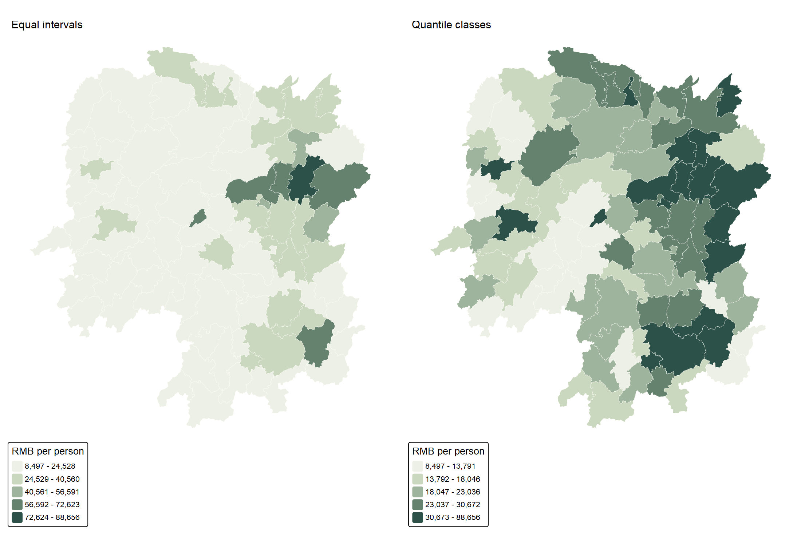
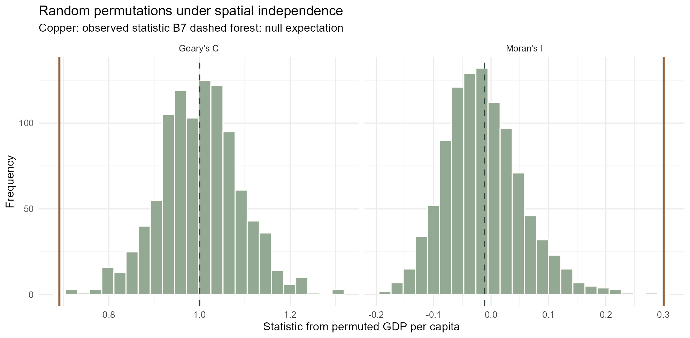
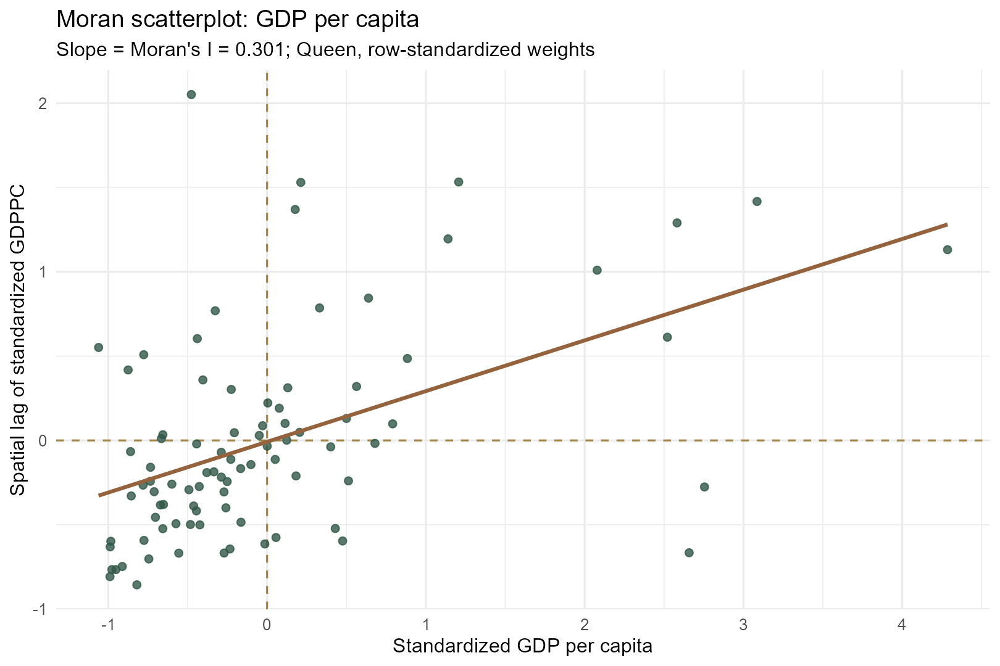
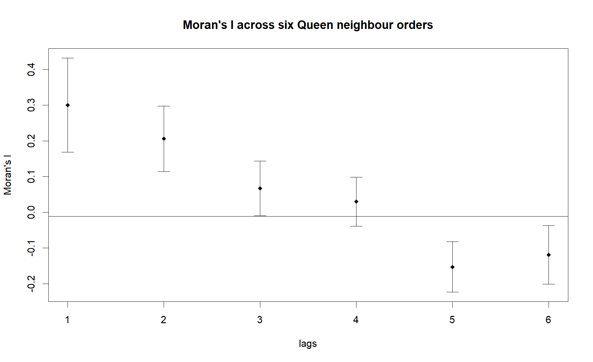
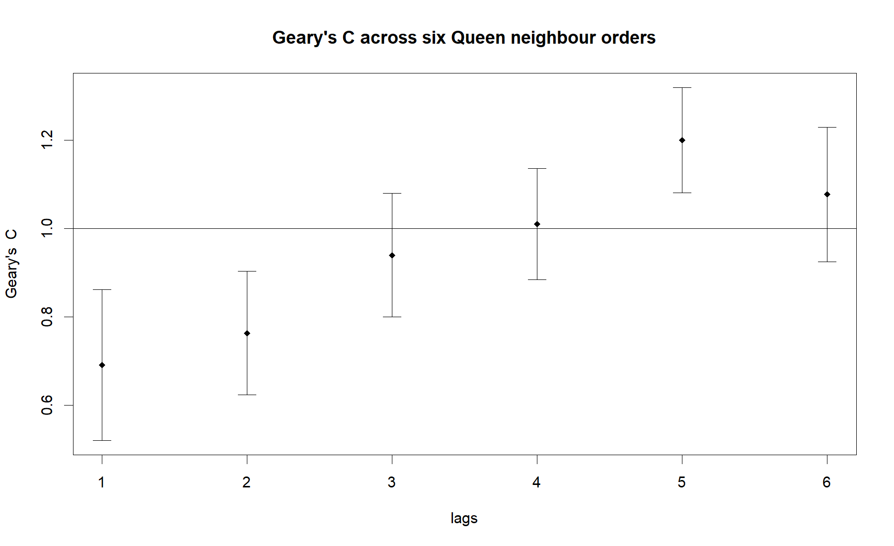

```{r}
#| include: false
source("Hands-on_Ex/Hands-on_Ex05/analysis-5a.R")
```

## Question and approach

Does a county with relatively high GDP per capita tend to sit beside other high-valued counties? A choropleth can suggest a pattern, but it cannot tell me whether that pattern is unusual under a spatial-randomisation benchmark. Following the sequence in [Chapter 9 of *R for Geospatial Data Science and Analytics*](https://r4gdsa.netlify.app/chap09.html) and the class screenshots, I join the Hunan boundaries to the 2012 GDPPC table, build Queen-contiguity weights, calculate global Moran's I and Geary's C, test both by permutation, then look across six neighbour orders.

The question is about **spatial association in this teaching dataset**, not whether neighbouring counties cause one another's economic outcomes. GDP per capita measures output per resident, not household income or service adequacy.

## Data and quality checks

I reused the Hunan shapefile, `Hunan_2012.csv` and dictionary supplied for Exercise 4. The two tables each have `r nrow(hunan)` counties and join one-to-one on `County`. The original WGS84 polygons are valid; for this exercise I also keep a projected EPSG:32650 copy for consistent spatial processing. The original statistical publisher and boundary vintage are not identified in the archive, so I do not assign them a more precise provenance. The [input checksums](outputs/input-checksums.csv), [validation audit](outputs/input-audit.csv) and [reproduction notes](README.md) document exactly what I used.

```{r}
#| echo: false
knitr::kable(input_audit, col.names = c("Check", "Result"))
```

The page executes the full [5A R script](analysis-5a.R) from a clean session. Its shared [preparation script](prepare.R) performs the import, checks, join and CRS transformation. The following extract shows the key operations; the linked scripts contain the executable version and seed values.

```{r}
#| eval: false
#| code-fold: show
hunan_boundary <- sf::st_read("Hands-on_Ex/Hands-on_Ex05/data/geospatial/Hunan.shp")
hunan2012 <- readr::read_csv("Hands-on_Ex/Hands-on_Ex05/data/aspatial/Hunan_2012.csv")
hunan <- dplyr::left_join(hunan_boundary, hunan2012,
                          by = "County", relationship = "one-to-one")
hunan_m <- sf::st_transform(hunan, 32650)
queen <- spdep::poly2nb(hunan_m, queen = TRUE)
weights <- spdep::nb2listw(queen, style = "W")
```

## Map the indicator before testing

{fig-alt="Side-by-side county GDP per capita choropleths using equal-interval and quantile classes."}

Equal-interval bins retain the size of differences in RMB per person, but most counties occupy the lower ranges when the distribution is right-skewed. Quantile bins spread counties more evenly across the colours and make relative rank easier to see. The underlying values do not change. Neither map alone gives a significance test, and changing the classification can change the *visual* strength of the apparent cluster.

## Define neighbours and weights

A Queen neighbour shares a boundary or corner. With 88 counties, the matrix has `r sum(spdep::card(queen5))` directed links and an average of `r round(mean(spdep::card(queen5)), 2)` neighbours per county. The Rook rule, which requires a shared edge, yields `r sum(spdep::card(rook5))` directed links. No county is isolated under Queen contiguity. I row-standardise the Queen weights so each county's neighbour weights add to one; this makes the spatial lag an average of nearby values.

```{r}
#| echo: false
knitr::kable(weights_audit, col.names = c("Weight check", "Value"))
```

I keep the same county ordering for the weights and GDPPC vector. A silent row mismatch would make every subsequent statistic invalid. I also repeat the slide's `sfdep` sequence as an independent check against `spdep`; both return the same I to numerical precision. The [sfdep check output](outputs/sfdep-moran-check.txt) records its test and permutation report.

```{r}
#| eval: false
nb <- sfdep::st_contiguity(sf::st_geometry(hunan_m), queen = TRUE)
wt <- sfdep::st_weights(nb, style = "W")
sfdep::global_moran(hunan$GDPPC, nb, wt)
sfdep::global_moran_test(hunan$GDPPC, nb, wt)
set.seed(62651)
sfdep::global_moran_perm(hunan$GDPPC, nb, wt,
                          alternative = "greater", nsim = 999)
```

## Global Moran's I

Moran's I compares deviations from the provincial mean with weighted neighbour deviations. Its randomisation expectation is approximately $-1/(n-1)$, or `r round(-1/87, 4)` here. Positive I means similar values tend to be adjacent. I calculate the statistic, an analytical randomisation test, and a one-sided 999-permutation test with a recorded seed.

```{r}
#| eval: false
moran_obs <- spdep::moran(hunan$GDPPC, weights, n = 88,
                          S0 = spdep::Szero(weights))$I
moran_test <- spdep::moran.test(hunan$GDPPC, weights,
                                alternative = "greater")
set.seed(62651)
moran_perm <- spdep::moran.mc(hunan$GDPPC, weights, nsim = 999,
                              alternative = "greater")
```

## Global Geary's C

Geary's C measures squared *local differences* across neighbour pairs. Values below its null expectation of 1 indicate positive spatial association. It complements Moran's I rather than repeating it: a local discontinuity can affect C even when the overall cross-product pattern changes less.

```{r}
#| eval: false
geary_obs <- spdep::geary(hunan$GDPPC, weights, n = 88, n1 = 87,
                          S0 = spdep::Szero(weights))$C
geary_test <- spdep::geary.test(hunan$GDPPC, weights,
                                alternative = "greater")
set.seed(62652)
geary_perm <- spdep::geary.mc(hunan$GDPPC, weights, nsim = 999,
                              alternative = "greater")
```

```{r}
#| echo: false
report_a <- global_results |>
  dplyr::mutate(dplyr::across(c(observed, randomisation_expectation,
                                 analytic_p_one_sided,
                                 permutation_p_one_sided),
                               ~ round(.x, 5))) |>
  dplyr::select(statistic, observed, randomisation_expectation,
                analytic_p_one_sided, permutation_p_one_sided)
knitr::kable(report_a,
  col.names = c("Measure", "Observed", "Null expectation",
                "Analytical p", "Permutation p"))
```

Moran's I is `r sprintf("%.3f", moran_obs)` and Geary's C is `r sprintf("%.3f", geary_obs)`. Both point to neighbouring counties being more alike in GDPPC than a spatially random rearrangement would typically produce. With 999 permutations, `r sprintf("%.3f", moran_permutation$p.value)` is the smallest reportable Monte Carlo p-value in these runs; it is **not** evidence for `p < 0.001`. The analytical tests and permutations agree on the direction, though their p-values answer the question through different reference distributions.

{fig-alt="Histograms of 999 permuted Moran I and Geary C values with observed and null-expectation reference lines."}

The copper lines mark the observed statistics; dashed lines mark the null expectations. The test permutes county GDPPC over the **fixed** spatial weight structure. It does not model the mechanisms behind the values.

## Moran scatterplot and neighbour orders

{fig-alt="Moran scatterplot with quadrant reference lines and regression slope 0.301."}

For row-standardised weights, the fitted slope in this scatterplot is Moran's I (`r sprintf("%.3f", moran_obs)`). Counties in the upper-right and lower-left quadrants contribute to positive association. The graph also reminds me that one province-wide number averages over quite different local situations.

{fig-alt="Moran correlogram across six topological neighbour orders."}

{fig-alt="Geary correlogram across six topological neighbour orders."}

The first-order association is strongest. In the [Moran correlogram report](outputs/moran-correlogram.txt), second-order I is about 0.206, approaching zero by the fourth order and becoming negative at the fifth and sixth. Geary's C likewise moves from about 0.691 towards and then above 1. These are *topological* steps, not fixed kilometre bands. The later-order values are descriptive: orders overlap in a finite, irregular study area, and I would not turn the six curves into six independent causal claims.

## What I learned

The choice of neighbour rule belongs in the analysis, not just in a map caption. Here Queen and Rook differ by eight directed links, while row standardisation gives each county's neighbourhood the same total weight despite unequal numbers of neighbours. I also learned why a permutation result should be reported with its simulation resolution: writing “p < 0.001” for 999 draws would imply precision the experiment cannot supply. The 2012 pattern is statistically clear at the global level, but it says neither which counties drive it nor whether policies, industry, migration or administrative boundaries created it. Those questions motivate [Exercise 5B](Hands-on_Ex05b.qmd).

## Sources and reproducibility

- [Chapter 9: Global Spatial Autocorrelation](https://r4gdsa.netlify.app/chap09.html), course workbook; methodology followed with original commentary and validation.
- User-supplied Hunan shapefile, `Hunan_2012.csv` and `Dictionary.xlsx`; source publisher and boundary date are not documented in the archive. [Checksums](outputs/input-checksums.csv) identify the exact local inputs.
- [spdep reference manual](https://r-spatial.github.io/spdep/) for neighbour definitions, Moran's I, Geary's C and correlograms.
- [Preparation and reproduction notes](README.md), [full 5A R script](analysis-5a.R), [test output](outputs/test-reports.txt) and [R session information](outputs/session-5a.txt).
