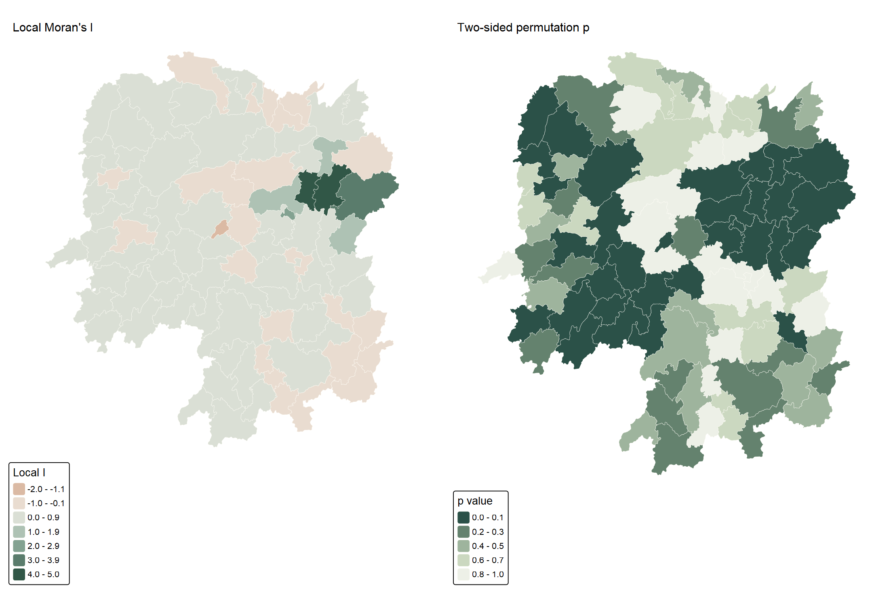
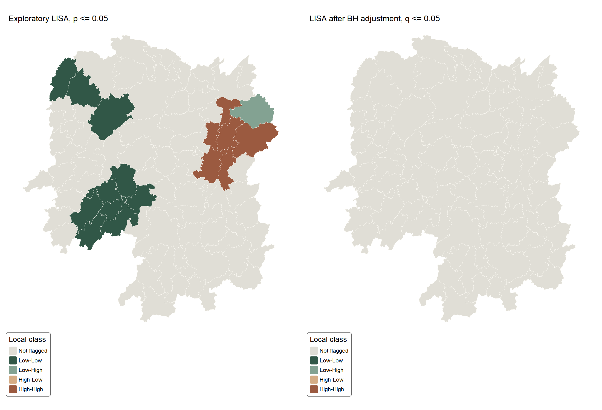
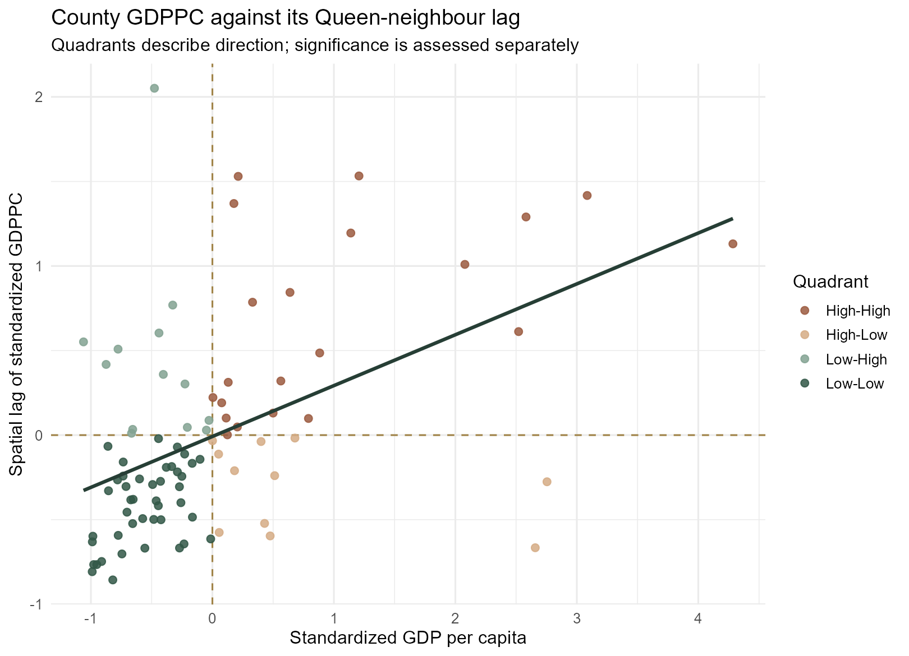
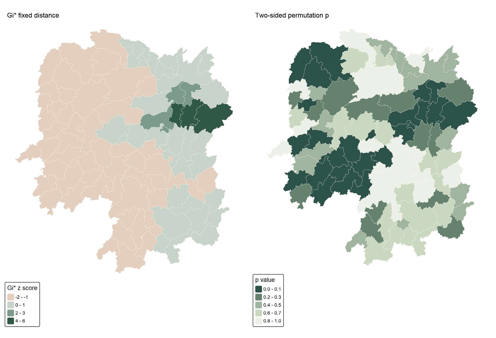
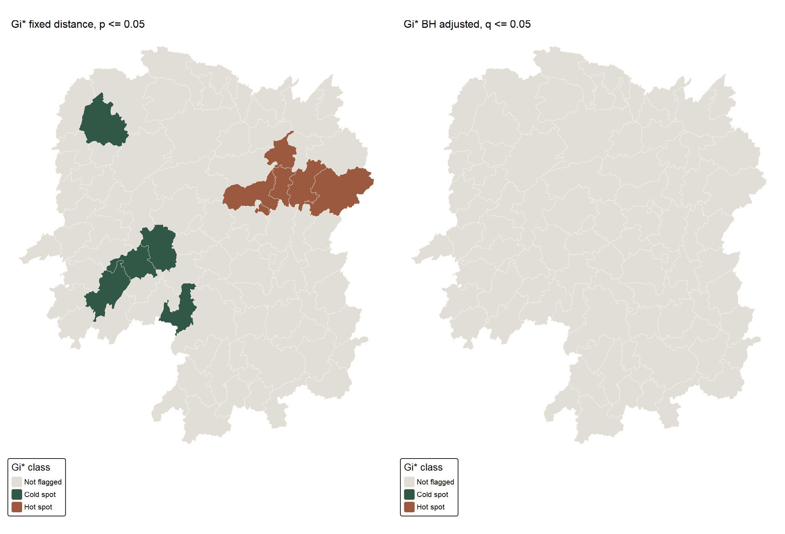
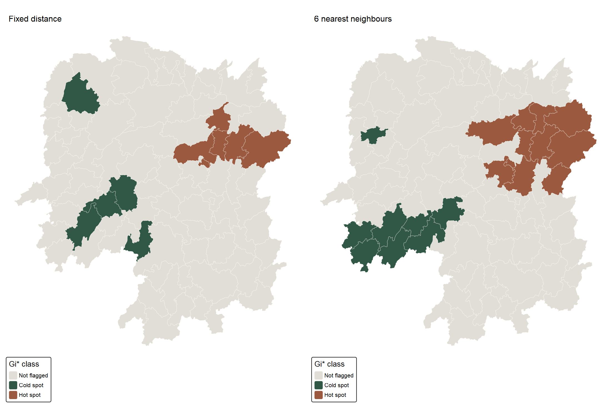

```{r}
#| include: false
source("Hands-on_Ex/Hands-on_Ex05/analysis-5b.R")
```

## Why a local analysis?

[Exercise 5A](Hands-on_Ex05a.qmd) found positive *global* association in the 2012 GDP per capita of the 88 Hunan counties in the supplied teaching extract. That result does not say where the relationship is strongest. Following [Chapter 10 of the course workbook](https://r4gdsa.netlify.app/chap10.html) and the class screenshots, I calculate local Moran's I and Getis–Ord Gi* with `sfdep`, map their permutation results, and test whether the apparent locations survive a change in spatial weights and a multiple-testing adjustment.

These maps are exploratory evidence about a 2012 spatial pattern. They do not measure whether development programmes succeeded or whether one county's GDP causes another's.

## Reusing and checking the Hunan inputs

The shared [preparation script](prepare.R) joins the supplied shapefile and `Hunan_2012.csv` one-to-one on `County`, checks all 88 geometries and GDPPC values, and transforms the polygons from EPSG:4326 to **EPSG:32650** for distance calculations in metres. The exact raw-file checksums and reproduction instructions are in the [data note](README.md). The page executes the complete [5B R script](analysis-5b.R) in a clean session.

{fig-alt="Two choropleths of the same Hunan GDPPC data under different class rules."}

The side-by-side classification is a useful reminder that a dark cluster on a map partly depends on how values are binned. The local tests below use the **unclassified numeric GDPPC values**, not these colours.

## Queen weights and the global baseline

The screenshots build a neighbour list with `st_contiguity()` and row-standardised weights with `st_weights(style = "W")`. My analysis confirms 448 directed Queen links, no zero-neighbour county, and row sums of one. `sfdep::global_moran()` returns `r sprintf("%.3f", global5b$I)`, matching the `spdep` estimate in 5A. This cross-check matters because different data ordering or weights would make the local comparison unreliable.

```{r}
#| eval: false
nb <- sfdep::st_contiguity(sf::st_geometry(hunan_m), queen = TRUE)
wt <- sfdep::st_weights(nb, style = "W")
sfdep::global_moran(hunan_m$GDPPC, nb, wt)
```

## Local Moran's I and LISA classes

Local Moran asks whether each county's deviation from the provincial mean aligns with its neighbours' deviations. I use 999 fixed-seed permutations and the **two-sided simulated p-value** for each county. A High-High or Low-Low label requires both the appropriate scatterplot quadrant and `p <= 0.05`; a High-Low or Low-High label describes a local contrast. A quadrant by itself is not a significance result.

```{r}
#| eval: false
set.seed(62653)
local_result <- sfdep::local_moran(hunan_m$GDPPC, nb, wt,
                                  alternative = "two.sided", nsim = 999)
local_result$p_bh <- p.adjust(local_result$p_ii_sim, method = "BH")
```

{fig-alt="Paired maps of county local Moran I and its two-sided simulated p-value."}

{fig-alt="Hunan LISA classifications at unadjusted p 0.05 and Benjamini-Hochberg adjusted q 0.05."}

```{r}
#| echo: false
knitr::kable(lisa_counts, col.names = c("Decision rule", "LISA class", "Counties"))
```

At the unadjusted 5% threshold, `r sum(as.character(lisa$cluster) != "Not flagged")` counties are flagged: `r sum(as.character(lisa$cluster) == "High-High")` High-High, `r sum(as.character(lisa$cluster) == "Low-Low")` Low-Low, and `r sum(as.character(lisa$cluster) == "Low-High")` Low-High. The high-high set includes Liuyang, Wangcheng, Zhuzhou and Changsha; several low-low counties occur in the west and southwest. After Benjamini–Hochberg adjustment across all 88 local tests, **no county remains flagged at q <= 0.05**. Thus the coloured unadjusted map is a candidate-finding device, not a verified list of 17 separate discoveries.

{fig-alt="Scatterplot of standardised GDPPC and its Queen-neighbour spatial lag, with four local quadrants."}

The [county-level results table](outputs/local-moran-results.csv) includes the statistic, analytical and simulated p-values, adjusted q-values and quadrant, allowing a reader to inspect a county without relying on its colour alone.

## Getis–Ord Gi*: hot and cold spots

Gi* tests whether *high or low values in a neighbourhood as a whole* are unusually concentrated. It differs from local Moran's I: the focal county is included in the Gi* neighbourhood, and the output describes a hot or cold concentration rather than a high/low quadrant pairing. Here I choose the minimum distance that connects the county network, about `r sprintf("%.1f", threshold_m / 1000)` km, then include the focal county. This threshold is calculated on EPSG:32650 metre coordinates. Its neighbourhood sizes range from `r min(spdep::card(fixed_nb))` to `r max(spdep::card(fixed_nb))`, including self. I also try six nearest neighbours plus self as a sensitivity check.

```{r}
#| eval: false
threshold_m <- sfdep::critical_threshold(sf::st_geometry(hunan_m))
fixed_nb <- sfdep::include_self(sfdep::st_dist_band(
  sf::st_geometry(hunan_m), upper = threshold_m + 1))
fixed_wt <- sfdep::st_weights(fixed_nb, style = "W")
set.seed(62654)
gi <- sfdep::local_gstar_perm(hunan_m$GDPPC, fixed_nb, fixed_wt,
                              alternative = "two.sided", nsim = 999)
gi$p_bh <- p.adjust(gi$p_sim, method = "BH")
```

{fig-alt="Paired maps of Gi* standard scores and permutation p-values for the fixed distance rule."}

{fig-alt="Gi* hot and cold spot classifications using unadjusted p and adjusted q values."}

```{r}
#| echo: false
knitr::kable(gi_counts, col.names = c("Decision rule", "Gi* class", "Counties"))
```

With the fixed-distance rule, `r sum(as.character(gistar$class) == "Hot spot")` counties are exploratory hot spots and `r sum(as.character(gistar$class) == "Cold spot")` are cold spots at unadjusted p <= 0.05. They include Liuyang and Wangcheng on the high side and Longhui and Suining on the low side. Again, **none remains flagged after BH adjustment**. The [full Gi* table](outputs/gistar-results.csv) reports both raw and adjusted values.

## Sensitivity to the neighbourhood definition

{fig-alt="Side-by-side exploratory Gi* cluster maps using fixed distance and six nearest neighbours."}

The six-nearest-neighbour rule flags `r sum(as.character(gistar$class_knn) != "Not flagged")` counties, compared with `r sum(as.character(gistar$class) != "Not flagged")` under fixed distance. `r sum(as.character(gistar$class) != as.character(gistar$class_knn))` county classifications differ. The alternatives are not interchangeable: a fixed radius gives sparse areas fewer neighbours, while k-nearest neighbours stretches further across sparse terrain. The kNN graph can have disconnected components even though each county gets six neighbours; it is presented as a sensitivity comparison rather than as a claim of a single correct economic neighbourhood.

```{r}
#| echo: false
knitr::kable(distance_audit, col.names = c("Distance/weight check", "Value"),
             digits = 1)
```

## What I learned

Global significance does not automatically translate into strong evidence for individual counties. Here the global Moran test is clear, but the 88 county-level LISA and Gi* tests lose their individual flags after adjustment. I also learned to separate a county's High-High quadrant from a statistically flagged High-High cluster, and to check how many conclusions move when the neighbourhood definition changes. The maps identify hypotheses worth investigating with fuller socioeconomic data; they cannot establish economic spillovers, welfare, or policy effects from GDPPC alone.

## Sources and reproducibility

- [Chapter 10: Local Spatial Autocorrelation](https://r4gdsa.netlify.app/chap10.html), course workbook; analysis sequence adapted and independently interpreted.
- [sfdep documentation](https://sfdep.josiahparry.com/) for `st_contiguity()`, `local_moran()` and `local_gstar_perm()`.
- User-supplied Hunan shapefile, `Hunan_2012.csv` and dictionary. The archive does not identify the original statistical publisher or boundary vintage; exact [checksums](outputs/input-checksums.csv) and [reproduction instructions](README.md) are retained.
- [Full 5B R script](analysis-5b.R), [local Moran results](outputs/local-moran-results.csv), [Gi* results](outputs/gistar-results.csv), and [R session information](outputs/session-5b.txt).
