## What this exercise investigates

A provincial average can hide quite different local economic conditions. I use Hunan's 88 county-level areas to compare GDP per capita with geographically weighted summaries. My question is how much the local picture changes when I change the neighbourhood or weighting kernel.

This follows the preparation, mapping, conversion, bandwidth and summary-statistics sequence in the supplied class script. The extensions refer to [Dr Kam's Lesson 4](https://github.com/tskam/ISSS626-AY2026-27Aug/blob/master/lesson/Lesson04/Lesson04-Spatial_Weights.qmd). The checks, comparisons and explanations are developed for this exercise.

[Download the complete RStudio script](In-class_Ex04.R). Open it in the course project and use **Ctrl+Enter** for selected lines or **Source** for the complete analysis. This is separate from [Hands-on Exercise 4](../../Hands-on_Ex/Hands-on_Ex04/Hands-on_Ex04.qmd), which remains unchanged.

## Packages and reproducibility

The script uses sf, dplyr, readr, readxl, spdep, tmap, ggplot2 and GWmodel; tables use knitr. I use ggplot2 for descriptive charts rather than loading ggstatsplot and the entire tidyverse for functions not needed here.

Extract the supplied Hunan ZIP into this exercise folder, or set `COURSE_DATA_ZIP` to its location. The script checks seven input files against [recorded checksums](outputs/input-checksums.csv). Rendering executes the complete script; the excerpts below show the same code, and the full script is displayed at the end.

```{r}
#| output: false
source("In-class_Ex/In-class_Ex04/In-class_Ex04.R")
```


## Preparing the data

::: {.panel-tabset}

### Task

Import sf polygons and a CSV tibble, join by County, and retain NAME_2, ID_3, NAME_3, County, GDPPC, GIO, Agri and Service. Named selection is safer than column positions if the input schema changes.

### Import and join

```r
hunan_boundary <- st_read(file.path(input_base4,"data/geospatial/Hunan.shp"),quiet=TRUE)
hunan2012 <- read_csv(file.path(input_base4,"data/aspatial/Hunan_2012.csv"),show_col_types=FALSE)
stopifnot(!anyDuplicated(hunan_boundary$County),!anyDuplicated(hunan2012$County))
unmatched_boundary <- anti_join(st_drop_geometry(hunan_boundary),hunan2012,by="County")
unmatched_table <- anti_join(hunan2012,st_drop_geometry(hunan_boundary),by="County")
stopifnot(nrow(unmatched_boundary)==0,nrow(unmatched_table)==0)
hunan <- left_join(hunan_boundary,hunan2012,by="County",relationship="one-to-one") |>
 select(NAME_2, ID_3, NAME_3, County, GDPPC, GIO, Agri, Service)
hunan_sf <- hunan
stopifnot(nrow(hunan)==88,!anyNA(hunan$GDPPC),all(is.finite(hunan$GDPPC)),all(hunan$GDPPC>0),
 st_crs(hunan)$epsg==4326,!any(st_is_empty(hunan)),all(st_is_valid(hunan)))
# Preserve polygon order: neighbours and lag vectors use this exact order.
dictionary <- readxl::read_excel(file.path(input_base4,"data/aspatial/Dictionary.xlsx"))
gdppc_definition <- dictionary |> filter(Variable=="GDPPC")
audit4 <- tibble(check=c("Boundary rows","Indicator rows","Joined rows","Duplicate county keys",
 "Unmatched boundary keys","Unmatched indicator keys","Missing GDPPC","Invalid geometries","Empty geometries"),
 value=c(nrow(hunan_boundary),nrow(hunan2012),nrow(hunan),0,nrow(unmatched_boundary),nrow(unmatched_table),sum(is.na(hunan$GDPPC)),sum(!st_is_valid(hunan)),sum(st_is_empty(hunan))))
write_csv(audit4,file.path(base4,"outputs/input-audit.csv"))
write_csv(gdppc_definition,file.path(base4,"outputs/gdppc-definition.csv"))
```


### Checks

```{r}
knitr::kable(audit4, caption="Checks before analysis")
```


All 88 boundary records match one indicator record. There are no duplicate keys, missing GDPPC values, empty geometries or invalid polygons. Spatial weights depend on row order, so I preserve it throughout.

:::

GDPPC is measured in RMB per person. The dictionary calls the agriculture variable **Agriculture**, whereas the CSV uses **Agri**: it is agricultural output in RMB million, not a percentage. GIO and Service are also output values in RMB million. These data describe 2012, not current economic conditions.

## Mapping GDPPC

::: {.panel-tabset}

### Task

Put a labelled county map beside the GDP-per-capita map. Use a histogram to examine the distribution without geography.

### Code

```r
basemap <- tm_shape(hunan_sf) +
  tm_polygons(fill="#eee8d7", col="#6e776d") +
  tm_text("NAME_3", size=0.5)
gdppc <- qtm(hunan_sf, "GDPPC")
tmap_arrange(basemap, gdppc, ncol=2)
```


The saved figure uses the full script's plotting helper to add consistent monetary breaks, titles and the portal's forest palette.

### Result

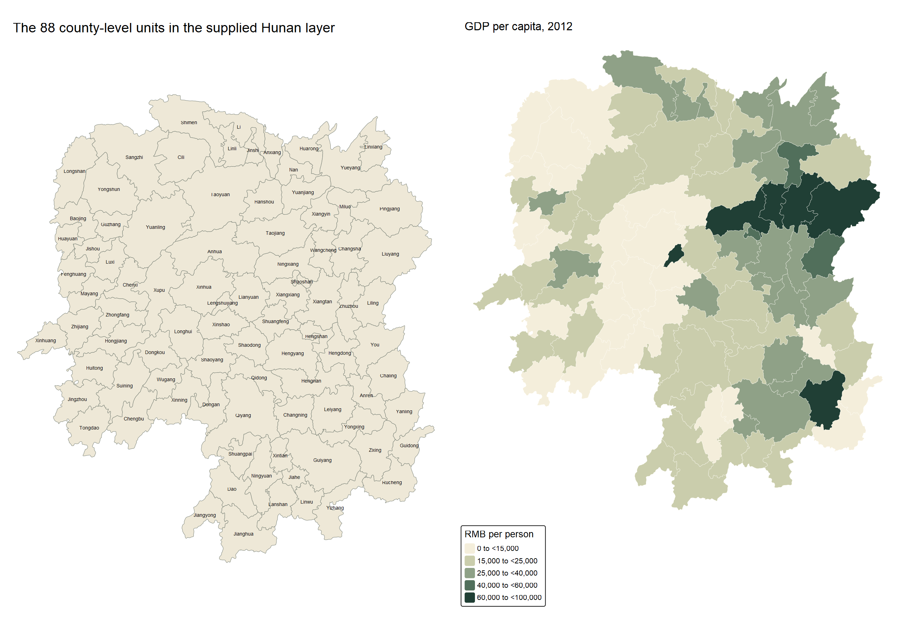

:::

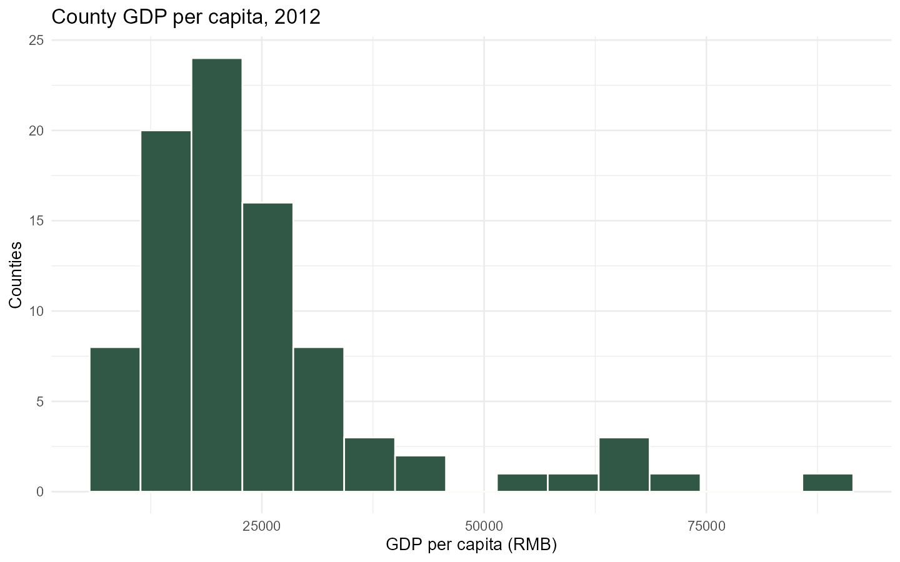

Changsha county records RMB 88,656 per person, at the upper end of a visibly uneven distribution. The histogram alone cannot establish whether the geographical arrangement is random. An unweighted county mean is also not the same as population-weighted provincial GDP per capita.

## Converting to SpatialPolygonsDataFrame

```r
suppressPackageStartupMessages(library(GWmodel))
# Keep WGS84 here, with great-circle distances in every GWmodel call.
# GWmodel uses polygon representative coordinates, distinct from the projected
# centroids used above for the spdep sensitivity comparison.
hunan_sp <- as_Spatial(hunan_sf)
stopifnot(identical(hunan_sp$County,hunan_sf$County))
```


I preserve the sf object for mapping and convert a copy for GWmodel. Coordinates remain WGS84, so every GWmodel call explicitly requests great-circle distances with `longlat=TRUE`.

## Geographically weighted summary statistics with adaptive bandwidth

::: {.panel-tabset}

### Cross-validation

```r
bw_CV <- bw.gwr(GDPPC ~ 1, data=hunan_sp, approach="CV",
               adaptive=TRUE, kernel="bisquare", longlat=TRUE)
```


CV chooses a local scale through prediction error for the intercept-only model.

### AICc

```r
bw_AIC <- bw.gwr(GDPPC ~ 1, data=hunan_sp, approach="AICc",
                adaptive=TRUE, kernel="bisquare", longlat=TRUE)
bandwidths <- data.frame(criterion=c("CV","AICc"),neighbours=c(bw_CV,bw_AIC))
print(bandwidths)
write_csv(bandwidths,file.path(base4,"outputs/bandwidths.csv"))
```


The supplied script uses `approach="AIC"`. I use the documented `"AICc"` spelling to make the corrected criterion explicit. This is an intercept-only model, not an economic regression with explanatory variables.

### Selected bandwidths

```{r}
knitr::kable(bandwidths)
```


Both searches select **22**. This is an adaptive neighbour-count scale, not 22 kilometres. Agreement is reassuring for this calculation but does not make it a universal optimum. Focal observations enter the summaries, and compact kernels have zero weight at and beyond their cutoff.

:::

## Computing geographically weighted summary statistics

```r
gwstat <- gwss(data=hunan_sp, vars="GDPPC", bw=bw_AIC,
               kernel="bisquare", quantile=TRUE, adaptive=TRUE, longlat=TRUE)
# Verify returned coordinates and row order before attaching County keys.
extract_stats <- function(result) {
 stopifnot(nrow(result$SDF)==nrow(hunan_sf),
   isTRUE(all.equal(unname(sp::coordinates(result$SDF)),
                    unname(sp::coordinates(hunan_sp)),tolerance=1e-10)))
 out <- as.data.frame(result$SDF@data)
 stopifnot(all(vapply(out,function(x) all(is.finite(x)),logical(1))))
 out$County <- hunan_sf$County
 out
}
gwstat_df <- extract_stats(gwstat)
hunan_gstat <- left_join(hunan_sf,gwstat_df,by="County",relationship="one-to-one")
print(names(gwstat_df))
write_csv(gwstat_df,file.path(base4,"outputs/gw-summary.csv"))
```


The AICc-selected bisquare model requests both ordinary and robust summaries. Before joining output to the map, I verify returned coordinates and then attach the county key. This protects against silently assigning a statistic to the wrong polygon.

## Visualising geographically weighted summary statistics

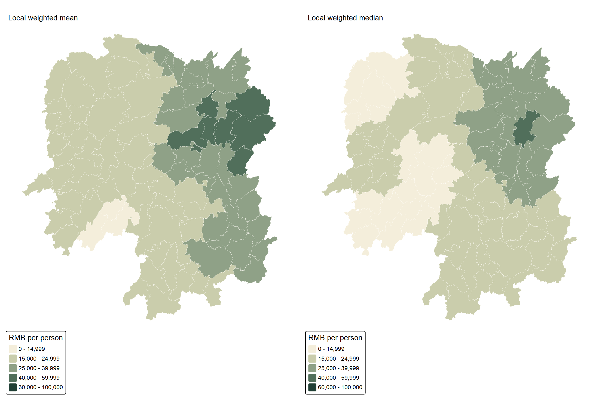

The local weighted mean ranges from **RMB 13,689 to RMB 49,006**. Comparing the median helps question whether high values pull up the mean. These two maps share fixed monetary breaks: the same colour therefore means the same amount.

### Five-class quantile map from the class exercise

Quantiles emphasise relative rank rather than equal monetary differences. I keep the class exercise's five classes but use the portal's forest palette.

```{r}
tm_shape(hunan_gstat) +
  tm_polygons(fill="GDPPC_LM",
    fill.scale=tm_scale_intervals(style="quantile", n=5, values=palette4),
    fill.legend=tm_legend(title="Local mean (RMB/person)")) +
  tm_borders(col="#fffdf7", lwd=0.4) +
  tm_title("Geographically weighted mean GDP per capita") +
  tm_layout(frame=FALSE, legend.outside=TRUE)
```

  
### Spread, shape and robust summaries

```{r}
knitr::kable(stat_ranges, digits=2, caption="Computed ranges of the eight local summaries")
```


::: {.panel-tabset}

### Standard deviation

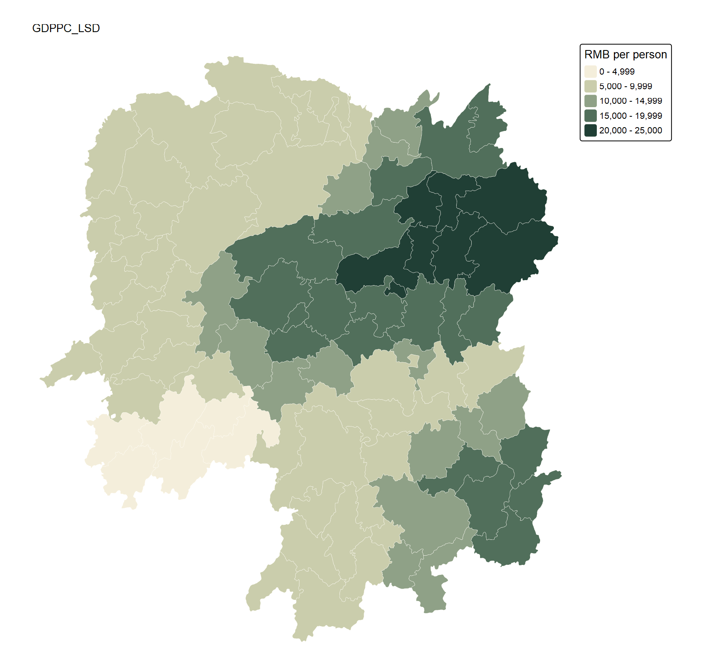

Dispersion is in RMB per person, not uncertainty around a causal estimate.

### Variance

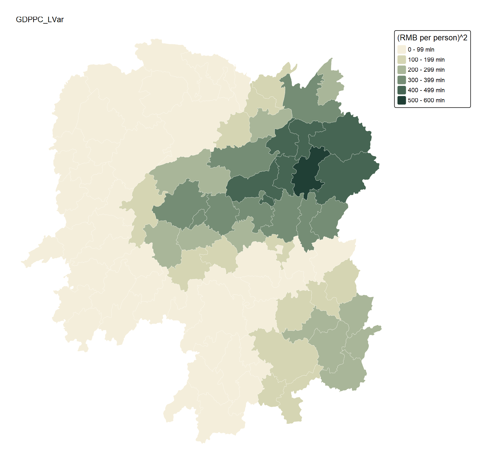

Variance is in squared RMB-per-person units and is not directly comparable with GDPPC.

### Coefficient of variation

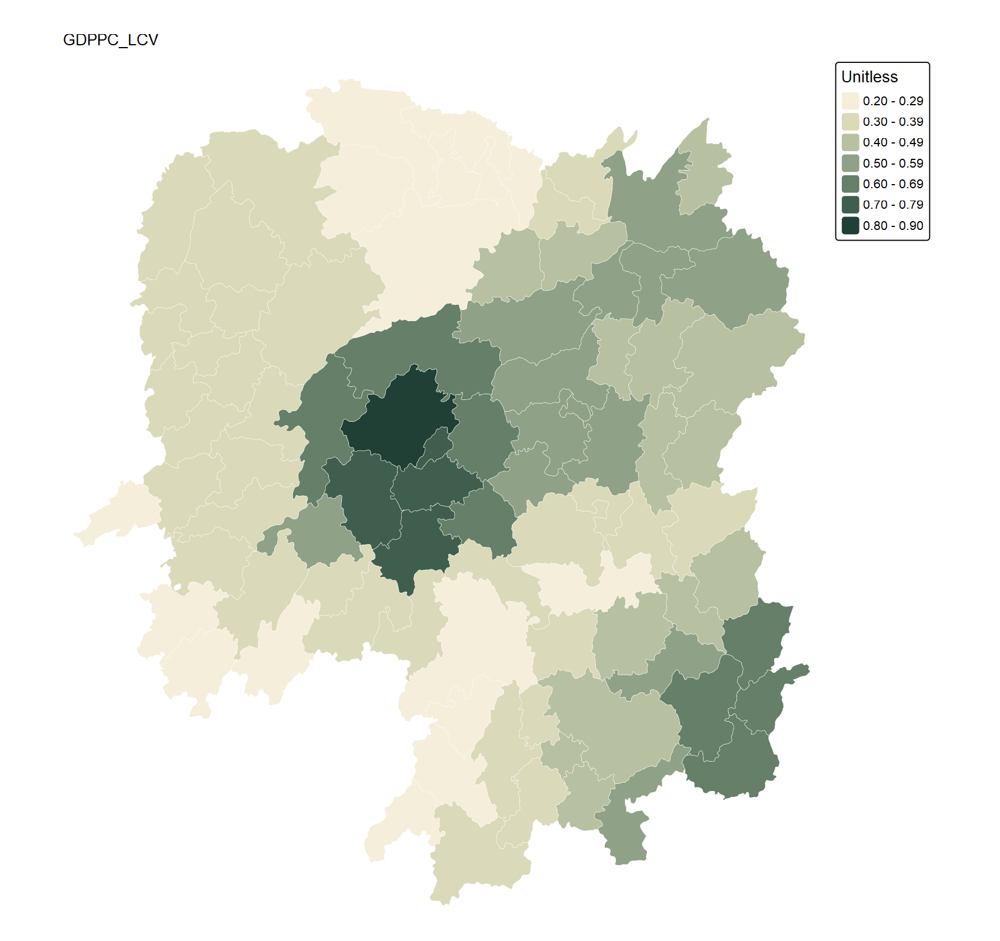

This unitless measure expresses standard deviation relative to the local mean.

### Skewness

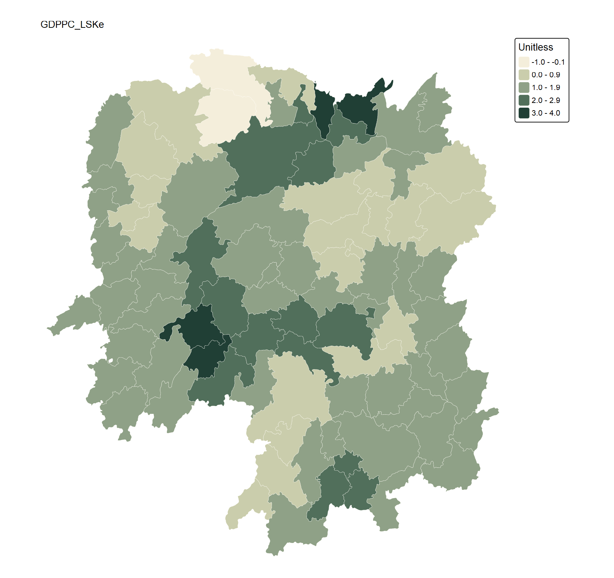

Positive values indicate a longer upper tail within the weighted neighbourhood.

### Interquartile range

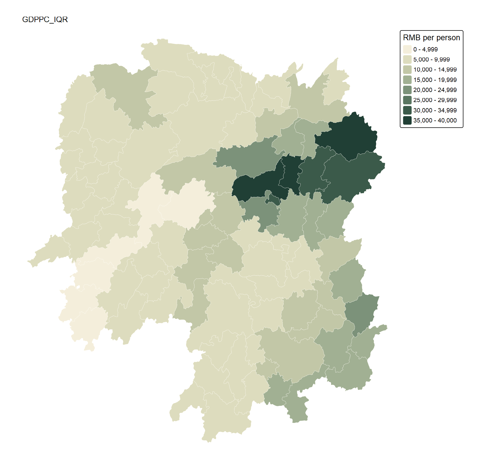

The IQR describes the middle half of the weighted distribution and is less dominated by extremes than variance.

### Quantile imbalance

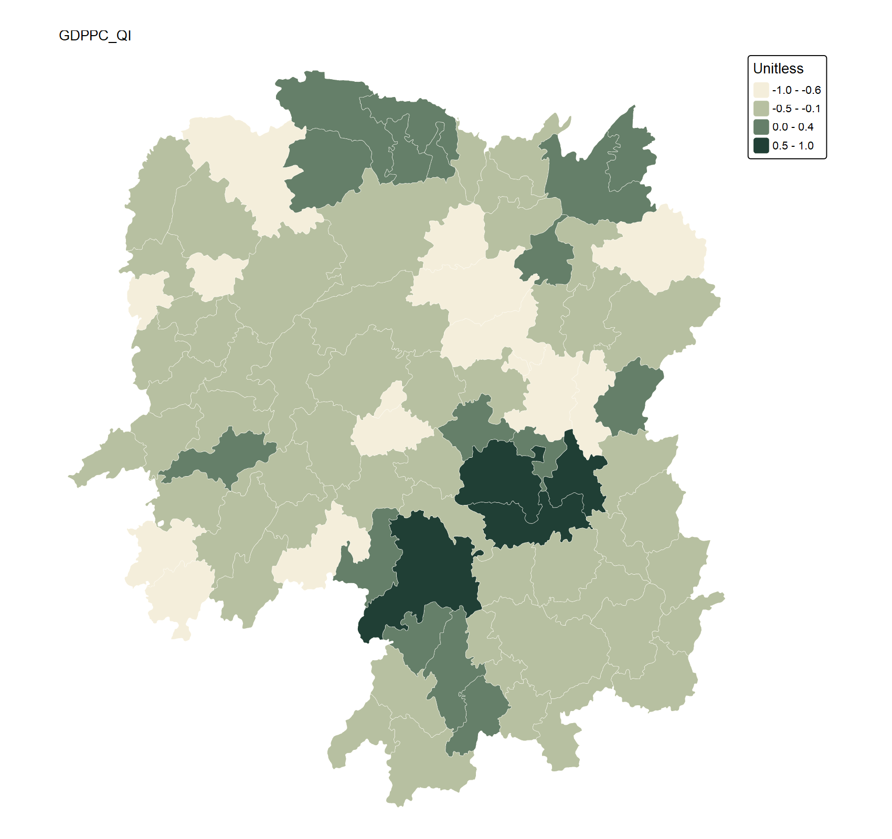

This is a robust, unitless description of asymmetry around the median.

:::

## Comparing five kernels

```r
kernels <- c("gaussian","exponential","bisquare","tricube","boxcar")
kernel_results <- setNames(lapply(kernels,function(k) {
 extract_stats(gwss(hunan_sp,vars="GDPPC",bw=bw_AIC,kernel=k,
                   adaptive=TRUE,quantile=TRUE,longlat=TRUE))
}),kernels)
kernel_summary <- bind_rows(lapply(kernels,function(k) {
 x <- kernel_results[[k]]$GDPPC_LM
 data.frame(kernel=k,min_mean=min(x),max_mean=max(x),
            mean_abs_change=mean(abs(x-gwstat_df$GDPPC_LM)))
}))
write_csv(kernel_summary,file.path(base4,"outputs/kernel-comparison.csv"))
print(kernel_summary)
```


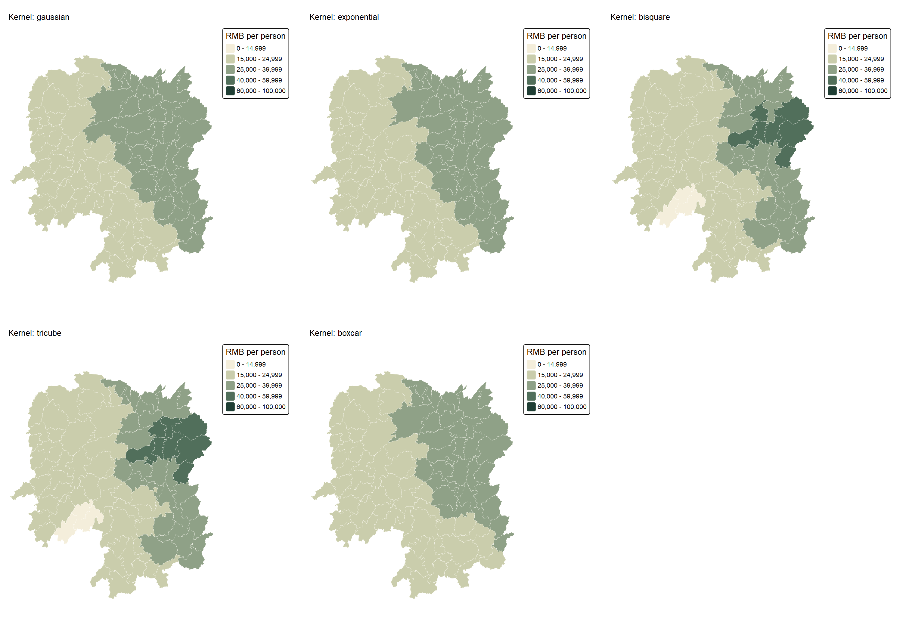

```{r}
knitr::kable(kernel_summary, digits=1, caption="Local means and mean absolute change from bisquare (RMB/person)")
```


Tricube is closest to bisquare, with a mean absolute difference of about **RMB 181**. Gaussian and exponential kernels compress the range: their local maxima are around RMB 32,300 rather than the bisquare maximum of RMB 49,006. Their non-zero tails mean the adaptive scale does not restrict contributions to only 22 observations. Boxcar gives equal weights inside its cutoff.

I hold the bisquare-selected bandwidth constant to isolate kernel sensitivity. These kernels have **not** each been optimised separately, so this is not a ranking of predictive performance.

## Local economic association: extension

```r
# Keep the lesson's 37-neighbour setting as a specified sensitivity scale,
# not an optimised correlation bandwidth. Correct its longitude/latitude flag.
gwCorr <- gwss(hunan_sp,vars=c("GDPPC","Agri"),bw=37,
               kernel="bisquare",adaptive=TRUE,longlat=TRUE)
correlation_df <- extract_stats(gwCorr) |>
 select(County,Corr_GDPPC.Agri,Spearman_rho_GDPPC.Agri)
stopifnot(all(abs(correlation_df$Corr_GDPPC.Agri)<=1),
          all(abs(correlation_df$Spearman_rho_GDPPC.Agri)<=1))
global_cor <- data.frame(method=c("Pearson","Spearman"),
 correlation=c(cor(hunan_sf$GDPPC,hunan_sf$Agri),
 cor(hunan_sf$GDPPC,hunan_sf$Agri,method="spearman")))
write_csv(correlation_df,file.path(base4,"outputs/local-correlations.csv"))
write_csv(global_cor,file.path(base4,"outputs/global-correlations.csv"))
print(global_cor); print(summary(correlation_df))
```


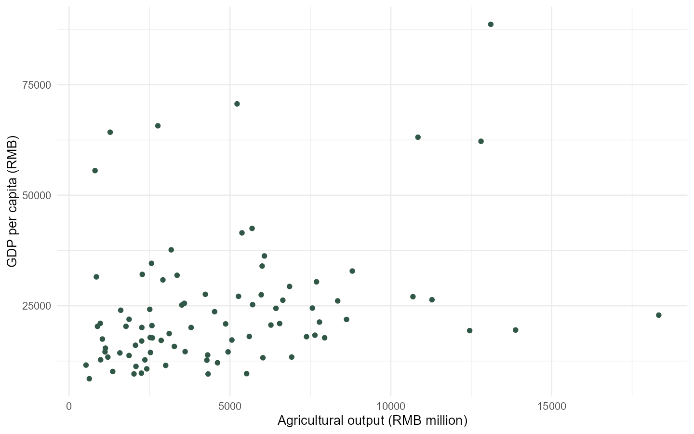

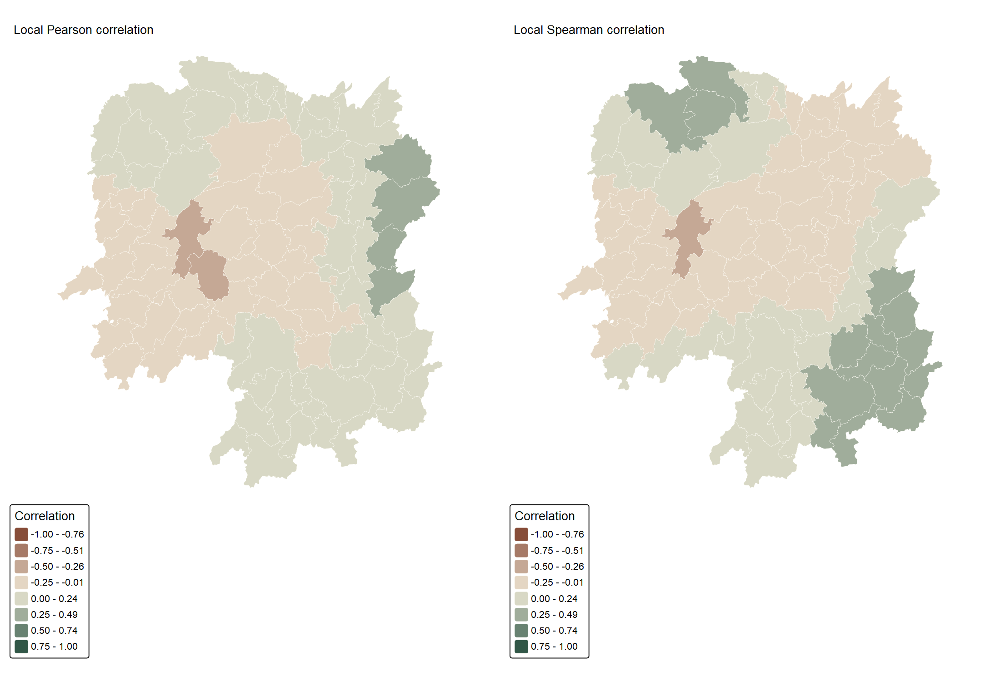

The overall Pearson correlation is **0.305**, but local Pearson correlations at the lesson's 37-neighbour scale range from **−0.286 to 0.358**. The overall Spearman correlation is **0.359**, while the local values range from **−0.317 to 0.488**. A positive province-wide association does not describe every neighbourhood equally well.

The 37-neighbour setting is a specified comparison scale, not a correlation-specific optimum. I use great-circle distances rather than treating degrees as planar units. Overlapping local summaries are exploratory, not independent significance tests. Agricultural output is an absolute total whereas GDPPC is per capita; county size and economic composition may affect the comparison. These maps do not establish causation.

## Spatial weights: supporting comparison

The complete script retains Queen/Rook, distance and spatial-lag calculations as background to the weighting idea.

```{r}
knitr::kable(graph_summary, digits=2)
```


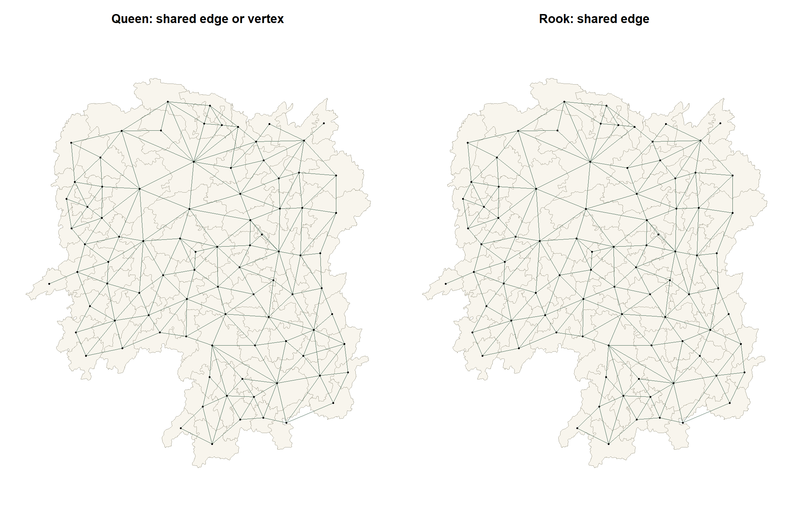

Queen has 448 directed links and Rook has 440. The 62-km graph is connected without isolated counties. One-nearest-neighbour linking also has no isolates, yet forms 24 disconnected components. These are different diagnostic checks.

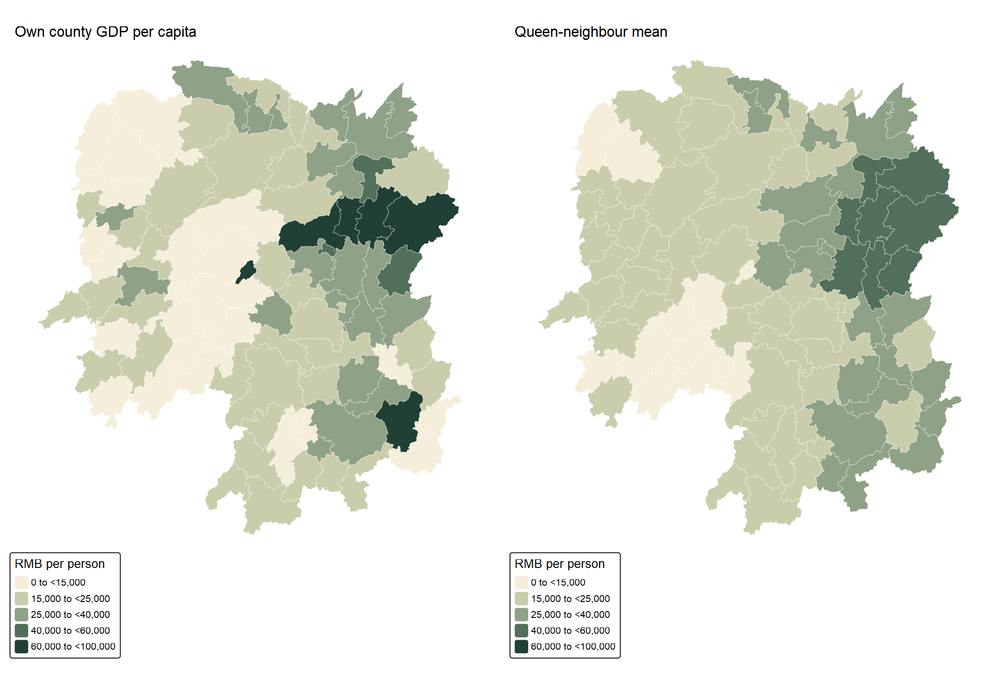

Anxiang's own GDPPC is RMB 23,667, versus a Queen-neighbour mean of RMB 24,847.2. Including itself produces a window mean of RMB 24,650.5. A sum of county per-capita values is only an arithmetic exercise, not regional GDP.

## What I learned

The most useful distinction for me is between choosing a neighbourhood and choosing how strongly each observation contributes. The same adaptive scale can produce quite different local economic summaries.

CV and AICc agree at 22 here, but the kernel comparison stops me from treating one smoothed map as the only possible picture. The median and IQR are useful checks when a few unusually high values influence the mean and variance.

From a finance perspective, I need to check the denominator before comparing economic indicators. GDP per capita and total agricultural output answer different questions. Local correlation can identify places to investigate; it cannot establish an investment thesis or a causal relationship by itself.

## Sources and reproducible files

- [Dr Kam Tin Seong, Lesson 4](https://github.com/tskam/ISSS626-AY2026-27Aug/blob/master/lesson/Lesson04/Lesson04-Spatial_Weights.qmd), consulted 19 September 2026, plus the supplied classroom script and photographs.
- Supplied Hunan shapefile, Hunan_2012.csv and Dictionary.xlsx, prepared locally on 19 September 2026. The archive does not establish a new download date. No current data are substituted.
- [GWmodel bandwidth documentation](https://search.r-project.org/CRAN/refmans/GWmodel/html/bw.gwr.html) and [GWSS documentation](https://search.r-project.org/CRAN/refmans/GWmodel/html/gwss.html).
- [Complete R script](In-class_Ex04.R), [local summaries CSV](outputs/gw-summary.csv), [kernel comparisons CSV](outputs/kernel-comparison.csv), [session information](outputs/session-info.txt).
- [Download mean/median PNG](figures/gw-mean-median.png) or [five-kernel PNG](figures/kernel-comparison.png).

## Complete script

All preparation, plotting helpers and calculations are available below and in the downloadable R file.

```{r}
#| echo: false
#| results: asis
cat("\n```r\n", paste(readLines("In-class_Ex/In-class_Ex04/In-class_Ex04.R"), collapse="\n"), "\n```\n", sep="")
```
