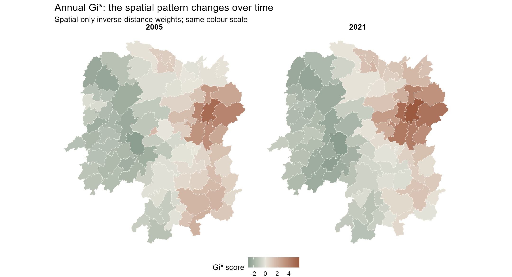
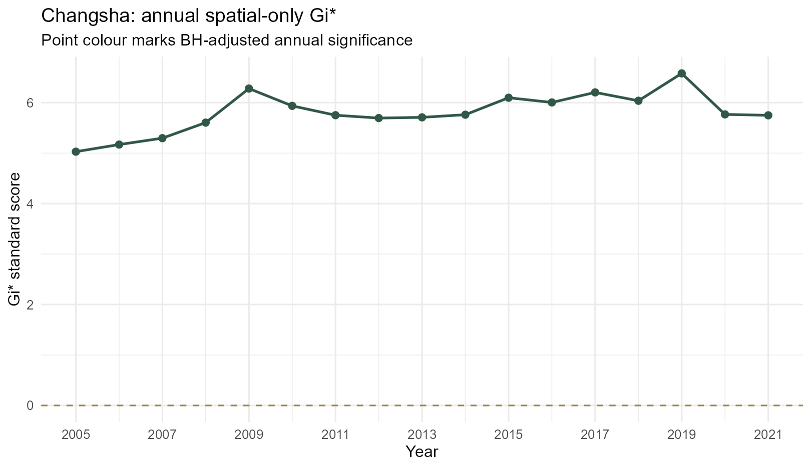
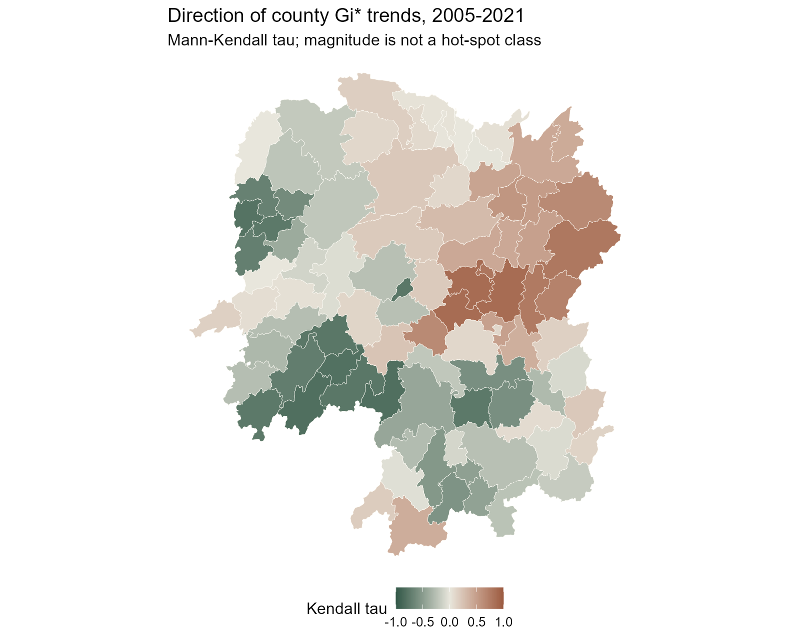
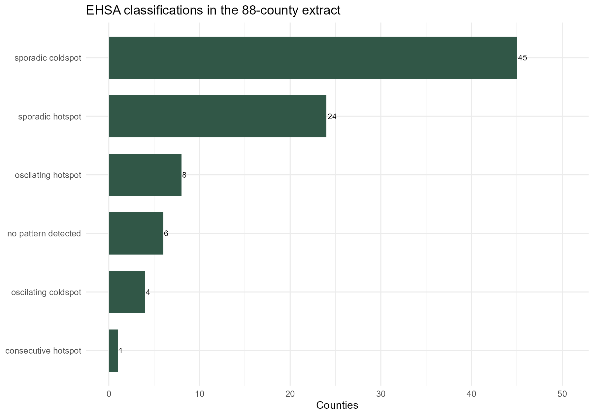
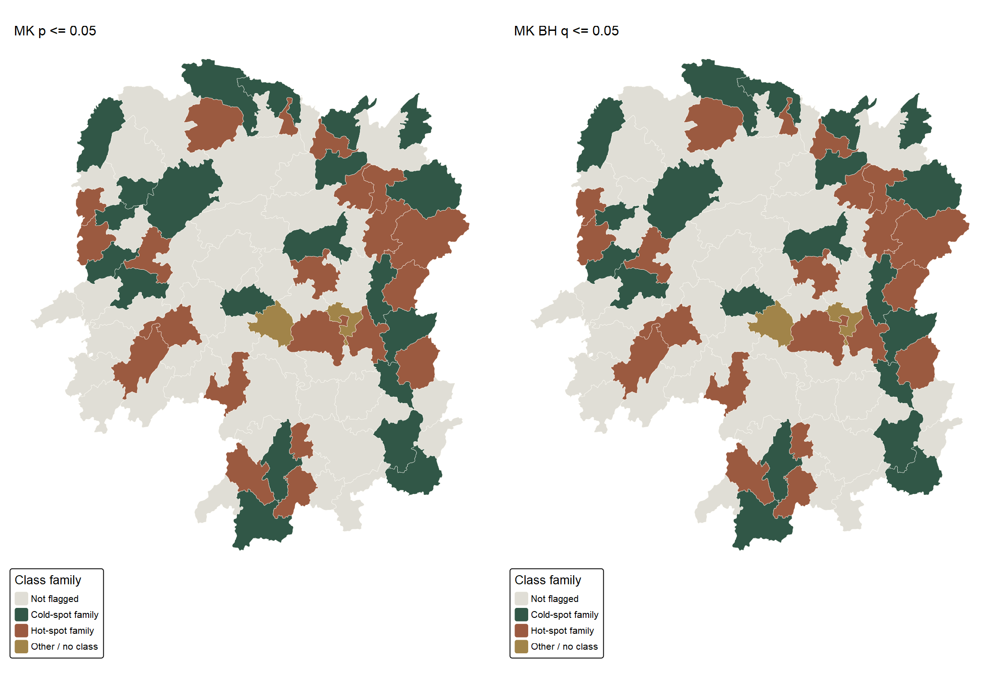

```{r}
#| include: false
source("In-class_Ex/In-class_Ex05/analysis.R", encoding = "UTF-8")
```

## What I set out to examine

A single GDP per capita map shows where county values were high at one point in time. It misses how the *spatial concentration* of high and low values changes. In this exercise I follow the sequence in [In-class Exercise 5: Emerging Hot Spot Analysis](https://isss626-ay2026-27aug.netlify.app/in-class_ex/in-class_ex05/in-class_ex05-ehsa#/title-slide): build a space-time cube, calculate annual local Gi*, inspect a county's time series, apply Mann–Kendall tests, and map the package's EHSA classifications.

I use the class's **2005–2021 Hunan GDPPC series**, not the 2012-only CSV used in my earlier exercises. The analysis covers the 88 county-level polygons in this teaching extract. It is a comparison of spatial patterns, not a test of whether one county's development caused another's.

[Open the complete RStudio script](analysis.R) to see and run every step. The page itself executes that script when rendered. [Preparation code](prepare.R) and the [data/reproduction note](README.md) are also available.

## Preparing the two inputs

The shapefile supplies county geometry; `Hunan_GDPPC.csv` supplies `Year`, `County` and `GDPPC`. The [source manifest](outputs/source-manifest.csv) gives pinned course-repository URLs, access date and SHA-256 checksums. I check that each of the 88 counties has one positive GDPPC observation for every year from 2005 through 2021, with no duplicated county-year keys. The boundary starts in WGS84 and is projected to EPSG:32650 before distance weights are calculated.

```{r}
#| echo: false
knitr::kable(audit05, col.names = c("Validation check", "Result"))
```

One detail mattered more than it first appeared: the CSV begins with **Longshan**, whereas the shapefile begins with **Anxiang**. The cube's neighbour lists are passed to time slices by row position. I therefore reorder *each year* to the polygon order and assert an exact match before any Gi* calculation. Without this check, the code can run yet assign the wrong neighbourhood to a county. After alignment, Changsha's 2005 Gi* agrees with the value shown in class (`r sprintf("%.3f", filter(changsha05, Year == 2005)$gi_star)`).

```{r}
#| eval: false
gdppc <- dplyr::arrange(gdppc, Year, match(County, hunan$County))
stopifnot(all(vapply(split(gdppc$County, gdppc$Year),
                     identical, logical(1), hunan$County)))
```

## Building the space-time cube

`sfdep::spacetime()` connects the attribute table to the geometry by `County` and identifies `Year` as time. The resulting object passes `is_spacetime_cube()`. I then include each county in its Queen-contiguity neighbourhood, as Gi* requires, and use inverse-distance weights calculated on metre coordinates. The full code checks that there are no empty neighbourhoods or non-finite weights.

```{r}
#| eval: false
cube <- sfdep::spacetime(gdppc, hunan,
                         .loc_col = "County", .time_col = "Year")
sfdep::is_spacetime_cube(cube)
cube <- cube |>
  sfdep::activate("geometry") |>
  dplyr::mutate(
    nb = sfdep::include_self(sfdep::st_contiguity(geometry)),
    wt = sfdep::st_inverse_distance(nb, geometry, scale = 1, alpha = 1)
  ) |>
  sfdep::set_nbs("nb") |>
  sfdep::set_wts("wt")
```

```{r}
#| echo: false
knitr::kable(weights_audit05, col.names = c("Cube/weight check", "Result"))
```

## Annual Gi*: comparing the spatial pattern

I calculate a **spatial-only** Gi* for each year using 499 conditional permutations and a recorded seed. Positive scores indicate a concentration of higher GDPPC values in the local neighbourhood; negative scores indicate lower values. I adjust the two-sided simulated p-values across the 88 counties *within each year* using Benjamini–Hochberg (BH). This is an additional caution, not a claim that the class slide performed the same correction.

{fig-alt="Side-by-side 2005 and 2021 Hunan county Gi-star maps using a consistent forest-to-copper scale."}

The high-value concentration remains visible around the eastern counties, but the two maps should not be read as a simple before/after welfare measure. GDPPC is not household income, and the source does not establish a common real-price base. The [annual results table](outputs/annual-gistar.csv) retains every score and p-value rather than just a colour category.

```{r}
#| echo: false
knitr::kable(annual_flags05, col.names = c("Year", "Unadjusted p <= 0.05", "BH q <= 0.05"))
```

Depending on the year, `r min(annual_flags05$unadjusted_p05)`–`r max(annual_flags05$unadjusted_p05)` counties meet unadjusted p <= 0.05, but **none meets BH q <= 0.05**. With 499 permutations, the smallest two-sided simulated p-value has limited resolution, which makes the adjusted test especially conservative across 88 counties. The unadjusted locations are exploratory, not 17 years of confirmed county discoveries.

## Following Changsha through time

The class example uses Changsha to illustrate a Gi* time series. I plot the county's annual **spatial-only** scores, first as a saved PNG and then as an interactive chart. These are *not* the time-lagged Gi* scores used internally by the final EHSA routine.

{fig-alt="Line chart of Changsha annual Gi-star scores from 2005 to 2021 with a zero reference line."}

```{r}
#| echo: false
plotly::ggplotly(changsha_plot05, tooltip = c("x", "y"))
```

Changsha's series starts at `r sprintf("%.2f", first(changsha05$gi_star))` in 2005 and ends at `r sprintf("%.2f", last(changsha05$gi_star))` in 2021. It rises and dips along the way; a positive long-run trend does not mean a steady year-by-year increase.

## Mann–Kendall trend tests

Mann–Kendall tests whether the annual Gi* sequence has a monotonic trend. Its tau runs from −1 to 1; `sl` in the package output is the p-value. I calculate the test separately for all 88 counties and add BH-adjusted trend q-values. The test describes a trend in *local spatial concentration*, not a trend in the raw GDPPC level.

```{r}
#| eval: false
mk <- gi_by_year |>
  dplyr::group_by(County) |>
  dplyr::summarise(mk = list(unclass(Kendall::MannKendall(gi_star))),
                   .groups = "drop") |>
  tidyr::unnest_wider(mk) |>
  dplyr::mutate(q_bh = p.adjust(sl, method = "BH"))
```

For Changsha, tau is `r sprintf("%.3f", changsha_mk05$tau)` and p is `r signif(changsha_mk05$p_value, 3)` (BH q = `r signif(changsha_mk05$q_bh, 3)`). This supports an upward tendency in its spatial-only Gi* series, while the chart shows why I would not call it a smooth increase. The complete [Mann–Kendall results](outputs/mann-kendall-results.csv) permit the same check for every county.

{fig-alt="Hunan county map of positive and negative Mann-Kendall tau values for Gi-star time series."}

The sign and size of tau are displayed everywhere; the map alone is not a significance map. Consecutive yearly observations and economic shocks may be temporally dependent, a limitation of the usual Mann–Kendall reference test.

## Emerging hot spot classification

Finally, I run `sfdep::emerging_hotspot_analysis()` with a **one-year time lag** (`k = 1`) and 99 simulations, matching the slide's main specification. I pass in the same documented spatial neighbour and weight columns. The built-in routine combines time-lagged Gi* scores with a Mann–Kendall trend and applies its default 0.01 classification threshold. Its detailed category labels are not interchangeable with the separate annual spatial-only maps above.

```{r}
#| eval: false
set.seed(626505)
ehsa <- sfdep::emerging_hotspot_analysis(
  x = cube, .var = "GDPPC", k = 1, nsim = 99,
  nb_col = "nb", wt_col = "wt", threshold = .01
)
```

{fig-alt="Horizontal bar chart of the six EHSA categories returned by sfdep."}

```{r}
#| echo: false
knitr::kable(class_counts05, col.names = c("Package classification", "Counties"))
```

The largest group is `r class_counts05$classification[1]` (`r class_counts05$count[1]` counties). “Sporadic” does not mean a continuous or newly emerging trend; it indicates intermittent significant hot/cold bins under the package rules. The package output includes `r sum(ehsa05$p_value <= .05)` counties with an unadjusted Mann–Kendall trend p <= 0.05, and `r sum(ehsa05$trend_q_bh <= .05)` after BH adjustment across locations. [County classifications and trend values](outputs/ehsa-results.csv) are available for review.

{fig-alt="Paired maps of EHSA class families, filtered by raw and BH-adjusted Mann-Kendall trend significance."}

The maps group detailed package labels into hot-spot and cold-spot *families* for legibility; the table and CSV retain their exact classifications. Grey means the trend test did not pass the indicated threshold, not that GDPPC is zero or that the county has no temporal change.

### A methodological distinction

The class overview describes FDR correction as part of the general EHSA approach. In the installed `sfdep` implementation, the classification is based on simulated Gi* p-values at its threshold; the function does **not** itself apply an FDR adjustment to every space-time bin. I separately apply BH within each annual spatial-only Gi* slice and across the 88 county trend tests, and label those checks clearly. This page therefore does not claim exact equivalence with Esri's FDR-corrected EHSA procedure. The annual spatial-only and lagged EHSA analyses also have different temporal neighbourhoods and simulation counts.

## What I learned

The biggest practical lesson was about row order: a valid-looking map can be wrong if time-series rows and polygon neighbours are paired by position without a key check. I also learned to ask *which* Gi* series a trend test is describing. Changsha's spatial-only trend is positive, while the EHSA classification uses a time-lagged neighbourhood and tells a different, categorical story. Finally, the difference between unadjusted and BH-filtered maps showed me how much caution is needed when looking at many counties over many years. The teaching extract uses one boundary layer for the full period, does not document boundary changes or a price deflator, and cannot support causal claims about regional policy or living standards.

## Sources and reproduction

- [In-class Exercise 5 slides](https://isss626-ay2026-27aug.netlify.app/in-class_ex/in-class_ex05/in-class_ex05-ehsa#/title-slide), Dr Kam Tin Seong, accessed 3 October 2026.
- [Pinned class data repository](https://github.com/tskam/ISSS626-AY2026-27Aug/tree/567a99d2dc576cb3b9d46dabea209f55d9fb5fba/In-class_Ex/In-class_Ex05/data), accessed 3 October 2026; exact links and hashes in the [source manifest](outputs/source-manifest.csv). The CSV identifies years but does not establish the original statistical publisher, boundary vintage, or inflation adjustment.
- [sfdep EHSA documentation](https://sfdep.josiahparry.com/reference/emerging_hotspot_analysis.html) and [sfdep source](https://github.com/JosiahParry/sfdep/blob/main/R/emerging-hostpot-analysis.R) for the implemented classification; [Esri EHSA documentation](https://pro.arcgis.com/en/pro-app/latest/tool-reference/space-time-pattern-mining/learnmoreemerging.htm) for the wider method and FDR context.
- [Full RStudio script](analysis.R), [preparation code](prepare.R), [reproduction note](README.md), and [R session information](outputs/session-info.txt).
