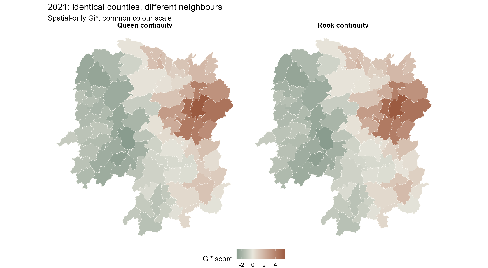
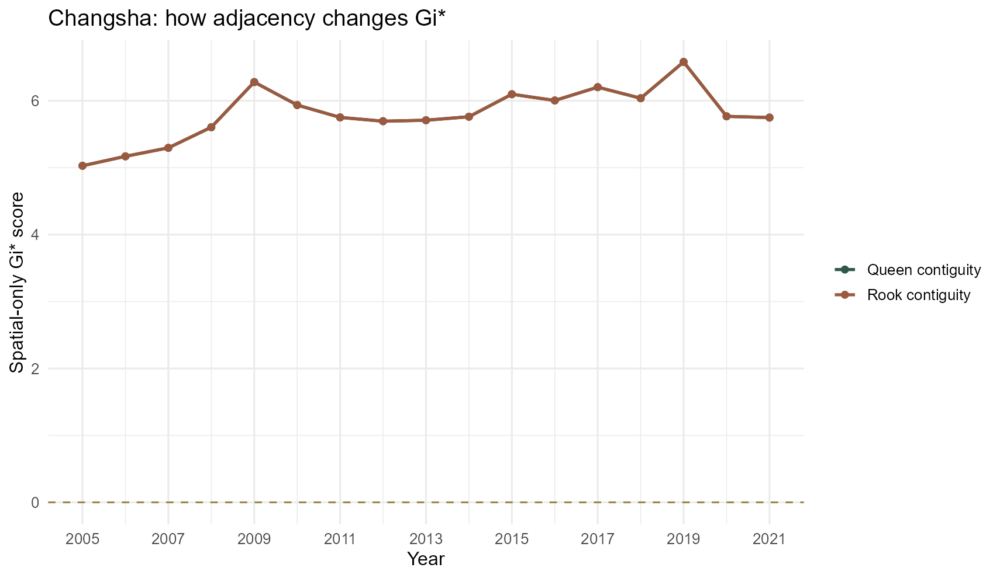
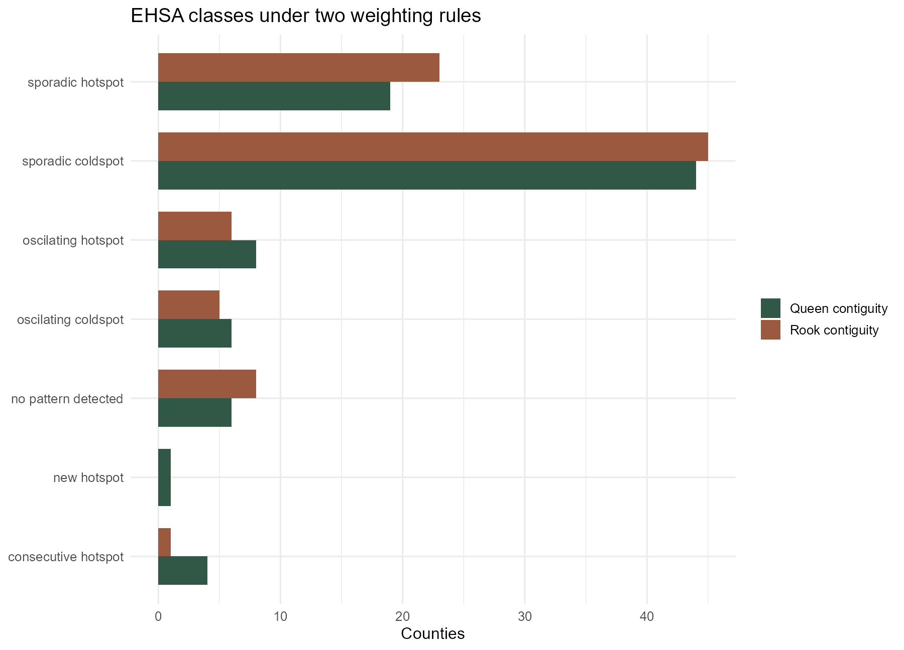
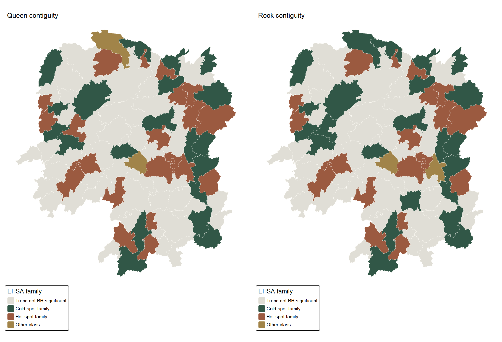

```{r}
#| include: false
source("In-class_Ex/In-class_Ex06/analysis.R", encoding = "UTF-8")
```

## Question and approach

[Chapter 11 of *R for Geospatial Data Science and Analytics*](https://r4gdsa.netlify.app/chap11) develops an emerging-hot-spot analysis (EHSA) from a Hunan county space-time cube. My [In-class Exercise 5](../In-class_Ex05/In-class_Ex05.html) already follows the classroom version of that sequence. For Exercise 6 I wanted to test one decision that the sequence leaves open: **would a stricter definition of neighbours materially change the result?**

I keep the chapter's data, 2005–2021 period, Gi*–Mann–Kendall–EHSA sequence, one-year lag, and `sfdep` methods. The baseline counts counties that touch at either an edge or a vertex (*Queen* contiguity). The comparison counts only shared edges (*rook* contiguity). Both include the county itself for Gi* and use inverse-distance weights. This is a sensitivity analysis, not a second dataset or an independent confirmation of the pattern.

[Open the complete RStudio script](analysis.R). The page runs it from a clean R session; [reproduction notes](README.md) explain the data download and package setup.

## Preparing the data

I reuse the pinned [Hunan shapefile and Hunan_GDPPC.csv](../In-class_Ex05/outputs/source-manifest.csv) from Exercise 5. Its preparation script checks file hashes, 88 unique counties, 17 complete years, positive GDPPC values and valid polygons. It then projects the boundaries to EPSG:32650. I also preserve the polygon row order within each year: the source CSV and shapefile begin with different counties, and a positional mismatch would silently attach the wrong neighbours.

```{r}
#| eval: false
source("In-class_Ex/In-class_Ex05/prepare.R", encoding = "UTF-8")
cube <- sfdep::spacetime(gdppc05, hunan05,
                         .loc_col = "County", .time_col = "Year")
stopifnot(sfdep::is_spacetime_cube(cube))
```

```{r}
#| echo: false
knitr::kable(weight_audit06, col.names = c("Validation / neighbourhood check", "Result"))
```

## Building the cube and two neighbourhoods

Only `r weight_audit06$value[weight_audit06$measure == "Counties with different neighbour counts"]` of 88 counties have a different number of direct neighbours under rook rather than Queen contiguity. That sounds small, but EHSA uses spatial and temporal neighbourhoods repeatedly, so a change at a few locations can affect the eventual classes elsewhere. I keep the weight calculation and random seeds fixed to isolate the adjacency choice as far as the implementation permits.

```{r}
#| eval: false
queen_cube <- cube |>
  sfdep::activate("geometry") |>
  dplyr::mutate(nb = sfdep::include_self(sfdep::st_contiguity(geometry)),
                wt = sfdep::st_inverse_distance(nb, geometry,
                                                scale = 1, alpha = 1)) |>
  sfdep::set_nbs("nb") |>
  sfdep::set_wts("wt")

rook_cube <- cube |>
  sfdep::activate("geometry") |>
  dplyr::mutate(nb = sfdep::include_self(
                  sfdep::st_contiguity(geometry, queen = FALSE)),
                wt = sfdep::st_inverse_distance(nb, geometry,
                                                scale = 1, alpha = 1)) |>
  sfdep::set_nbs("nb") |>
  sfdep::set_wts("wt")
```

## Annual local Gi* and Changsha

Following the chapter, I calculate a spatial-only Gi* for each county in each year. Here I use 499 conditional permutations per year, a fixed seed, and a two-sided test. The saved [annual county results](outputs/annual-gistar.csv) include both raw simulated p-values and Benjamini–Hochberg (BH) q-values calculated separately within each 88-county year. A positive Gi* is relative evidence of nearby high values; it is not a measure of household welfare.

{fig-alt="Side-by-side Hunan county Gi-star maps for Queen and rook contiguity on the same colour scale."}

The 2021 county scores have a Spearman rank correlation of `r sprintf("%.3f", dplyr::filter(comparison06, Year == 2021)$spearman)`. The median absolute county difference is `r sprintf("%.3f", dplyr::filter(comparison06, Year == 2021)$median_absolute_change)` and `r dplyr::filter(comparison06, Year == 2021)$opposite_sign` scores switch sign. The median is zero because most counties have the same direct neighbour list under both rules; it does not mean every score is unchanged. The [year-by-year sensitivity table](outputs/annual-sensitivity.csv) makes that distinction visible.

The chapter follows Changsha over time. In this extract its two lines coincide because its neighbour list is unchanged by this particular Queen-to-rook switch. That is a useful negative result: I should not manufacture a difference just because I drew two lines.

{fig-alt="Changsha line chart of annual spatial-only Gi-star scores, with Queen and rook results overlapping."}

```{r}
#| echo: false
plotly::ggplotly(changsha_plot06, tooltip = c("x", "y", "colour"))
```

```{r}
#| echo: false
knitr::kable(dplyr::filter(yearly06, Year %in% c(2005, 2021)),
             col.names = c("Neighbourhood", "Year", "Raw p ≤ 0.05", "BH q ≤ 0.05"))
```

## Mann–Kendall trends

I then run a Mann–Kendall test on each county's 17 annual **spatial-only Gi*** scores, as in the workbook. The test concerns a monotonic tendency in local concentration, not growth in GDPPC itself. I adjust its 88 p-values by BH within each neighbourhood specification. The [complete trend table](outputs/mann-kendall.csv) retains tau, p and q for every county.

```{r}
#| eval: false
mk <- gi06 |>
  dplyr::group_by(specification, County) |>
  dplyr::summarise(mk = list(unclass(Kendall::MannKendall(gi_star))),
                   .groups = "drop") |>
  tidyr::unnest_wider(mk)
```

For Changsha, tau is `r sprintf("%.3f", dplyr::filter(mk06, County == "Changsha", specification == "Queen contiguity")$tau)` under both rules. The corresponding Queen p-value is `r signif(dplyr::filter(mk06, County == "Changsha", specification == "Queen contiguity")$p_value, 3)`. The overlap is consistent with its identical neighbour lists. Across all counties, `r dplyr::filter(summary06, measure == "Queen BH-significant MK trends")$value` Queen-based and `r dplyr::filter(summary06, measure == "Rook BH-significant MK trends")$value` rook-based trends pass BH q ≤ 0.05. This does not imply that the two sets contain exactly the same counties.

## Emerging hot spot classes

Finally, I apply `emerging_hotspot_analysis()` to each cube with `k = 1`, 99 simulations, a 0.01 classification threshold and the corresponding neighbour/weight columns. I reset the seed before each run. The package's EHSA routine uses **time-lagged Gi***, so its classifications are not simply labels attached to the annual spatial-only scores above.

```{r}
#| eval: false
set.seed(626606)
queen_ehsa <- sfdep::emerging_hotspot_analysis(
  x = queen_cube, .var = "GDPPC", k = 1, nsim = 99,
  nb_col = "nb", wt_col = "wt", threshold = .01)
```

{fig-alt="Bar chart comparing the number of Hunan counties in each EHSA class under Queen and rook contiguity."}

```{r}
#| echo: false
knitr::kable(classes06, col.names = c("Neighbourhood", "Package class", "Counties"))
```

The detailed class agrees for `r sum(class_compare06$same_class)` of the 88 counties and changes for `r sum(!class_compare06$same_class)`. The [county comparison file](outputs/classification-comparison.csv) identifies every transition; for example, Luxi is a “new hotspot” under Queen contiguity but a “sporadic hotspot” under rook contiguity. This is a change in **classification**, not evidence that the underlying GDPPC observation changed.

{fig-alt="Paired Hunan maps comparing Queen and rook EHSA hot-spot and cold-spot families among counties with BH-significant Mann–Kendall trends."}

For readability the map groups detailed labels into hot-spot and cold-spot families and greys out counties whose *trend* does not pass BH q ≤ 0.05. The [EHSA results table](outputs/ehsa-results.csv) retains exact package labels. In this installed `sfdep` version, the built-in class uses simulated bin p-values without applying FDR correction to every space-time bin. My annual BH check and the mapped trend BH check are separate safeguards; they do not turn this into an exact replica of Esri's FDR-corrected EHSA. With 99 simulations, class boundaries should also be treated as exploratory rather than very fine-grained evidence.

## What I learned

The broad 2021 Gi* picture is robust to this particular neighbour change, but 13 detailed EHSA classes are not. That contrast taught me to separate **map-level similarity** from **county-level classification stability**. I also learned that a spatially unchanged county such as Changsha can have an identical annual curve even while the classification table changes elsewhere. The bigger limitation is that the class data do not establish a price deflator or boundary changes across 2005–2021, and GDPPC is not a direct measure of residents' living standards. Neighbour definitions are analytical choices, not causal mechanisms.

## Sources and reproduction

- [Chapter 11: Emerging Hot Spot Analysis](https://r4gdsa.netlify.app/chap11), accessed 3 October 2026.
- [Pinned teaching-data manifest](../In-class_Ex05/outputs/source-manifest.csv) and [Exercise 5 preparation script](../In-class_Ex05/prepare.R), using the class Hunan shapefile and Hunan_GDPPC.csv.
- [sfdep EHSA documentation](https://sfdep.josiahparry.com/reference/emerging_hotspot_analysis.html) and [source code](https://github.com/JosiahParry/sfdep/blob/main/R/emerging-hostpot-analysis.R), consulted for the implemented threshold and temporal-neighbourhood behaviour.
- [Full RStudio script](analysis.R), [reproduction notes](README.md), [session information](outputs/session-info.txt) and [summary table](outputs/summary.csv).
