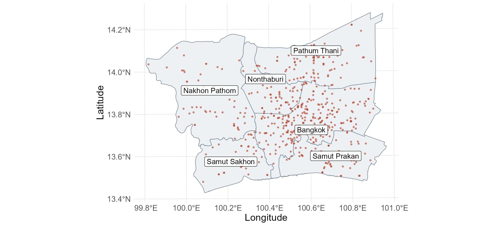
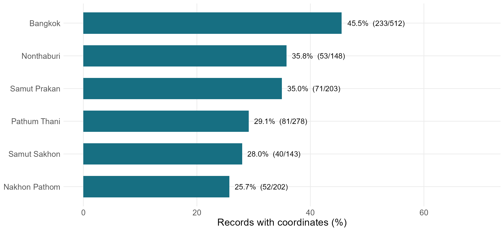
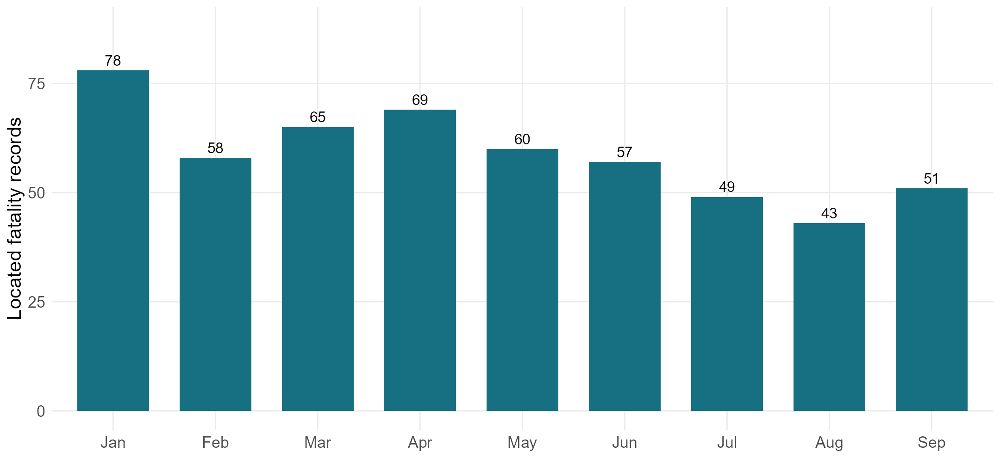
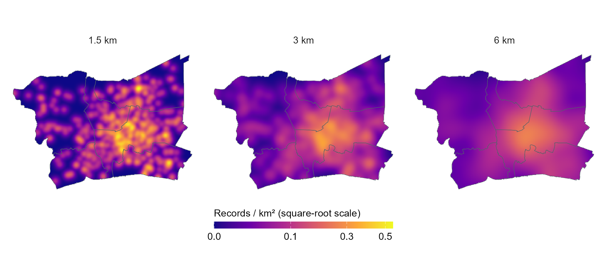
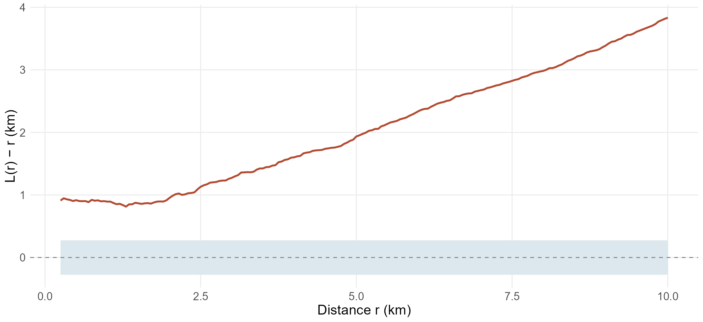
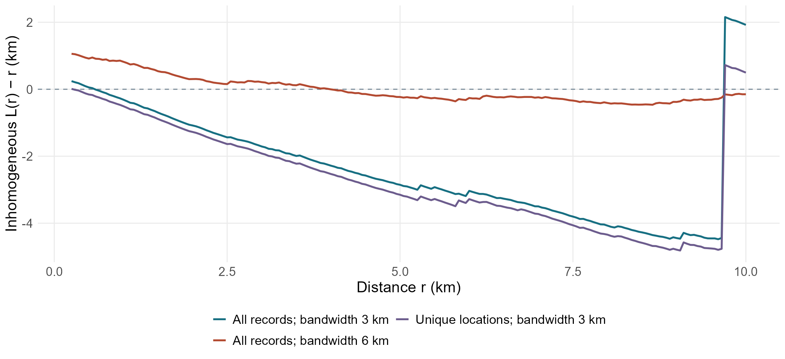

```{r}
#| include: false
s <- jsonlite::fromJSON("Take-home_Ex/Take-home_Ex01/outputs/summary.json")
stopifnot(s$study_records == 530, s$observation_end == "2024-09-30")
```

## Contents

Study question and data  
Spatial concentration and statistical evidence  
Implications and limitations

## Research question

**Where are located fatality records concentrated, and does clustering remain after allowing intensity to vary?**

The analysis covers 530 records in six provinces.

One record represents a recorded fatality, **not necessarily one distinct crash**.

## Study area

{height=420}

::: {.takeaway}
Bangkok contains 232 of 530 located records (43.8%).
:::

::: {.source}
Sources: Kaggle / DDC compilation; geoBoundaries, OpenStreetMap and Wambacher (ODbL 1.0). UTM 47N.
:::

## The largest limitation is missing locations

{height=390}

::: {.takeaway}
74.6% of distinct national records lack coordinates. Coverage differs across province-of-death groups.
:::

::: {.source}
Source: Kaggle version 1, after exact-row deduplication. Death-province groups differ from spatial inclusion.
:::

## The file covers nine months, not a full year

{height=390}

::: {.takeaway}
January: 78 located records. August: 43. These are confirmed-death dates, not crash dates.
:::

::: {.source}
Source: Kaggle / DDC compilation. October–December are absent, not zero; counts are not exposure-adjusted.
:::

## A broad concentration remains under different smoothing

{height=410}

::: {.takeaway}
The peak falls from 0.545 to 0.257 records/km² as bandwidth increases from 1.5 to 6 km.
:::

::: {.source}
Gaussian KDE; 500 m pixels; shared colour scale. Sources: Kaggle / DDC; geoBoundaries (ODbL 1.0).
:::

## The uniform spatial reference is rejected

{height=390}

::: {.takeaway}
Global Monte Carlo p = `r sprintf("%.3f", s$global_csr_p)`. Uneven intensity can explain rejection; interaction is not established.
:::

::: {.source}
199 fixed-count CSR simulations; translation correction; global maximum-deviation band over 0.25–10 km.
:::

## Intensity-adjusted results are sensitive to bandwidth

{height=390}

::: {.takeaway}
At 1 km, the curve changes from −0.312 to +0.820 km. Residual interaction is unresolved.
:::

::: {.source}
Leave-one-out intensity; 3 km and 6 km bandwidths. Descriptive curves without a significance envelope.
:::

## What the checks establish

| Check | Result | Interpretation |
|---|---|---|
| KDE bandwidth | Broad concentration persists | Useful regional description |
| Repeated locations | 530 records → 503 locations | Broad ordinary-L pattern remains |
| Intensity bandwidth | Adjusted curve changes substantially | No stable interaction conclusion |

::: {.takeaway}
At 3 km bandwidth, one point contributes 30.0% of the total inverse-intensity weight.
:::

## Public-safety implications

Use the broad concentration to prioritise **case-file verification and site review**.

Improve coordinate recording and introduce reliable crash identifiers.

Add traffic exposure and road-condition evidence before selecting enforcement or engineering interventions.

Low mapped counts are not grounds for reducing resources.

## Conclusion and limitations

**Located records are concentrated, but the evidence for interaction between separate crashes is not robust.**

Missing locations, incomplete-year coverage, uncertain event identity, and planar distances limit interpretation.

[Technical report and references](technical-report.html) · [GitHub project](https://github.com/yufanyou2025/ISS626-VAA)

::: {.source}
Main sources: Kaggle / DDC compilation; geoBoundaries / OpenStreetMap; Thailand NSO; sf and spatstat documentation.
:::

