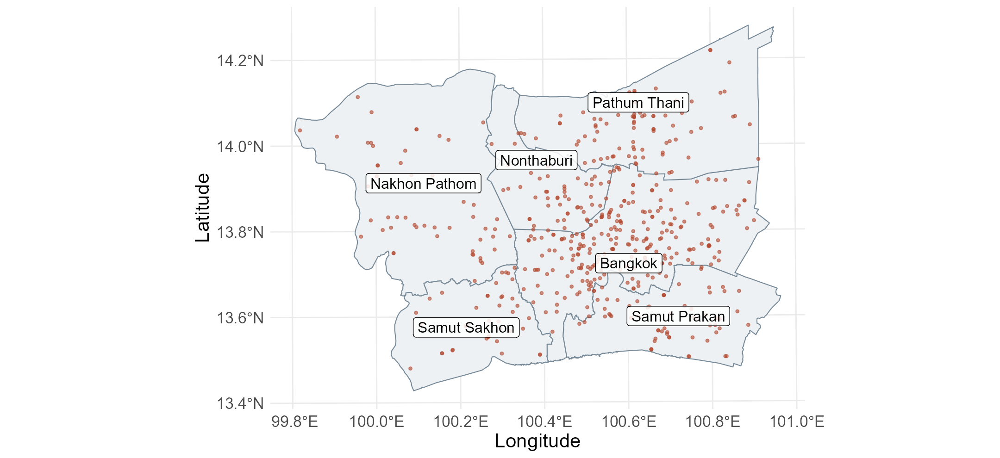
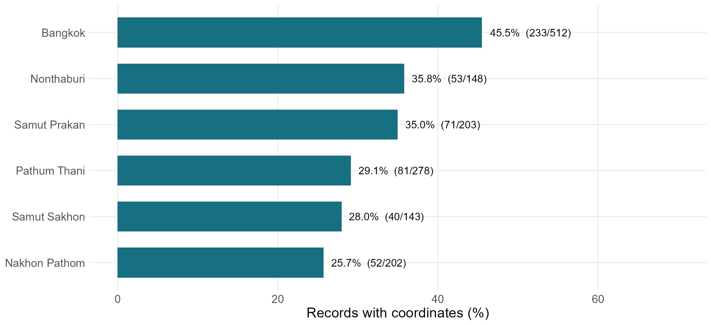
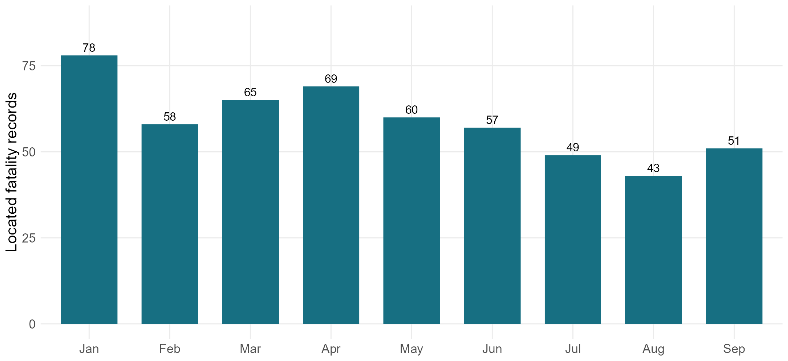
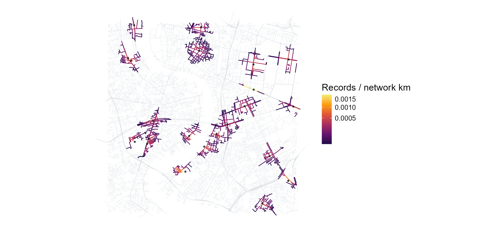
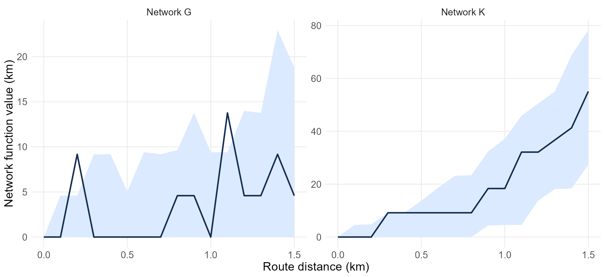

```{r}
#| include: false
s <- jsonlite::fromJSON("Take-home_Ex/Take-home_Ex01/outputs/summary.json")
ns <- jsonlite::fromJSON("Take-home_Ex/Take-home_Ex01/outputs/network-summary.json")
stopifnot(s$study_records == 530, s$observation_end == "2024-09-30")
```

## Contents

Study question and data  
Spatial concentration and statistical evidence  
Implications and limitations

## Research question

**Where are located fatality records concentrated, and what changes when streets define the distance?**

The regional analysis covers 530 records in six provinces. A central Bangkok street-network example uses `r ns$snap_accepted` matched records.

One record represents a recorded fatality, **not necessarily one distinct crash**.

## Study area

{height=420}

::: {.takeaway}
Bangkok contains 232 of 530 located records (43.8%).
:::

::: {.source}
Sources: Kaggle / DDC compilation; geoBoundaries, OpenStreetMap and Wambacher (ODbL 1.0). UTM 47N.
:::

## The largest limitation is missing locations

{height=390}

::: {.takeaway}
74.6% of distinct national records lack coordinates. Coverage differs across province-of-death groups.
:::

::: {.source}
Source: Kaggle version 1, after exact-row deduplication. Death-province groups differ from spatial inclusion.
:::

## The file covers nine months, not a full year

{height=390}

::: {.takeaway}
January: 78 located records. August: 43. These are confirmed-death dates, not crash dates.
:::

::: {.source}
Source: Kaggle / DDC compilation. October–December are absent, not zero; counts are not exposure-adjusted.
:::

## A closer look at roads in central Bangkok

{height=405}

::: {.takeaway}
`r ns$focus_records` records fall inside an 8 × 8 km square around the regional density peak; `r ns$snap_accepted` match the mapped road component within 100 m.
:::

::: {.source}
Roads: © OpenStreetMap contributors (ODbL), September 2026. Fatality records: Kaggle / DDC, January–September 2024.
:::

## Density follows routes, not a square grid

{height=405}

::: {.takeaway}
Continuous network KDE colours road segments by recorded fatalities per network kilometre. The display scale is 700 m of route distance.
:::

::: {.source}
spNetwork quartic kernel, lixel centres, max_depth 8. The focused subset is exploratory; no traffic denominator is available.
:::

## Network K and G offer a different comparison

{height=390}

::: {.takeaway}
`r ns$network_k_simulations` simulations place the same number of points approximately uniformly by road length. Pointwise bands do not give a global test.
:::

::: {.source}
spNetwork network K/G; 100 m simulation resolution and steps to 1.5 km. The focus was selected from the observed pattern.
:::

## What the checks establish

| Check | Result | Interpretation |
|---|---|---|
| Regional planar KDE | Broad Bangkok concentration | Guides local inspection |
| Road matching | `r ns$snap_accepted` of `r ns$focus_records` focus records | Positions are near mapped roads |
| Network KDE | Colour follows connected streets | Shows route-based concentration |
| Network K/G | Uniform-by-road-length reference | Exploratory local comparison |

::: {.takeaway}
The network map adds street context, but neither analysis measures risk per road user.
:::

## Public-safety implications

Use the broad concentration to prioritise **case-file verification and site review**.

Improve coordinate recording and introduce reliable crash identifiers.

Add traffic exposure and road-condition evidence before selecting enforcement or engineering interventions.

Low mapped counts are not grounds for reducing resources.

## Conclusion and limitations

**Located records are concentrated. The focused road map shows where a small matched subset lies along streets.**

Missing locations, incomplete-year coverage, uncertain crash identity, and a 2026 road snapshot limit interpretation. Evidence for interaction between separate crashes remains unresolved.

[Technical report and references](technical-report.html) · [GitHub project](https://github.com/yufanyou2025/ISS626-VAA)

::: {.source}
Main sources: Kaggle / DDC; geoBoundaries; OpenStreetMap contributors; R4GDSA Chapter 7; Gelb's spNetwork documentation.
:::

