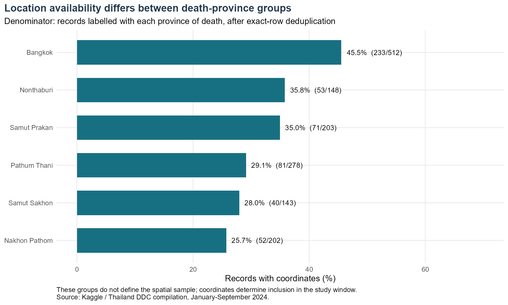
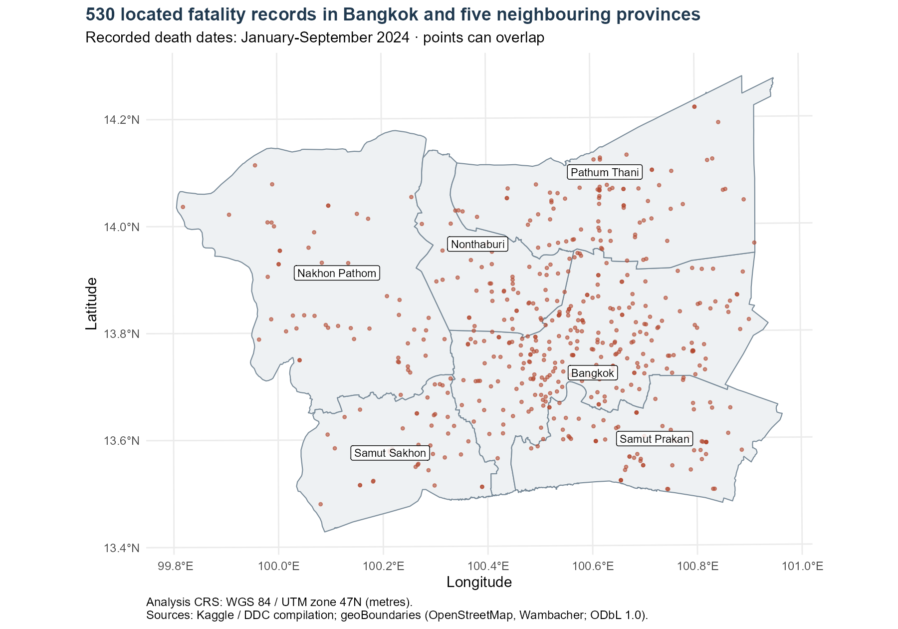
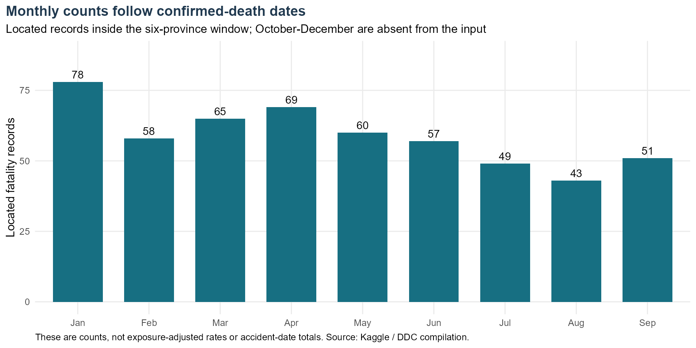
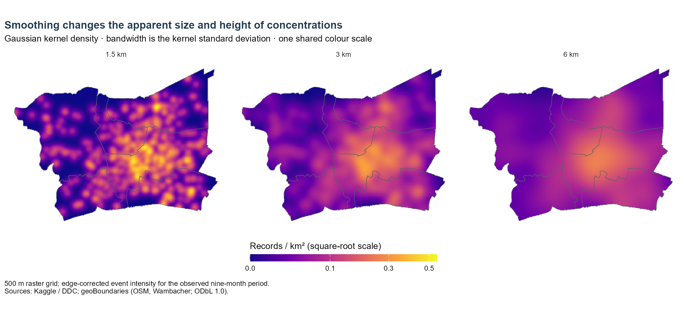
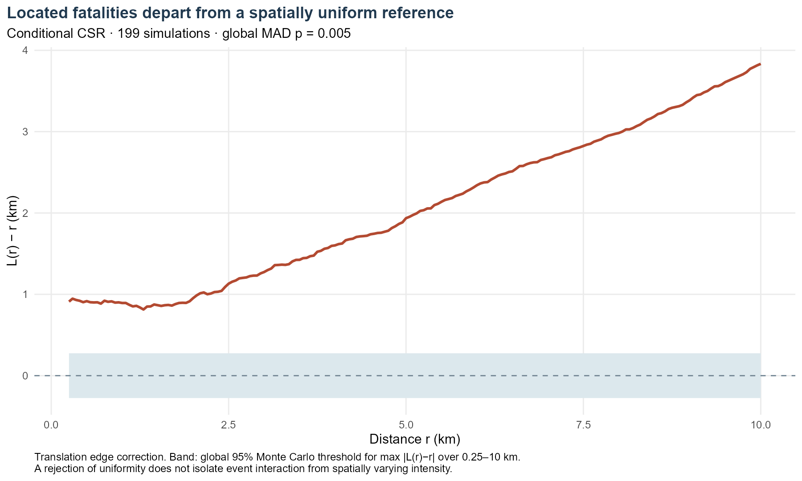
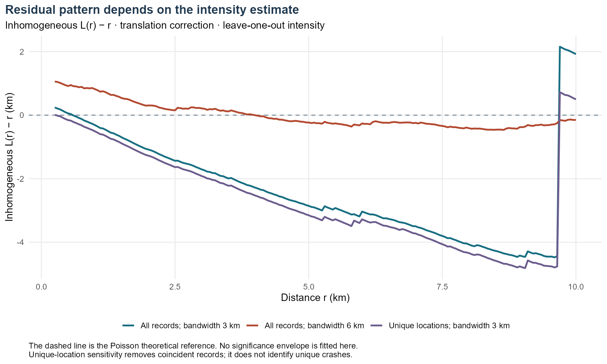

```{r}
#| label: run-analysis
#| include: false
source("Take-home_Ex/Take-home_Ex01/analysis.R", local = knitr::knit_global())
knitr::read_chunk("Take-home_Ex/Take-home_Ex01/analysis.R")
fmt <- function(x, digits = 0) formatC(x, format = "f", digits = digits, big.mark = ",")
```

[Executive summary](executive-summary.qmd) · [Source code](https://github.com/yufanyou2025/ISS626-VAA/blob/master/Take-home_Ex/Take-home_Ex01/analysis.R)

## Introduction and research question

Road-safety planning needs to know where recorded deaths are concentrated, but a concentration on a map is not automatically evidence of greater individual risk. More journeys, more roads, and better reporting can all produce more observed events in an area.

This study asks: **Where are geocoded fatality records concentrated in Greater Bangkok during January–September 2024, and how much evidence of clustering remains after allowing for spatially varying intensity?**

The distinction matters here. The spatially uniform reference is clearly rejected, while the intensity-adjusted curves are sensitive to how intensity is estimated. The defensible conclusion is that observed fatality locations are unevenly distributed. The analysis does not establish a stable pattern of interaction between distinct crashes.

## Data and study design

### Sources and observation period

The [Kaggle dataset](https://www.kaggle.com/datasets/pornsakkamchan/thailand-road-accident-fatalities-2024), uploaded by Pornsak Kamchan, is described as a Thailand Department of Disease Control compilation combining three sources. Version 1 was accessed on 10 September 2026; its metadata gives a last update of 5 January 2025. That provenance is the uploader's description, not an independently verified linkage to the underlying source systems.

The original file contains **12,762 rows and 13 fields**. Although the title says 2024, every observed date lies between **1 January and 30 September 2024**. October–December are absent and are not treated as months with zero deaths. The date field is **confirmed death date**, so the monthly comparison is not a comparison of accident dates.

Administrative polygons come from [geoBoundaries gbOpen Thailand ADM1](https://www.geoboundaries.org/api/current/gbOpen/THA/ADM1/), boundary ID THA-ADM1-36821470. The pinned release uses source revision 9469f09, represents 2017, and was built in December 2023. Its sources are OpenStreetMap and Wambacher, under ODbL 1.0. Using an older boundary is a limitation; this study does not establish that every boundary matches 2024 exactly.

### Event definition

One point represents **one distinct record of a road-traffic fatality with usable coordinates inside the study area**. It does not necessarily represent one distinct crash. There is no dedicated crash or person identifier.

Exactly identical rows are removed as likely duplicate records. This is a working assumption because different people could, in principle, share every released attribute. The 24 removed rows are outside the final metropolitan sample, so this choice does not change its 530 records. Repeated coordinates in that sample are retained: several fatalities can arise from one crash, and unrelated records may share a rounded location.

The sample contains **503 distinct coordinate pairs** and **515 distinct location–date combinations**. Collapsing coordinates is used only as a sensitivity check, not as a method for identifying unique crashes. No artificial jitter is added.

### Spatial window and CRS

The window combines Bangkok, Samut Prakan, Nonthaburi, Pathum Thani, Nakhon Pathom, and Samut Sakhon. This follows the six-province “Bangkok and Vicinities” grouping in [National Statistical Office documentation](https://catalogapi.nso.go.th/api/doc/department/D10/SD10_04/SD10_04_265_1.pdf?preview=1). It provides an explicit administrative interpretation of Greater Bangkok.

The six polygons are selected using ISO codes TH-10, TH-11, TH-12, TH-13, TH-73, and TH-74 and dissolved into one study window. Its calculated area is **`r fmt(area_km2, 1)` km²**. Spatial inclusion uses the coordinates, rather than the person's province or province of death. Boundary intersections count as inside; no points in this file have ambiguous membership across the selected province polygons.

The coordinate headers are reversed in the downloaded file: all available values in `acc_lat` fall between approximately 97.9 and 105.6, while `acc_long` ranges from 5.9 to 20.4. These values and their Thailand locations support treating the former as longitude and the latter as latitude. WGS 84 is assumed for the original coordinates because the source does not document a datum. Coordinates and polygons are transformed to **WGS 84 / UTM zone 47N, EPSG:32647**, for metre-based distances and areas. Assigning a CRS and transforming coordinates are different operations; see the [sf documentation](https://r-spatial.github.io/sf/articles/sf1.html).

### Main analytical choices

| Choice | Setting and reason | Main limitation |
|---|---|---|
| Observation period | 1 January–30 September 2024; complete available date span | Death dates, not crash times; completeness is unknown |
| Observation space | Union of six administrative provinces | Road events occur on networks, not freely across all land |
| Kernel density | Gaussian, 3 km standard deviation; 500 m pixels | A regional display scale, not an optimal or causal scale |
| Density sensitivity | 1.5 km and 6 km, with the same legend | Apparent peaks depend on smoothing |
| Second-order function | Translation-corrected L(r) − r | Ordinary L assumes a stationary process |
| Test distances | 0.25–10 km in 50 m steps | Grid-based evidence; very short distances and longer scales excluded |
| Null model | Independent uniform locations, conditional on 530 points in the same window | Baseline of uniformity, not a realistic road-exposure model |
| Monte Carlo settings | 199 simulations; seed 20260910 | Minimum attainable p-value is 0.005 |
| Inhomogeneous diagnostic | Leave-one-out intensity; 3 km and 6 km bandwidths; translation correction; normalization power 2 | Estimated intensity can make inverse weights unstable |
| Coincidence sensitivity | One point per exact coordinate pair, 503 points | Changes the event unit and cannot recover crash IDs |

Ten kilometres is below one quarter of the window's shorter bounding-box dimension, approximately 94 km. This limits, but does not remove, boundary influence. The 250 m lower limit avoids presenting very small distances as precise given the unknown coordinate accuracy.

## Task 1 — Data preparation and quality

The workflow preserves the raw CSV and creates new longitude, latitude, and parsed date fields. UTF-8 import retains Thai values. The Buddhist Era year 2567 is converted to 2024 by subtracting 543; the day and month are retained. The script checks parsing, year values, coordinate ranges, polygon validity, and sample counts.

There are no parsing problems or invalid selected polygons in this run. Missing coordinates are not imputed. Text-based geocoding would introduce location uncertainty that is difficult to justify from the available metadata.

```{r}
#| label: setup
#| eval: false
```

```{r}
#| label: data-preparation
#| eval: false
```

```{r}
#| label: study-window
#| eval: false
```

```{r}
#| echo: false
knitr::kable(audit, col.names = c("Sequential stage", "Removed at this stage", "Retained"), format.args = list(big.mark = ","))
```

The sequence reconciles: 24 identical rows, 9,498 records without usable coordinates, and 2,710 located records outside the window are removed from the 12,762 input rows. The result is 530 spatial records. The largest loss occurs before spatial filtering: **74.6% of distinct national records lack coordinates**. This prevents the mapped sample from being treated as representative without further evidence.

### Location availability by province of death

{#fig-coverage}

::: {#interpretation-coverage}
Coordinate availability varies from 25.7% for records labelled Nakhon Pathom to 45.5% for those labelled Bangkok. This difference warns against comparing mapped counts as if observation coverage were equal. The denominator here is each group defined by province of death; it is not the set of fatalities spatially located inside each polygon. Province of death and accident location can differ, so these percentages cannot be used directly to inflate the spatial counts.
:::

### Spatial sample

{#fig-study}

::: {#interpretation-study}
Bangkok contains 232 of the 530 spatially selected records, or 43.8%. Records also extend into all five neighbouring provinces. This is a regional pattern rather than a set confined to the Bangkok administrative boundary. Points overlap where records share coordinates, and labels can obscure individual points. The figure shows the available geocoded sample; it neither locates missing records nor establishes the risk faced by road users.
:::

```{r}
#| echo: false
knitr::kable(province_table, digits = c(0, 1, 0, 3), col.names = c("Province", "Area (km²)", "Located records", "Records / km²"))
```

Records per km² describe areal intensity over this nine-month extract. They are not deaths per person, per vehicle, or per kilometre travelled.

```{r}
#| label: descriptive-views
#| eval: false
```

## Task 2 — First-order analysis

### Monthly distribution

{#fig-monthly}

::: {#interpretation-monthly}
January has the highest count in the spatial sample, with 78 records, and August has the lowest, with 43. September rises to 51. These differences describe the available death-date records, not changes in crash risk. The extract covers only nine months, the months differ in length, and coordinate availability may also change over time. A seasonal or holiday explanation would therefore need additional evidence.
:::

### Kernel density estimation

Gaussian kernel density estimation distributes each event over nearby locations. The 3 km bandwidth provides a district-scale view, while 1.5 km and 6 km show how much the map depends on smoothing. This is a transparent descriptive choice rather than a claim that 3 km is statistically optimal.

Edge correction compensates for kernel mass outside the observation window. All maps use 500 m pixels and one square-root colour scale, with legend values expressed in records per km². The units refer to the entire observed period and are not annualised. Tiny negative values from numerical FFT rounding are checked and clipped to zero for display.

{#fig-kde}

::: {#interpretation-kde}
All three maps show a broad concentration in and around Bangkok, but the smaller bandwidth separates it into many local peaks. The maximum intensity falls from 0.545 records/km² at 1.5 km to 0.339 at 3 km and 0.257 at 6 km. The 3 km maximum lies within Bangkok. These are smoothed concentrations of recorded fatalities. Their positions and heights do not identify the most dangerous road segments, because traffic exposure, the road network, and missing records are not included.
:::

The whole-window average is `r fmt(npoints(X) / area_km2, 3)` records/km². The KDE is useful because that single average hides local variation. However, a planar kernel can smooth across rivers, inaccessible land, and neighbouring roads. A road-network interpretation would require additional data and different distance assumptions. The [spatstat documentation](https://spatstat.org/) describes the package's point-pattern framework.

```{r}
#| label: first-order
#| eval: false
```

## Task 3 — Second-order analysis

### What is the comparison?

The question is whether the observed pattern departs from independent, spatially uniform placement inside the same window. Ripley's K summarises neighbouring events within distance r; the transformation L(r) = √(K(r)/π) makes the Poisson reference L(r) − r = 0. Positive values indicate excess nearby pairs relative to that reference, rather than proof of a causal relationship between crashes.

Translation correction adjusts pair contributions for the overlap between the observation window and a shifted copy of it. This addresses boundary truncation under the method's assumptions. It does not correct selective reporting or replace a road-network exposure model.

The test keeps the observed point count fixed. Each of 199 simulations places 530 independent uniform points in the same polygon. For each pattern, including the observed one, the test statistic is the maximum absolute deviation |L(r) − r| across the prespecified 0.25–10 km grid. The Monte Carlo p-value is (1 + number of simulated statistics at least as large as observed) / 200.

The plotted band uses the 95th percentile of simulated maximum deviations. It is a simultaneous, constant-width comparison over the selected grid, not a pointwise envelope or a confidence interval for the true L function. General envelope distinctions are discussed in the [spatstat envelope documentation](https://rdrr.io/cran/spatstat.explore/man/envelope.html).

{#fig-csr}

::: {#interpretation-csr}
The observed curve exceeds the uniform-reference envelope. Its maximum absolute deviation is 3.834 km, compared with a simulated threshold of 0.275 km; the global Monte Carlo p-value is 0.005. Uniform independent placement is therefore not a plausible description of this recorded pattern. However, roads, travel activity, settlement, and recording coverage are spatially uneven. Rejection of uniformity does not show that separate crashes interact, or that the mapped concentrations imply greater individual risk.
:::

```{r}
#| label: second-order
#| eval: false
```

### Allowing intensity to vary

An inhomogeneous K function reweights pairs using estimated local intensities. Here, intensity is estimated leave-one-out so a point does not contribute to its own estimate. The [Kinhom documentation](https://rdrr.io/cran/spatstat.explore/man/Kinhom.html) explains this approach and the Poisson reference. Translation correction and renormalisation with power 2 are used.

These curves are **descriptive diagnostics**, not a calibrated second hypothesis test. A suitable formal test would also account for estimating the intensity surface. The diagnostic still assumes that its intensity model and second-order structure are meaningful for the observation process.

{#fig-inhom}

::: {#interpretation-inhom}
The result changes materially with bandwidth. At 1 km, L-inhomogeneous(r) − r is −0.312 km using 3 km smoothing but +0.820 km using 6 km. The 3 km curve also jumps sharply near the upper end of the distance range. Collapsing repeated locations changes the curve but does not resolve bandwidth sensitivity. Without a calibrated envelope, negative values are not evidence of significant regularity. These diagnostics do not support a stable conclusion about residual interaction.
:::

An intensity-weight check helps explain the instability. At 3 km bandwidth, one point contributes **30.0% of the sum of inverse-intensity weights**; at 6 km, the largest share is **2.94%**. This is not the share of the K statistic itself, but it shows how a low estimated intensity can give one location substantial influence. The sharp change should not be interpreted as a physical interaction threshold.

```{r}
#| echo: false
knitr::kable(intensity_diagnostics, digits = c(0, 6, 3, 2), col.names = c("Bandwidth (km)", "Minimum intensity / km²", "Maximum intensity / km²", "Largest inverse-weight share (%)"))
```

## Task 4 — Integration and sensitivity

The first-order maps show uneven observed intensity, especially within Bangkok. The ordinary L-function agrees that a uniform spatial reference is inadequate. These findings complement each other, but they do not provide two independent proofs of crash interaction: spatially varying intensity can produce the ordinary L-function result.

The inhomogeneous diagnostic changes the interpretation. Results depend on the intensity bandwidth and, at 3 km, on influential low-intensity locations. It would be misleading to select one curve and label the pattern “clustered” or “regular” without acknowledging this instability.

Repeated coordinates are another concern. Removing coincident locations reduces the pattern from 530 records to 503 locations. At 10 km, ordinary L(r) − r changes only from 3.834 to 3.806 km; at 1 km it falls from 0.893 to 0.726 km. Coincident records matter more at short distances, but they do not explain the broad ordinary-L departure. This sensitivity changes the event unit and is not a reconstruction of distinct accidents. No separate p-value is claimed for that comparison.

```{r}
#| echo: false
knitr::kable(l_summary, digits = 3, col.names = c("Distance (km)", "All records: L(r) − r (km)", "Unique locations: L(r) − r (km)"))
```

```{r}
#| label: sensitivity
#| eval: false
```

Together, the checks favour a restrained conclusion: **there is a clear concentration of located fatality records, but the current data and intensity model do not establish robust interaction between separate crashes**. More advanced methods would not automatically resolve the missing-location and event-definition problems.

## Task 5 — Geovisualisation and communication

Each major figure has a short interpretation immediately beneath it. The study map provides geographic context before the density maps; the KDE panels share one legend so colours remain comparable. Count charts retain zero baselines. The statistical plots label distances in kilometres and distinguish the theoretical reference from simulated evidence. The inhomogeneous diagnostic deliberately has no significance shading.

Maps use a colour gradient for magnitude rather than labelling arbitrary bands as “safe” or “dangerous”. The displayed figures and their interpretations support the same event definition and observation period.

## Task 6 — Public-safety planning and management

::: {#planning-discussion}
The main practical use of this analysis is to identify broad areas for closer investigation. Bangkok contains 232 of the 530 located records, and its concentration remains visible under different KDE bandwidths. Agencies could use this as a starting point for reviewing existing fatal-crash case files and checking whether known problem locations are represented. The map alone is insufficient for choosing individual roads for engineering work.

Improving location recording should be a priority alongside hotspot review. Nearly three quarters of distinct records in the national extract have no coordinates, and availability differs across province-of-death groups. A consistent process for recording crash coordinates, location accuracy, and event identifiers would make future spatial comparisons more credible. Linking multiple fatalities to a shared crash identifier would also help distinguish the number of deaths from the number of crashes.

Decisions about enforcement, road redesign, or emergency response need information that is missing here. Traffic volumes, road type, speed, intersection layout, pedestrian activity, and emergency access could help assess whether a concentration reflects greater exposure, preventable hazards, or reporting differences. These are proposed follow-up inputs, not causes established by this study.

The results should not be used to reduce resources in areas with few mapped records. A sparse map may reflect incomplete geocoding. Similarly, the January count is not sufficient evidence for a seasonal deployment strategy because the available dates concern confirmed deaths, the extract stops in September, and monthly observation completeness is unknown.

A reasonable next step is a joint data-quality and site-review exercise: verify the locations and event identities in the broad concentration areas, compare them with independent operational records, and then assess particular interventions using exposure and road-condition evidence.
:::

## Limitations and conclusion {.unnumbered}

The dominant limitation is selective location availability. The analysis concerns 530 geocoded records, not all road fatalities in Greater Bangkok. The source's national completeness and integration procedures have not been independently verified. The date field records confirmed deaths and covers nine months; it cannot support full-year or precise accident-time conclusions.

The assumed WGS 84 datum, unknown coordinate accuracy, older administrative boundaries, and planar treatment of road events add uncertainty. Multiple records can refer to one crash, while exact-row deduplication relies on released attributes. Edge correction does not solve these problems.

The evidence answers the research question in two parts. Located records are concentrated, with a prominent broad concentration within Bangkok. However, the sensitivity of the intensity-adjusted curves means that residual interaction is unresolved. This is useful as an exploratory account of recorded locations and a guide to further data checking, rather than a road-risk ranking.

## Reproducibility {.unnumbered}

The complete workflow is in [analysis.R](https://github.com/yufanyou2025/ISS626-VAA/blob/master/Take-home_Ex/Take-home_Ex01/analysis.R). Expand the code sections above to see the exact preparation, plotting, and simulation code. The report executes that script once before displaying its results; the expanded blocks display the same code without executing it twice.

Original input hashes are checked before analysis. Raw files remain outside Git because the Kaggle licence label does not establish clear redistribution permission. The repository includes download instructions, metadata, checksums, aggregated outputs, and package versions. The boundary source is pinned to a specific revision. No individual record is included in the downloadable result tables.

From the repository root, obtain the inputs described in `data/README.md`, then run:

```powershell
Rscript Take-home_Ex/Take-home_Ex01/analysis.R
quarto render Take-home_Ex/Take-home_Ex01/technical-report.qmd
quarto render Take-home_Ex/Take-home_Ex01/executive-summary.qmd
```

The R script writes the figures and result tables. Rendering the report reruns the full analysis with the fixed simulation seed. The slides use the same saved figures and summary values. On Windows, `render.ps1` sets a supported UTF-8 locale for the render process and restores the previous environment afterwards.

```{r}
#| label: export-results
#| eval: false
```

```{r}
#| echo: false
knitr::kable(versions, row.names = FALSE, col.names = c("Package", "Version"))
```

::: {.callout-note collapse="true"}
## R session information

```{r}
#| echo: false
sessionInfo()
```
:::

## References {.unnumbered}

1. ISSS626 (2026). [Take-home Exercise 1: Geospatial Analytics for Public Safety](https://isss626-ay2026-27aug.netlify.app/take-home_ex01). Assignment requirements and course policy.
2. Kamchan, P. (2025). [Thailand Road Accident Fatalities 2024](https://www.kaggle.com/datasets/pornsakkamchan/thailand-road-accident-fatalities-2024), version 1. Accessed 10 September 2026.
3. geoBoundaries. [Thailand ADM1 metadata](https://www.geoboundaries.org/api/current/gbOpen/THA/ADM1/) and [pinned boundary data](https://github.com/wmgeolab/geoBoundaries/raw/9469f09/releaseData/gbOpen/THA/ADM1/geoBoundaries-THA-ADM1.geojson). OpenStreetMap and Wambacher attribution; [ODbL information](https://www.openstreetmap.org/copyright).
4. National Statistical Office of Thailand. [Statistical documentation: Bangkok and Vicinities](https://catalogapi.nso.go.th/api/doc/department/D10/SD10_04/SD10_04_265_1.pdf?preview=1). Geographic grouping.
5. ISSS626. [Lesson 2: Spatial Point Patterns Analysis](https://isss626-ay2026-27aug.netlify.app/lesson/Lesson02/Lesson02-SPPA.html).
6. Pebesma, E. [Simple Features for R](https://r-spatial.github.io/sf/articles/sf1.html).
7. Baddeley, A., Rubak, E., and Turner, R. [spatstat documentation and learning resources](https://spatstat.org/).
8. spatstat.explore. [Kinhom documentation](https://rdrr.io/cran/spatstat.explore/man/Kinhom.html) and [simulation envelope documentation](https://rdrr.io/cran/spatstat.explore/man/envelope.html). Package version 3.8.2 used locally.

## Assistance declaration {.unnumbered}

Generative AI prepared the code, analysis, visualisations, and written materials in this worked analysis. These contributions are not represented as independently completed student work.

